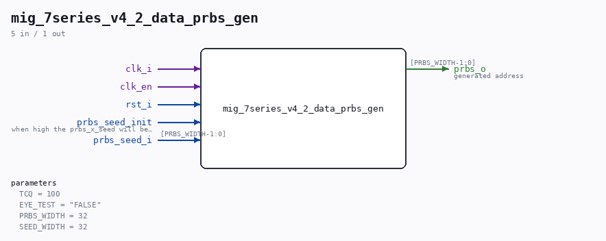

# mig_7series_v4_2_data_prbs_gen

Source: `/mnt/e/Dev/Repos/Ronny/nd-120/Verilog/fpga/nexys4ddr/ddr2-test/ip/ddr/ddr/example_design/rtl/traffic_gen/mig_7series_v4_2_data_prbs_gen.v`

> Generated by `Verilog/tests/module_doc.py` from the `//!`
> comments in the source. Do not edit by hand - edit the RTL comments and regenerate.

## Parameters

| Parameter | Default |
|---|---|
| `TCQ` | `100` |
| `EYE_TEST` | `"FALSE"` |
| `PRBS_WIDTH` | `32` |
| `SEED_WIDTH` | `32` |

## Ports

| Direction | Width | Name | Description |
|---|---|---|---|
| input | `1` | `clk_i` |  |
| input | `1` | `clk_en` |  |
| input | `1` | `rst_i` |  |
| input | `1` | `prbs_seed_init` | when high the prbs_x_seed will be loaded |
| input | `[PRBS_WIDTH-1:0]` | `prbs_seed_i` |  |
| output | `[PRBS_WIDTH-1:0]` | `prbs_o` | generated address |
