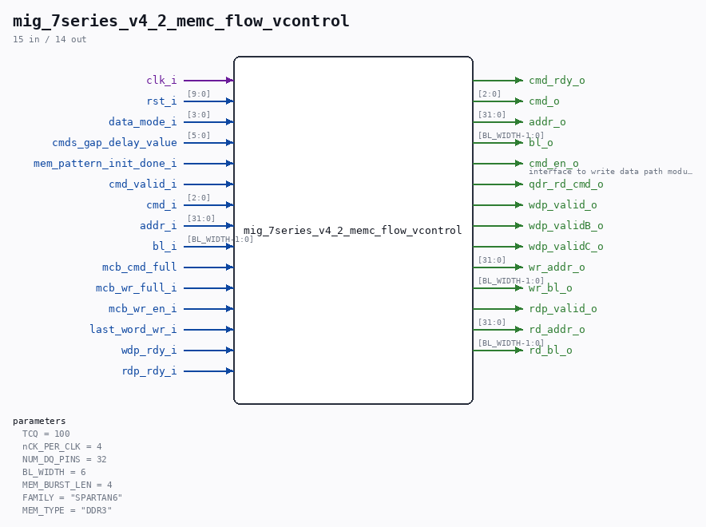

# mig_7series_v4_2_memc_flow_vcontrol

Source: `/mnt/e/Dev/Repos/Ronny/nd-120/Verilog/fpga/nexys4ddr/ddr2-test/ip/ddr/ddr/example_design/rtl/traffic_gen/mig_7series_v4_2_memc_flow_vcontrol.v`

> Generated by `Verilog/tests/module_doc.py` from the `//!`
> comments in the source. Do not edit by hand - edit the RTL comments and regenerate.

## Parameters

| Parameter | Default |
|---|---|
| `TCQ` | `100` |
| `nCK_PER_CLK` | `4` |
| `NUM_DQ_PINS` | `32` |
| `BL_WIDTH` | `6` |
| `MEM_BURST_LEN` | `4` |
| `FAMILY` | `"SPARTAN6"` |
| `MEM_TYPE` | `"DDR3"` |

## Ports

| Direction | Width | Name | Description |
|---|---|---|---|
| input | `1` | `clk_i` |  |
| input | `[9:0]` | `rst_i` |  |
| input | `[3:0]` | `data_mode_i` |  |
| input | `[5:0]` | `cmds_gap_delay_value` |  |
| input | `1` | `mem_pattern_init_done_i` |  |
| output | `1` | `cmd_rdy_o` |  |
| input | `1` | `cmd_valid_i` |  |
| input | `[2:0]` | `cmd_i` |  |
| input | `[31:0]` | `addr_i` |  |
| input | `[BL_WIDTH-1:0]` | `bl_i` |  |
| input | `1` | `mcb_cmd_full` |  |
| input | `1` | `mcb_wr_full_i` |  |
| output | `[2:0]` | `cmd_o` |  |
| output | `[31:0]` | `addr_o` |  |
| output | `[BL_WIDTH-1:0]` | `bl_o` |  |
| output | `1` | `cmd_en_o` | interface to write data path module |
| output | `1` | `qdr_rd_cmd_o` |  |
| input | `1` | `mcb_wr_en_i` |  |
| input | `1` | `last_word_wr_i` |  |
| input | `1` | `wdp_rdy_i` |  |
| output | `1` | `wdp_valid_o` |  |
| output | `1` | `wdp_validB_o` |  |
| output | `1` | `wdp_validC_o` |  |
| output | `[31:0]` | `wr_addr_o` |  |
| output | `[BL_WIDTH-1:0]` | `wr_bl_o` |  |
| input | `1` | `rdp_rdy_i` |  |
| output | `1` | `rdp_valid_o` |  |
| output | `[31:0]` | `rd_addr_o` |  |
| output | `[BL_WIDTH-1:0]` | `rd_bl_o` |  |
