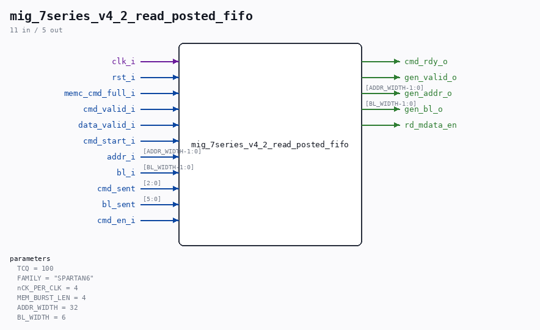

# mig_7series_v4_2_read_posted_fifo

Source: `/mnt/e/Dev/Repos/Ronny/nd-120/Verilog/fpga/nexys4ddr/ddr2-test/ip/ddr/ddr/example_design/rtl/traffic_gen/mig_7series_v4_2_read_posted_fifo.v`

> Generated by `Verilog/tests/module_doc.py` from the `//!`
> comments in the source. Do not edit by hand - edit the RTL comments and regenerate.

## Parameters

| Parameter | Default |
|---|---|
| `TCQ` | `100` |
| `FAMILY` | `"SPARTAN6"` |
| `nCK_PER_CLK` | `4` |
| `MEM_BURST_LEN` | `4` |
| `ADDR_WIDTH` | `32` |
| `BL_WIDTH` | `6` |

## Ports

| Direction | Width | Name | Description |
|---|---|---|---|
| input | `1` | `clk_i` |  |
| input | `1` | `rst_i` |  |
| output | `1` | `cmd_rdy_o` |  |
| input | `1` | `memc_cmd_full_i` |  |
| input | `1` | `cmd_valid_i` |  |
| input | `1` | `data_valid_i` |  |
| input | `1` | `cmd_start_i` |  |
| input | `[ADDR_WIDTH-1:0]` | `addr_i` |  |
| input | `[BL_WIDTH-1:0]` | `bl_i` |  |
| input | `[2:0]` | `cmd_sent` |  |
| input | `[5:0]` | `bl_sent` |  |
| input | `1` | `cmd_en_i` |  |
| output | `1` | `gen_valid_o` |  |
| output | `[ADDR_WIDTH-1:0]` | `gen_addr_o` |  |
| output | `[BL_WIDTH-1:0]` | `gen_bl_o` |  |
| output | `1` | `rd_mdata_en` |  |
