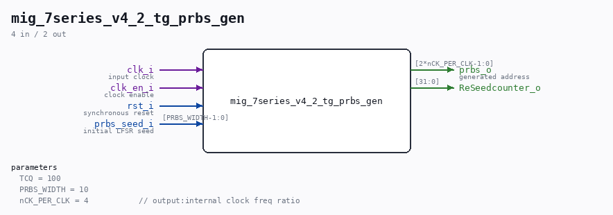

# mig_7series_v4_2_tg_prbs_gen

Source: `/mnt/e/Dev/Repos/Ronny/nd-120/Verilog/fpga/nexys4ddr/ddr2-test/ip/ddr/ddr/example_design/rtl/traffic_gen/mig_7series_v4_2_tg_prbs_gen.v`

> Generated by `Verilog/tests/module_doc.py` from the `//!`
> comments in the source. Do not edit by hand - edit the RTL comments and regenerate.

## Parameters

| Parameter | Default |
|---|---|
| `TCQ` | `100` |
| `PRBS_WIDTH` | `10` |
| `nCK_PER_CLK` | `4           // output:internal clock freq ratio` |

## Ports

| Direction | Width | Name | Description |
|---|---|---|---|
| input | `1` | `clk_i` | input clock |
| input | `1` | `clk_en_i` | clock enable |
| input | `1` | `rst_i` | synchronous reset |
| input | `[PRBS_WIDTH-1:0]` | `prbs_seed_i` | initial LFSR seed |
| output | `[2*nCK_PER_CLK-1:0]` | `prbs_o` | generated address |
| output | `[31:0]` | `ReSeedcounter_o` |  |
