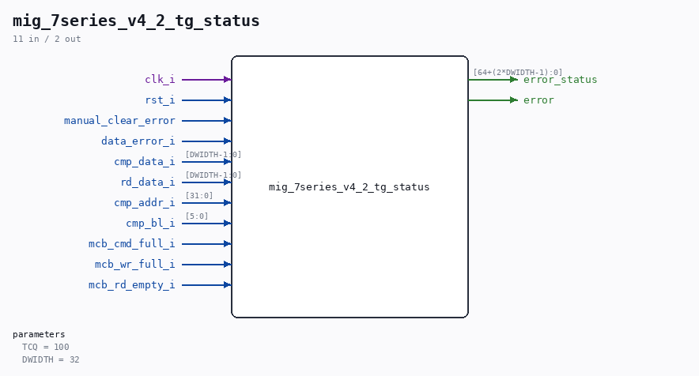

# mig_7series_v4_2_tg_status

Source: `/mnt/e/Dev/Repos/Ronny/nd-120/Verilog/fpga/nexys4ddr/ddr2-test/ip/ddr/ddr/example_design/rtl/traffic_gen/mig_7series_v4_2_tg_status.v`

> Generated by `Verilog/tests/module_doc.py` from the `//!`
> comments in the source. Do not edit by hand - edit the RTL comments and regenerate.

## Parameters

| Parameter | Default |
|---|---|
| `TCQ` | `100` |
| `DWIDTH` | `32` |

## Ports

| Direction | Width | Name | Description |
|---|---|---|---|
| input | `1` | `clk_i` |  |
| input | `1` | `rst_i` |  |
| input | `1` | `manual_clear_error` |  |
| input | `1` | `data_error_i` |  |
| input | `[DWIDTH-1:0]` | `cmp_data_i` |  |
| input | `[DWIDTH-1:0]` | `rd_data_i` |  |
| input | `[31:0]` | `cmp_addr_i` |  |
| input | `[5:0]` | `cmp_bl_i` |  |
| input | `1` | `mcb_cmd_full_i` |  |
| input | `1` | `mcb_wr_full_i` |  |
| input | `1` | `mcb_rd_empty_i` |  |
| output | `[64+(2*DWIDTH-1):0]` | `error_status` |  |
| output | `1` | `error` |  |
