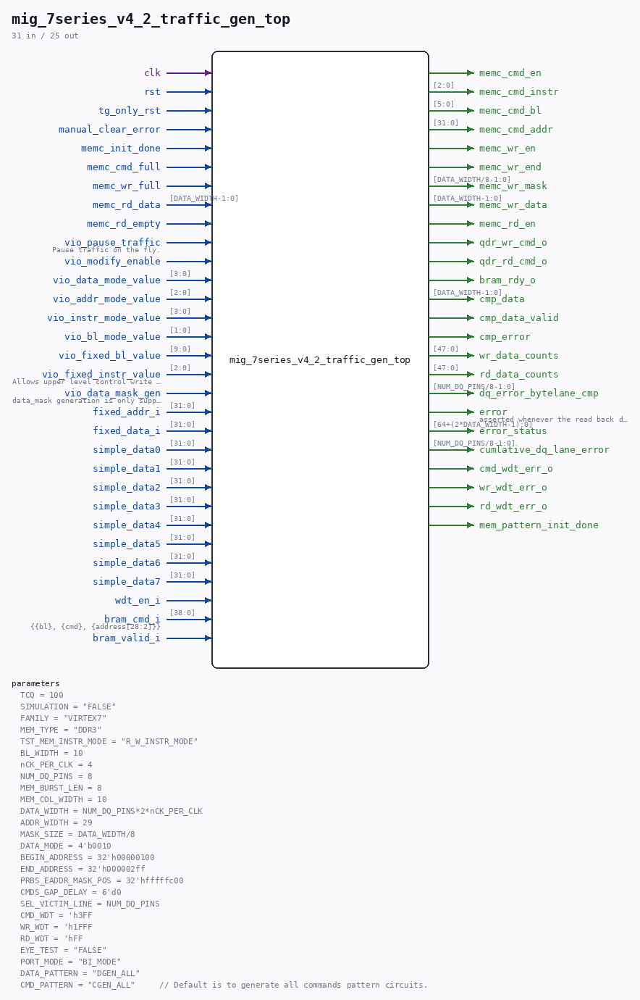

# mig_7series_v4_2_traffic_gen_top

Source: `/mnt/e/Dev/Repos/Ronny/nd-120/Verilog/fpga/nexys4ddr/ddr2-test/ip/ddr/ddr/example_design/rtl/traffic_gen/mig_7series_v4_2_traffic_gen_top.v`

> Generated by `Verilog/tests/module_doc.py` from the `//!`
> comments in the source. Do not edit by hand - edit the RTL comments and regenerate.

## Parameters

| Parameter | Default |
|---|---|
| `TCQ` | `100` |
| `SIMULATION` | `"FALSE"` |
| `FAMILY` | `"VIRTEX7"` |
| `MEM_TYPE` | `"DDR3"` |
| `TST_MEM_INSTR_MODE` | `"R_W_INSTR_MODE"` |
| `BL_WIDTH` | `10` |
| `nCK_PER_CLK` | `4` |
| `NUM_DQ_PINS` | `8` |
| `MEM_BURST_LEN` | `8` |
| `MEM_COL_WIDTH` | `10` |
| `DATA_WIDTH` | `NUM_DQ_PINS*2*nCK_PER_CLK` |
| `ADDR_WIDTH` | `29` |
| `MASK_SIZE` | `DATA_WIDTH/8` |
| `DATA_MODE` | `4'b0010` |
| `BEGIN_ADDRESS` | `32'h00000100` |
| `END_ADDRESS` | `32'h000002ff` |
| `PRBS_EADDR_MASK_POS` | `32'hfffffc00` |
| `CMDS_GAP_DELAY` | `6'd0` |
| `SEL_VICTIM_LINE` | `NUM_DQ_PINS` |
| `CMD_WDT` | `'h3FF` |
| `WR_WDT` | `'h1FFF` |
| `RD_WDT` | `'hFF` |
| `EYE_TEST` | `"FALSE"` |
| `PORT_MODE` | `"BI_MODE"` |
| `DATA_PATTERN` | `"DGEN_ALL"` |
| `CMD_PATTERN` | `"CGEN_ALL"     // Default is to generate all commands pattern circuits.` |

## Ports

| Direction | Width | Name | Description |
|---|---|---|---|
| input | `1` | `clk` |  |
| input | `1` | `rst` |  |
| input | `1` | `tg_only_rst` |  |
| input | `1` | `manual_clear_error` |  |
| input | `1` | `memc_init_done` |  |
| input | `1` | `memc_cmd_full` |  |
| output | `1` | `memc_cmd_en` |  |
| output | `[2:0]` | `memc_cmd_instr` |  |
| output | `[5:0]` | `memc_cmd_bl` |  |
| output | `[31:0]` | `memc_cmd_addr` |  |
| output | `1` | `memc_wr_en` |  |
| output | `1` | `memc_wr_end` |  |
| output | `[DATA_WIDTH/8-1:0]` | `memc_wr_mask` |  |
| output | `[DATA_WIDTH-1:0]` | `memc_wr_data` |  |
| input | `1` | `memc_wr_full` |  |
| output | `1` | `memc_rd_en` |  |
| input | `[DATA_WIDTH-1:0]` | `memc_rd_data` |  |
| input | `1` | `memc_rd_empty` |  |
| output | `1` | `qdr_wr_cmd_o` |  |
| output | `1` | `qdr_rd_cmd_o` |  |
| input | `1` | `vio_pause_traffic` | Pause traffic on the fly. |
| input | `1` | `vio_modify_enable` |  |
| input | `[3:0]` | `vio_data_mode_value` |  |
| input | `[2:0]` | `vio_addr_mode_value` |  |
| input | `[3:0]` | `vio_instr_mode_value` |  |
| input | `[1:0]` | `vio_bl_mode_value` |  |
| input | `[9:0]` | `vio_fixed_bl_value` |  |
| input | `[2:0]` | `vio_fixed_instr_value` | Allows upper level control write only or read only |
| input | `1` | `vio_data_mask_gen` | data_mask generation is only supported |
| input | `[31:0]` | `fixed_addr_i` |  |
| input | `[31:0]` | `fixed_data_i` |  |
| input | `[31:0]` | `simple_data0` |  |
| input | `[31:0]` | `simple_data1` |  |
| input | `[31:0]` | `simple_data2` |  |
| input | `[31:0]` | `simple_data3` |  |
| input | `[31:0]` | `simple_data4` |  |
| input | `[31:0]` | `simple_data5` |  |
| input | `[31:0]` | `simple_data6` |  |
| input | `[31:0]` | `simple_data7` |  |
| input | `1` | `wdt_en_i` |  |
| input | `[38:0]` | `bram_cmd_i` | {{bl}, {cmd}, {address[28:2]}} |
| input | `1` | `bram_valid_i` |  |
| output | `1` | `bram_rdy_o` |  |
| output | `[DATA_WIDTH-1:0]` | `cmp_data` |  |
| output | `1` | `cmp_data_valid` |  |
| output | `1` | `cmp_error` |  |
| output | `[47:0]` | `wr_data_counts` |  |
| output | `[47:0]` | `rd_data_counts` |  |
| output | `[NUM_DQ_PINS/8-1:0]` | `dq_error_bytelane_cmp` |  |
| output | `1` | `error` | asserted whenever the read back data is not correct. |
| output | `[64+(2*DATA_WIDTH-1):0]` | `error_status` |  |
| output | `[NUM_DQ_PINS/8-1:0]` | `cumlative_dq_lane_error` |  |
| output | `1` | `cmd_wdt_err_o` |  |
| output | `1` | `wr_wdt_err_o` |  |
| output | `1` | `rd_wdt_err_o` |  |
| output | `1` | `mem_pattern_init_done` |  |
