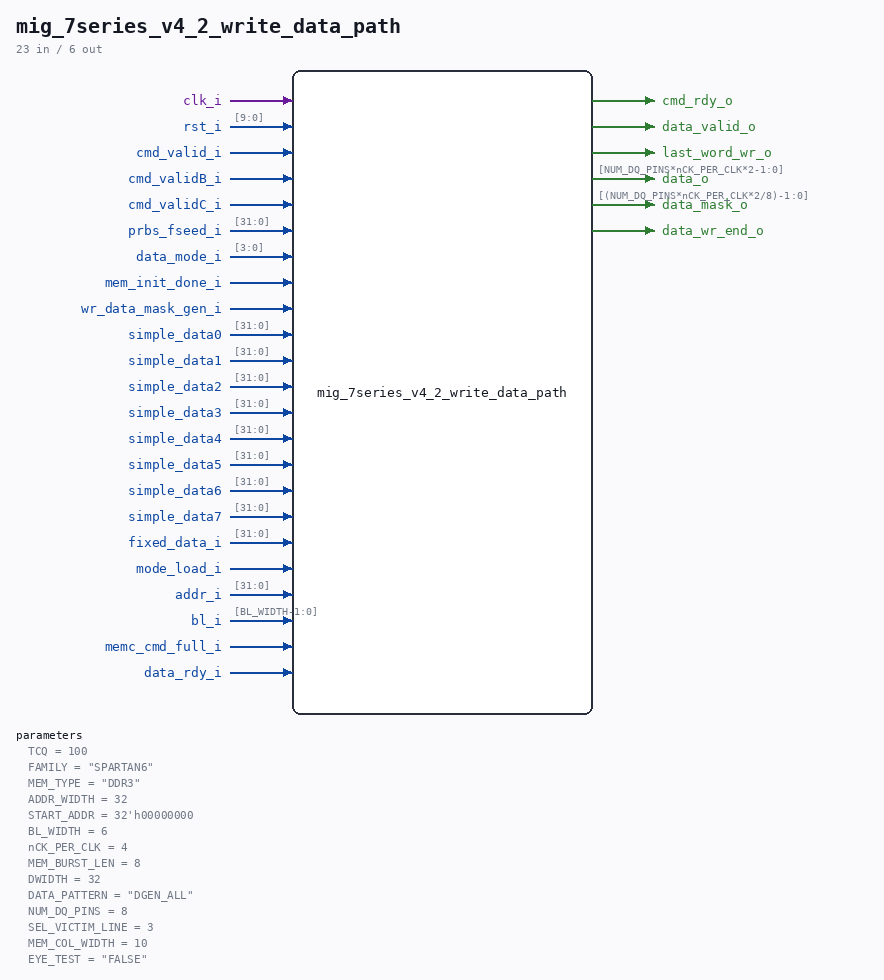

# mig_7series_v4_2_write_data_path

Source: `/mnt/e/Dev/Repos/Ronny/nd-120/Verilog/fpga/nexys4ddr/ddr2-test/ip/ddr/ddr/example_design/rtl/traffic_gen/mig_7series_v4_2_write_data_path.v`

> Generated by `Verilog/tests/module_doc.py` from the `//!`
> comments in the source. Do not edit by hand - edit the RTL comments and regenerate.

## Parameters

| Parameter | Default |
|---|---|
| `TCQ` | `100` |
| `FAMILY` | `"SPARTAN6"` |
| `MEM_TYPE` | `"DDR3"` |
| `ADDR_WIDTH` | `32` |
| `START_ADDR` | `32'h00000000` |
| `BL_WIDTH` | `6` |
| `nCK_PER_CLK` | `4` |
| `MEM_BURST_LEN` | `8` |
| `DWIDTH` | `32` |
| `DATA_PATTERN` | `"DGEN_ALL"` |
| `NUM_DQ_PINS` | `8` |
| `SEL_VICTIM_LINE` | `3` |
| `MEM_COL_WIDTH` | `10` |
| `EYE_TEST` | `"FALSE"` |

## Ports

| Direction | Width | Name | Description |
|---|---|---|---|
| input | `1` | `clk_i` |  |
| input | `[9:0]` | `rst_i` |  |
| output | `1` | `cmd_rdy_o` |  |
| input | `1` | `cmd_valid_i` |  |
| input | `1` | `cmd_validB_i` |  |
| input | `1` | `cmd_validC_i` |  |
| input | `[31:0]` | `prbs_fseed_i` |  |
| input | `[3:0]` | `data_mode_i` |  |
| input | `1` | `mem_init_done_i` |  |
| input | `1` | `wr_data_mask_gen_i` |  |
| input | `[31:0]` | `simple_data0` |  |
| input | `[31:0]` | `simple_data1` |  |
| input | `[31:0]` | `simple_data2` |  |
| input | `[31:0]` | `simple_data3` |  |
| input | `[31:0]` | `simple_data4` |  |
| input | `[31:0]` | `simple_data5` |  |
| input | `[31:0]` | `simple_data6` |  |
| input | `[31:0]` | `simple_data7` |  |
| input | `[31:0]` | `fixed_data_i` |  |
| input | `1` | `mode_load_i` |  |
| input | `[31:0]` | `addr_i` |  |
| input | `[BL_WIDTH-1:0]` | `bl_i` |  |
| input | `1` | `memc_cmd_full_i` |  |
| input | `1` | `data_rdy_i` |  |
| output | `1` | `data_valid_o` |  |
| output | `1` | `last_word_wr_o` |  |
| output | `[NUM_DQ_PINS*nCK_PER_CLK*2-1:0]` | `data_o` |  |
| output | `[(NUM_DQ_PINS*nCK_PER_CLK*2/8)-1:0]` | `data_mask_o` |  |
| output | `1` | `data_wr_end_o` |  |
