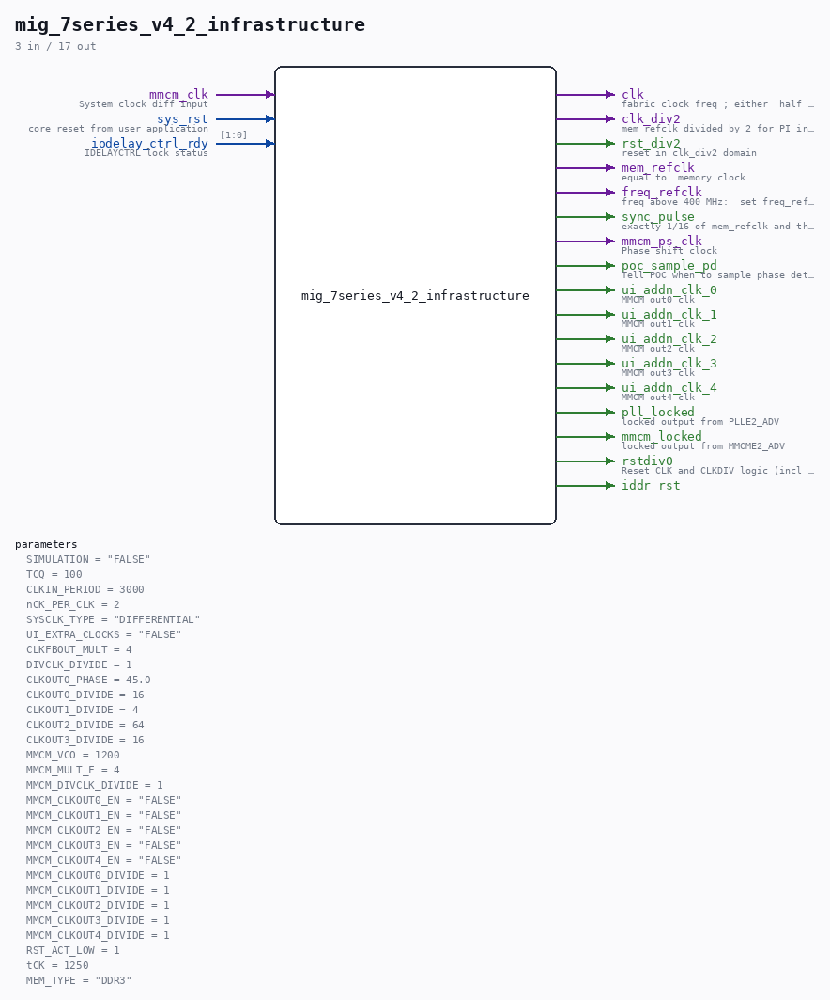

# mig_7series_v4_2_infrastructure

Source: `/mnt/e/Dev/Repos/Ronny/nd-120/Verilog/fpga/nexys4ddr/ddr2-test/ip/ddr/ddr/user_design/rtl/clocking/mig_7series_v4_2_infrastructure.v`

> Generated by `Verilog/tests/module_doc.py` from the `//!`
> comments in the source. Do not edit by hand - edit the RTL comments and regenerate.

## Parameters

| Parameter | Default |
|---|---|
| `SIMULATION` | `"FALSE"` |
| `TCQ` | `100` |
| `CLKIN_PERIOD` | `3000` |
| `nCK_PER_CLK` | `2` |
| `SYSCLK_TYPE` | `"DIFFERENTIAL"` |
| `UI_EXTRA_CLOCKS` | `"FALSE"` |
| `CLKFBOUT_MULT` | `4` |
| `DIVCLK_DIVIDE` | `1` |
| `CLKOUT0_PHASE` | `45.0` |
| `CLKOUT0_DIVIDE` | `16` |
| `CLKOUT1_DIVIDE` | `4` |
| `CLKOUT2_DIVIDE` | `64` |
| `CLKOUT3_DIVIDE` | `16` |
| `MMCM_VCO` | `1200` |
| `MMCM_MULT_F` | `4` |
| `MMCM_DIVCLK_DIVIDE` | `1` |
| `MMCM_CLKOUT0_EN` | `"FALSE"` |
| `MMCM_CLKOUT1_EN` | `"FALSE"` |
| `MMCM_CLKOUT2_EN` | `"FALSE"` |
| `MMCM_CLKOUT3_EN` | `"FALSE"` |
| `MMCM_CLKOUT4_EN` | `"FALSE"` |
| `MMCM_CLKOUT0_DIVIDE` | `1` |
| `MMCM_CLKOUT1_DIVIDE` | `1` |
| `MMCM_CLKOUT2_DIVIDE` | `1` |
| `MMCM_CLKOUT3_DIVIDE` | `1` |
| `MMCM_CLKOUT4_DIVIDE` | `1` |
| `RST_ACT_LOW` | `1` |
| `tCK` | `1250` |
| `MEM_TYPE` | `"DDR3"` |

## Ports

| Direction | Width | Name | Description |
|---|---|---|---|
| input | `1` | `mmcm_clk` | System clock diff input |
| input | `1` | `sys_rst` | core reset from user application |
| input | `[1:0]` | `iodelay_ctrl_rdy` | IDELAYCTRL lock status |
| output | `1` | `clk` | fabric clock freq ; either  half rate or quarter rate and is |
| output | `1` | `clk_div2` | mem_refclk divided by 2 for PI incdec |
| output | `1` | `rst_div2` | reset in clk_div2 domain |
| output | `1` | `mem_refclk` | equal to  memory clock |
| output | `1` | `freq_refclk` | freq above 400 MHz:  set freq_refclk = mem_refclk |
| output | `1` | `sync_pulse` | exactly 1/16 of mem_refclk and the sync pulse is exactly 1 memref_clk wide |
| output | `1` | `mmcm_ps_clk` | Phase shift clock |
| output | `1` | `poc_sample_pd` | Tell POC when to sample phase detector output. |
| output | `1` | `ui_addn_clk_0` | MMCM out0 clk |
| output | `1` | `ui_addn_clk_1` | MMCM out1 clk |
| output | `1` | `ui_addn_clk_2` | MMCM out2 clk |
| output | `1` | `ui_addn_clk_3` | MMCM out3 clk |
| output | `1` | `ui_addn_clk_4` | MMCM out4 clk |
| output | `1` | `pll_locked` | locked output from PLLE2_ADV |
| output | `1` | `mmcm_locked` | locked output from MMCME2_ADV |
| output | `1` | `rstdiv0` | Reset CLK and CLKDIV logic (incl I/O) |
| output | `1` | `iddr_rst` |  |
