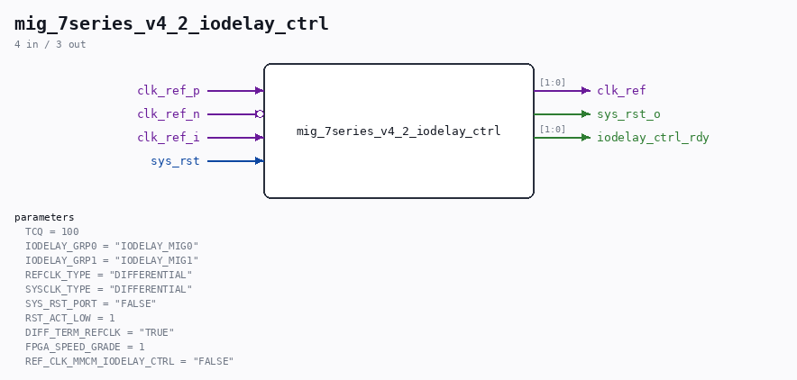

# mig_7series_v4_2_iodelay_ctrl

Source: `/mnt/e/Dev/Repos/Ronny/nd-120/Verilog/fpga/nexys4ddr/ddr2-test/ip/ddr/ddr/user_design/rtl/clocking/mig_7series_v4_2_iodelay_ctrl.v`

> Generated by `Verilog/tests/module_doc.py` from the `//!`
> comments in the source. Do not edit by hand - edit the RTL comments and regenerate.

## Parameters

| Parameter | Default |
|---|---|
| `TCQ` | `100` |
| `IODELAY_GRP0` | `"IODELAY_MIG0"` |
| `IODELAY_GRP1` | `"IODELAY_MIG1"` |
| `REFCLK_TYPE` | `"DIFFERENTIAL"` |
| `SYSCLK_TYPE` | `"DIFFERENTIAL"` |
| `SYS_RST_PORT` | `"FALSE"` |
| `RST_ACT_LOW` | `1` |
| `DIFF_TERM_REFCLK` | `"TRUE"` |
| `FPGA_SPEED_GRADE` | `1` |
| `REF_CLK_MMCM_IODELAY_CTRL` | `"FALSE"` |

## Ports

| Direction | Width | Name | Description |
|---|---|---|---|
| input | `1` | `clk_ref_p` |  |
| input | `1` | `clk_ref_n` *(active low)* |  |
| input | `1` | `clk_ref_i` |  |
| input | `1` | `sys_rst` |  |
| output | `[1:0]` | `clk_ref` |  |
| output | `1` | `sys_rst_o` |  |
| output | `[1:0]` | `iodelay_ctrl_rdy` |  |
