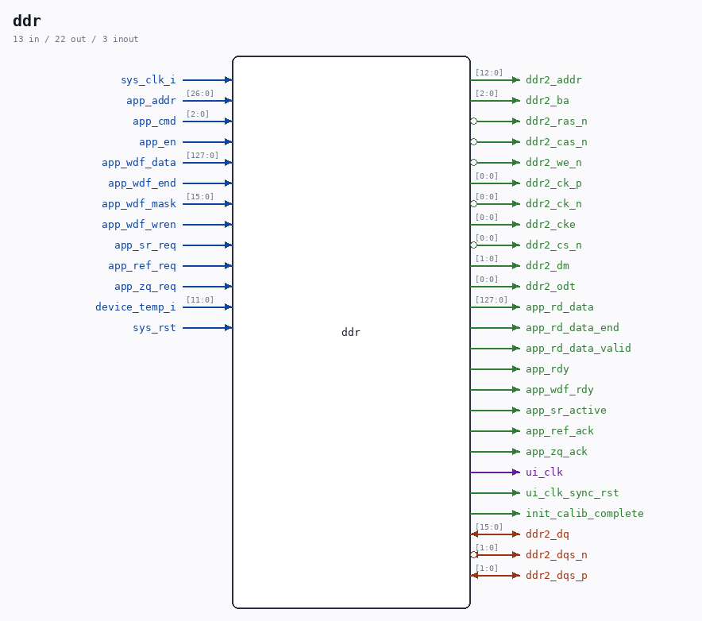

# ddr

Source: `/mnt/e/Dev/Repos/Ronny/nd-120/Verilog/fpga/nexys4ddr/ddr2-test/ip/ddr/ddr/user_design/rtl/ddr.v`

> Generated by `Verilog/tests/module_doc.py` from the `//!`
> comments in the source. Do not edit by hand - edit the RTL comments and regenerate.

## Ports

| Direction | Width | Name | Description |
|---|---|---|---|
| inout | `[15:0]` | `ddr2_dq` |  |
| inout | `[1:0]` | `ddr2_dqs_n` *(active low)* |  |
| inout | `[1:0]` | `ddr2_dqs_p` |  |
| output | `[12:0]` | `ddr2_addr` |  |
| output | `[2:0]` | `ddr2_ba` |  |
| output | `1` | `ddr2_ras_n` *(active low)* |  |
| output | `1` | `ddr2_cas_n` *(active low)* |  |
| output | `1` | `ddr2_we_n` *(active low)* |  |
| output | `[0:0]` | `ddr2_ck_p` |  |
| output | `[0:0]` | `ddr2_ck_n` *(active low)* |  |
| output | `[0:0]` | `ddr2_cke` |  |
| output | `[0:0]` | `ddr2_cs_n` *(active low)* |  |
| output | `[1:0]` | `ddr2_dm` |  |
| output | `[0:0]` | `ddr2_odt` |  |
| input | `1` | `sys_clk_i` |  |
| input | `[26:0]` | `app_addr` |  |
| input | `[2:0]` | `app_cmd` |  |
| input | `1` | `app_en` |  |
| input | `[127:0]` | `app_wdf_data` |  |
| input | `1` | `app_wdf_end` |  |
| input | `[15:0]` | `app_wdf_mask` |  |
| input | `1` | `app_wdf_wren` |  |
| output | `[127:0]` | `app_rd_data` |  |
| output | `1` | `app_rd_data_end` |  |
| output | `1` | `app_rd_data_valid` |  |
| output | `1` | `app_rdy` |  |
| output | `1` | `app_wdf_rdy` |  |
| input | `1` | `app_sr_req` |  |
| input | `1` | `app_ref_req` |  |
| input | `1` | `app_zq_req` |  |
| output | `1` | `app_sr_active` |  |
| output | `1` | `app_ref_ack` |  |
| output | `1` | `app_zq_ack` |  |
| output | `1` | `ui_clk` |  |
| output | `1` | `ui_clk_sync_rst` |  |
| output | `1` | `init_calib_complete` |  |
| input | `[11:0]` | `device_temp_i` |  |
| input | `1` | `sys_rst` |  |
