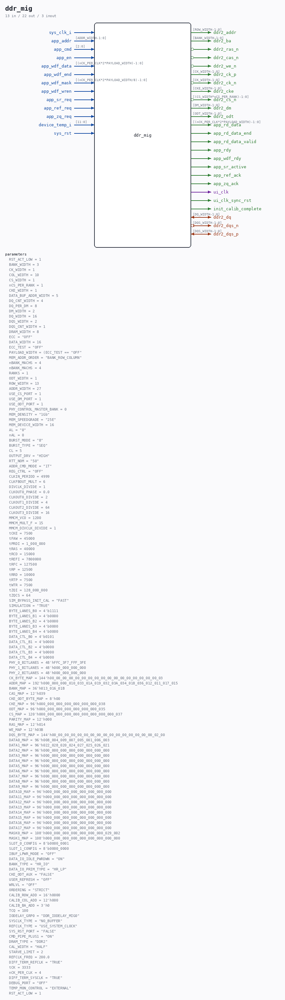

# ddr_mig

Source: `/mnt/e/Dev/Repos/Ronny/nd-120/Verilog/fpga/nexys4ddr/ddr2-test/ip/ddr/ddr/user_design/rtl/ddr_mig_sim.v`

> Generated by `Verilog/tests/module_doc.py` from the `//!`
> comments in the source. Do not edit by hand - edit the RTL comments and regenerate.

## Parameters

| Parameter | Default |
|---|---|
| `RST_ACT_LOW` | `1` |
| `BANK_WIDTH` | `3` |
| `CK_WIDTH` | `1` |
| `COL_WIDTH` | `10` |
| `CS_WIDTH` | `1` |
| `nCS_PER_RANK` | `1` |
| `CKE_WIDTH` | `1` |
| `DATA_BUF_ADDR_WIDTH` | `5` |
| `DQ_CNT_WIDTH` | `4` |
| `DQ_PER_DM` | `8` |
| `DM_WIDTH` | `2` |
| `DQ_WIDTH` | `16` |
| `DQS_WIDTH` | `2` |
| `DQS_CNT_WIDTH` | `1` |
| `DRAM_WIDTH` | `8` |
| `ECC` | `"OFF"` |
| `DATA_WIDTH` | `16` |
| `ECC_TEST` | `"OFF"` |
| `PAYLOAD_WIDTH` | `(ECC_TEST == "OFF"` |
| `MEM_ADDR_ORDER` | `"BANK_ROW_COLUMN"` |
| `nBANK_MACHS` | `4` |
| `nBANK_MACHS` | `4` |
| `RANKS` | `1` |
| `ODT_WIDTH` | `1` |
| `ROW_WIDTH` | `13` |
| `ADDR_WIDTH` | `27` |
| `USE_CS_PORT` | `1` |
| `USE_DM_PORT` | `1` |
| `USE_ODT_PORT` | `1` |
| `PHY_CONTROL_MASTER_BANK` | `0` |
| `MEM_DENSITY` | `"1Gb"` |
| `MEM_SPEEDGRADE` | `"25E"` |
| `MEM_DEVICE_WIDTH` | `16` |
| `AL` | `"0"` |
| `nAL` | `0` |
| `BURST_MODE` | `"8"` |
| `BURST_TYPE` | `"SEQ"` |
| `CL` | `5` |
| `OUTPUT_DRV` | `"HIGH"` |
| `RTT_NOM` | `"50"` |
| `ADDR_CMD_MODE` | `"1T"` |
| `REG_CTRL` | `"OFF"` |
| `CLKIN_PERIOD` | `4999` |
| `CLKFBOUT_MULT` | `6` |
| `DIVCLK_DIVIDE` | `1` |
| `CLKOUT0_PHASE` | `0.0` |
| `CLKOUT0_DIVIDE` | `2` |
| `CLKOUT1_DIVIDE` | `4` |
| `CLKOUT2_DIVIDE` | `64` |
| `CLKOUT3_DIVIDE` | `16` |
| `MMCM_VCO` | `1200` |
| `MMCM_MULT_F` | `15` |
| `MMCM_DIVCLK_DIVIDE` | `1` |
| `tCKE` | `7500` |
| `tFAW` | `45000` |
| `tPRDI` | `1_000_000` |
| `tRAS` | `40000` |
| `tRCD` | `15000` |
| `tREFI` | `7800000` |
| `tRFC` | `127500` |
| `tRP` | `12500` |
| `tRRD` | `10000` |
| `tRTP` | `7500` |
| `tWTR` | `7500` |
| `tZQI` | `128_000_000` |
| `tZQCS` | `64` |
| `SIM_BYPASS_INIT_CAL` | `"FAST"` |
| `SIMULATION` | `"TRUE"` |
| `BYTE_LANES_B0` | `4'b1111` |
| `BYTE_LANES_B1` | `4'b0000` |
| `BYTE_LANES_B2` | `4'b0000` |
| `BYTE_LANES_B3` | `4'b0000` |
| `BYTE_LANES_B4` | `4'b0000` |
| `DATA_CTL_B0` | `4'b0101` |
| `DATA_CTL_B1` | `4'b0000` |
| `DATA_CTL_B2` | `4'b0000` |
| `DATA_CTL_B3` | `4'b0000` |
| `DATA_CTL_B4` | `4'b0000` |
| `PHY_0_BITLANES` | `48'hFFC_3F7_FFF_3FE` |
| `PHY_1_BITLANES` | `48'h000_000_000_000` |
| `PHY_2_BITLANES` | `48'h000_000_000_000` |
| `CK_BYTE_MAP` | `144'h00_00_00_00_00_00_00_00_00_00_00_00_00_00_00_00_00_03` |
| `ADDR_MAP` | `192'h000_000_000_010_033_01A_019_032_03A_034_018_036_012_011_017_015` |
| `BANK_MAP` | `36'h013_016_01B` |
| `CAS_MAP` | `12'h039` |
| `CKE_ODT_BYTE_MAP` | `8'h00` |
| `CKE_MAP` | `96'h000_000_000_000_000_000_000_038` |
| `ODT_MAP` | `96'h000_000_000_000_000_000_000_035` |
| `CS_MAP` | `120'h000_000_000_000_000_000_000_000_000_037` |
| `PARITY_MAP` | `12'h000` |
| `RAS_MAP` | `12'h014` |
| `WE_MAP` | `12'h03B` |
| `DQS_BYTE_MAP` | `144'h00_00_00_00_00_00_00_00_00_00_00_00_00_00_00_00_02_00` |
| `DATA0_MAP` | `96'h008_004_009_007_005_001_006_003` |
| `DATA1_MAP` | `96'h022_028_020_024_027_025_026_021` |
| `DATA2_MAP` | `96'h000_000_000_000_000_000_000_000` |
| `DATA3_MAP` | `96'h000_000_000_000_000_000_000_000` |
| `DATA4_MAP` | `96'h000_000_000_000_000_000_000_000` |
| `DATA5_MAP` | `96'h000_000_000_000_000_000_000_000` |
| `DATA6_MAP` | `96'h000_000_000_000_000_000_000_000` |
| `DATA7_MAP` | `96'h000_000_000_000_000_000_000_000` |
| `DATA8_MAP` | `96'h000_000_000_000_000_000_000_000` |
| `DATA9_MAP` | `96'h000_000_000_000_000_000_000_000` |
| `DATA10_MAP` | `96'h000_000_000_000_000_000_000_000` |
| `DATA11_MAP` | `96'h000_000_000_000_000_000_000_000` |
| `DATA12_MAP` | `96'h000_000_000_000_000_000_000_000` |
| `DATA13_MAP` | `96'h000_000_000_000_000_000_000_000` |
| `DATA14_MAP` | `96'h000_000_000_000_000_000_000_000` |
| `DATA15_MAP` | `96'h000_000_000_000_000_000_000_000` |
| `DATA16_MAP` | `96'h000_000_000_000_000_000_000_000` |
| `DATA17_MAP` | `96'h000_000_000_000_000_000_000_000` |
| `MASK0_MAP` | `108'h000_000_000_000_000_000_000_029_002` |
| `MASK1_MAP` | `108'h000_000_000_000_000_000_000_000_000` |
| `SLOT_0_CONFIG` | `8'b0000_0001` |
| `SLOT_1_CONFIG` | `8'b0000_0000` |
| `IBUF_LPWR_MODE` | `"OFF"` |
| `DATA_IO_IDLE_PWRDWN` | `"ON"` |
| `BANK_TYPE` | `"HR_IO"` |
| `DATA_IO_PRIM_TYPE` | `"HR_LP"` |
| `CKE_ODT_AUX` | `"FALSE"` |
| `USER_REFRESH` | `"OFF"` |
| `WRLVL` | `"OFF"` |
| `ORDERING` | `"STRICT"` |
| `CALIB_ROW_ADD` | `16'h0000` |
| `CALIB_COL_ADD` | `12'h000` |
| `CALIB_BA_ADD` | `3'h0` |
| `TCQ` | `100` |
| `IODELAY_GRP0` | `"DDR_IODELAY_MIG0"` |
| `SYSCLK_TYPE` | `"NO_BUFFER"` |
| `REFCLK_TYPE` | `"USE_SYSTEM_CLOCK"` |
| `SYS_RST_PORT` | `"FALSE"` |
| `CMD_PIPE_PLUS1` | `"ON"` |
| `DRAM_TYPE` | `"DDR2"` |
| `CAL_WIDTH` | `"HALF"` |
| `STARVE_LIMIT` | `2` |
| `REFCLK_FREQ` | `200.0` |
| `DIFF_TERM_REFCLK` | `"TRUE"` |
| `tCK` | `3333` |
| `nCK_PER_CLK` | `4` |
| `DIFF_TERM_SYSCLK` | `"TRUE"` |
| `DEBUG_PORT` | `"OFF"` |
| `TEMP_MON_CONTROL` | `"EXTERNAL"` |
| `RST_ACT_LOW` | `1` |

## Ports

| Direction | Width | Name | Description |
|---|---|---|---|
| inout | `[DQ_WIDTH-1:0]` | `ddr2_dq` |  |
| inout | `[DQS_WIDTH-1:0]` | `ddr2_dqs_n` *(active low)* |  |
| inout | `[DQS_WIDTH-1:0]` | `ddr2_dqs_p` |  |
| output | `[ROW_WIDTH-1:0]` | `ddr2_addr` |  |
| output | `[BANK_WIDTH-1:0]` | `ddr2_ba` |  |
| output | `1` | `ddr2_ras_n` *(active low)* |  |
| output | `1` | `ddr2_cas_n` *(active low)* |  |
| output | `1` | `ddr2_we_n` *(active low)* |  |
| output | `[CK_WIDTH-1:0]` | `ddr2_ck_p` |  |
| output | `[CK_WIDTH-1:0]` | `ddr2_ck_n` *(active low)* |  |
| output | `[CKE_WIDTH-1:0]` | `ddr2_cke` |  |
| output | `[(CS_WIDTH*nCS_PER_RANK)-1:0]` | `ddr2_cs_n` *(active low)* |  |
| output | `[DM_WIDTH-1:0]` | `ddr2_dm` |  |
| output | `[ODT_WIDTH-1:0]` | `ddr2_odt` |  |
| input | `1` | `sys_clk_i` |  |
| input | `[ADDR_WIDTH-1:0]` | `app_addr` |  |
| input | `[2:0]` | `app_cmd` |  |
| input | `1` | `app_en` |  |
| input | `[(nCK_PER_CLK*2*PAYLOAD_WIDTH)-1:0]` | `app_wdf_data` |  |
| input | `1` | `app_wdf_end` |  |
| input | `[(nCK_PER_CLK*2*PAYLOAD_WIDTH/8)-1:0]` | `app_wdf_mask` |  |
| input | `1` | `app_wdf_wren` |  |
| output | `[(nCK_PER_CLK*2*PAYLOAD_WIDTH)-1:0]` | `app_rd_data` |  |
| output | `1` | `app_rd_data_end` |  |
| output | `1` | `app_rd_data_valid` |  |
| output | `1` | `app_rdy` |  |
| output | `1` | `app_wdf_rdy` |  |
| input | `1` | `app_sr_req` |  |
| input | `1` | `app_ref_req` |  |
| input | `1` | `app_zq_req` |  |
| output | `1` | `app_sr_active` |  |
| output | `1` | `app_ref_ack` |  |
| output | `1` | `app_zq_ack` |  |
| output | `1` | `ui_clk` |  |
| output | `1` | `ui_clk_sync_rst` |  |
| output | `1` | `init_calib_complete` |  |
| input | `[11:0]` | `device_temp_i` |  |
| input | `1` | `sys_rst` |  |
