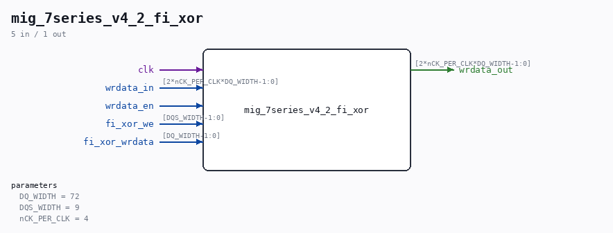

# mig_7series_v4_2_fi_xor

Source: `/mnt/e/Dev/Repos/Ronny/nd-120/Verilog/fpga/nexys4ddr/ddr2-test/ip/ddr/ddr/user_design/rtl/ecc/mig_7series_v4_2_fi_xor.v`

> Generated by `Verilog/tests/module_doc.py` from the `//!`
> comments in the source. Do not edit by hand - edit the RTL comments and regenerate.

## Parameters

| Parameter | Default |
|---|---|
| `DQ_WIDTH` | `72` |
| `DQS_WIDTH` | `9` |
| `nCK_PER_CLK` | `4` |

## Ports

| Direction | Width | Name | Description |
|---|---|---|---|
| input | `1` | `clk` |  |
| input | `[2*nCK_PER_CLK*DQ_WIDTH-1:0]` | `wrdata_in` |  |
| output | `[2*nCK_PER_CLK*DQ_WIDTH-1:0]` | `wrdata_out` |  |
| input | `1` | `wrdata_en` |  |
| input | `[DQS_WIDTH-1:0]` | `fi_xor_we` |  |
| input | `[DQ_WIDTH-1:0]` | `fi_xor_wrdata` |  |
