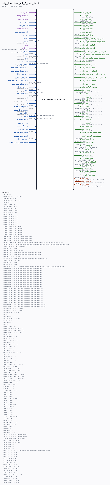

# mig_7series_v4_2_mem_intfc

Source: `/mnt/e/Dev/Repos/Ronny/nd-120/Verilog/fpga/nexys4ddr/ddr2-test/ip/ddr/ddr/user_design/rtl/ip_top/mig_7series_v4_2_mem_intfc.v`

> Generated by `Verilog/tests/module_doc.py` from the `//!`
> comments in the source. Do not edit by hand - edit the RTL comments and regenerate.

## Parameters

| Parameter | Default |
|---|---|
| `TCQ` | `100` |
| `DDR3_VDD_OP_VOLT` | `"135"` |
| `PAYLOAD_WIDTH` | `64` |
| `ADDR_CMD_MODE` | `"1T"` |
| `AL` | `"0"` |
| `BANK_WIDTH` | `3` |
| `BM_CNT_WIDTH` | `2` |
| `BURST_MODE` | `"8"` |
| `BURST_TYPE` | `"SEQ"` |
| `CA_MIRROR` | `"OFF"` |
| `CK_WIDTH` | `1` |
| `DATA_CTL_B0` | `4'hc` |
| `DATA_CTL_B1` | `4'hf` |
| `DATA_CTL_B2` | `4'hf` |
| `DATA_CTL_B3` | `4'hf` |
| `DATA_CTL_B4` | `4'hf` |
| `BYTE_LANES_B0` | `4'b1111` |
| `BYTE_LANES_B1` | `4'b0000` |
| `BYTE_LANES_B2` | `4'b0000` |
| `BYTE_LANES_B3` | `4'b0000` |
| `BYTE_LANES_B4` | `4'b0000` |
| `PHY_0_BITLANES` | `48'h0000_0000_0000` |
| `PHY_1_BITLANES` | `48'h0000_0000_0000` |
| `PHY_2_BITLANES` | `48'h0000_0000_0000` |
| `CK_BYTE_MAP` | `144'h00_00_00_00_00_00_00_00_00_00_00_00_00_00_00_00_00_00` |
| `ADDR_MAP` | `192'h000_000_000_000_000_000_000_000_000_000_000_000_000_000_000_000` |
| `BANK_MAP` | `36'h000_000_000` |
| `CAS_MAP` | `12'h000` |
| `CKE_ODT_BYTE_MAP` | `8'h00` |
| `CKE_MAP` | `96'h000_000_000_000_000_000_000_000` |
| `ODT_MAP` | `96'h000_000_000_000_000_000_000_000` |
| `CKE_ODT_AUX` | `"FALSE"` |
| `CS_MAP` | `120'h000_000_000_000_000_000_000_000_000_000` |
| `PARITY_MAP` | `12'h000` |
| `RAS_MAP` | `12'h000` |
| `WE_MAP` | `12'h000` |
| `DQS_BYTE_MAP` | `144'h00_00_00_00_00_00_00_00_00_00_00_00_00_00_00_00_00_00` |
| `DATA0_MAP` | `96'h000_000_000_000_000_000_000_000` |
| `DATA1_MAP` | `96'h000_000_000_000_000_000_000_000` |
| `DATA2_MAP` | `96'h000_000_000_000_000_000_000_000` |
| `DATA3_MAP` | `96'h000_000_000_000_000_000_000_000` |
| `DATA4_MAP` | `96'h000_000_000_000_000_000_000_000` |
| `DATA5_MAP` | `96'h000_000_000_000_000_000_000_000` |
| `DATA6_MAP` | `96'h000_000_000_000_000_000_000_000` |
| `DATA7_MAP` | `96'h000_000_000_000_000_000_000_000` |
| `DATA8_MAP` | `96'h000_000_000_000_000_000_000_000` |
| `DATA9_MAP` | `96'h000_000_000_000_000_000_000_000` |
| `DATA10_MAP` | `96'h000_000_000_000_000_000_000_000` |
| `DATA11_MAP` | `96'h000_000_000_000_000_000_000_000` |
| `DATA12_MAP` | `96'h000_000_000_000_000_000_000_000` |
| `DATA13_MAP` | `96'h000_000_000_000_000_000_000_000` |
| `DATA14_MAP` | `96'h000_000_000_000_000_000_000_000` |
| `DATA15_MAP` | `96'h000_000_000_000_000_000_000_000` |
| `DATA16_MAP` | `96'h000_000_000_000_000_000_000_000` |
| `DATA17_MAP` | `96'h000_000_000_000_000_000_000_000` |
| `MASK0_MAP` | `108'h000_000_000_000_000_000_000_000_000` |
| `MASK1_MAP` | `108'h000_000_000_000_000_000_000_000_000` |
| `CALIB_ROW_ADD` | `16'h0000` |
| `CALIB_COL_ADD` | `12'h000` |
| `CALIB_BA_ADD` | `3'h0` |
| `CL` | `5` |
| `COL_WIDTH` | `12` |
| `CMD_PIPE_PLUS1` | `"ON"` |
| `CS_WIDTH` | `1` |
| `CKE_WIDTH` | `1` |
| `CWL` | `5` |
| `DATA_WIDTH` | `64` |
| `DATA_BUF_ADDR_WIDTH` | `8` |
| `DATA_BUF_OFFSET_WIDTH` | `1` |
| `DDR2_DQSN_ENABLE` | `"YES"` |
| `DM_WIDTH` | `8` |
| `DQ_CNT_WIDTH` | `6` |
| `DQ_WIDTH` | `64` |
| `DQS_CNT_WIDTH` | `3` |
| `DQS_WIDTH` | `8` |
| `DRAM_TYPE` | `"DDR3"` |
| `DRAM_WIDTH` | `8` |
| `ECC` | `"OFF"` |
| `ECC_WIDTH` | `8` |
| `MC_ERR_ADDR_WIDTH` | `31` |
| `nAL` | `0` |
| `nBANK_MACHS` | `4` |
| `PRE_REV3ES` | `"OFF"` |
| `nCK_PER_CLK` | `4` |
| `nCS_PER_RANK` | `1` |
| `PHYCTL_CMD_FIFO` | `"FALSE"` |
| `ORDERING` | `"NORM"` |
| `PHASE_DETECT` | `"OFF"` |
| `IBUF_LPWR_MODE` | `"OFF"` |
| `BANK_TYPE` | `"HP_IO"` |
| `DATA_IO_PRIM_TYPE` | `"DEFAULT"` |
| `DATA_IO_IDLE_PWRDWN` | `"ON"` |
| `IODELAY_GRP` | `"IODELAY_MIG"` |
| `FPGA_SPEED_GRADE` | `1` |
| `OUTPUT_DRV` | `"HIGH"` |
| `REG_CTRL` | `"OFF"` |
| `RTT_NOM` | `"60"` |
| `RTT_WR` | `"120"` |
| `STARVE_LIMIT` | `2` |
| `tCK` | `2500` |
| `tCKE` | `10000` |
| `tFAW` | `40000` |
| `tPRDI` | `1_000_000` |
| `tRAS` | `37500` |
| `tRCD` | `12500` |
| `tREFI` | `7800000` |
| `tRFC` | `110000` |
| `tRP` | `12500` |
| `tRRD` | `10000` |
| `tRTP` | `7500` |
| `tWTR` | `7500` |
| `tZQI` | `128_000_000` |
| `tZQCS` | `64` |
| `WRLVL` | `"OFF"` |
| `DEBUG_PORT` | `"OFF"` |
| `CAL_WIDTH` | `"HALF"` |
| `RANK_WIDTH` | `1` |
| `RANKS` | `4` |
| `ODT_WIDTH` | `1` |
| `ROW_WIDTH` | `16` |
| `SLOT_0_CONFIG` | `8'b0000_0001` |
| `SLOT_1_CONFIG` | `8'b0000_0000` |
| `SIM_BYPASS_INIT_CAL` | `"OFF"` |
| `REFCLK_FREQ` | `300.0` |
| `nDQS_COL0` | `DQS_WIDTH` |
| `nDQS_COL1` | `0` |
| `nDQS_COL2` | `0` |
| `nDQS_COL3` | `0` |
| `DQS_LOC_COL0` | `144'h11100F0E0D0C0B0A09080706050403020100` |
| `DQS_LOC_COL1` | `0` |
| `DQS_LOC_COL2` | `0` |
| `DQS_LOC_COL3` | `0` |
| `USE_CS_PORT` | `1` |
| `USE_DM_PORT` | `1` |
| `USE_ODT_PORT` | `1` |
| `MASTER_PHY_CTL` | `0` |
| `USER_REFRESH` | `"OFF"` |
| `TEMP_MON_EN` | `"ON"` |
| `IDELAY_ADJ` | `"ON"` |
| `FINE_PER_BIT` | `"ON"` |
| `CENTER_COMP_MODE` | `"ON"` |
| `PI_VAL_ADJ` | `"ON"` |
| `TAPSPERKCLK` | `56` |
| `SKIP_CALIB` | `"FALSE"` |
| `FPGA_VOLT_TYPE` | `"N"` |

## Ports

| Direction | Width | Name | Description |
|---|---|---|---|
| input | `1` | `clk_ref` |  |
| input | `1` | `freq_refclk` |  |
| input | `1` | `mem_refclk` |  |
| input | `1` | `pll_lock` |  |
| input | `1` | `sync_pulse` |  |
| input | `1` | `mmcm_ps_clk` |  |
| input | `1` | `poc_sample_pd` |  |
| input | `1` | `error` |  |
| input | `1` | `reset` |  |
| output | `1` | `rst_tg_mc` |  |
| input | `[BANK_WIDTH-1:0]` | `bank` | To mc0 of mc.v |
| input | `1` | `clk` |  |
| input | `1` | `clk_div2` | mem_refclk divided by 2 for PI incdec |
| input | `1` | `rst_div2` | reset in clk_div2 domain |
| input | `[2:0]` | `cmd` | To mc0 of mc.v |
| input | `[COL_WIDTH-1:0]` | `col` | To mc0 of mc.v |
| input | `1` | `correct_en` |  |
| input | `[DATA_BUF_ADDR_WIDTH-1:0]` | `data_buf_addr` | To mc0 of mc.v |
| input | `1` | `dbg_idel_down_all` |  |
| input | `1` | `dbg_idel_down_cpt` |  |
| input | `1` | `dbg_idel_up_all` |  |
| input | `1` | `dbg_idel_up_cpt` |  |
| input | `1` | `dbg_sel_all_idel_cpt` |  |
| input | `[DQS_CNT_WIDTH-1:0]` | `dbg_sel_idel_cpt` |  |
| input | `1` | `hi_priority` | To mc0 of mc.v |
| input | `[RANK_WIDTH-1:0]` | `rank` | To mc0 of mc.v |
| input | `[2*nCK_PER_CLK-1:0]` | `raw_not_ecc` |  |
| input | `[ROW_WIDTH-1:0]` | `row` | To mc0 of mc.v |
| input | `1` | `rst` | To mc0 of mc.v, ... |
| input | `1` | `size` | To mc0 of mc.v |
| input | `[7:0]` | `slot_0_present` | To mc0 of mc.v |
| input | `[7:0]` | `slot_1_present` | To mc0 of mc.v |
| input | `1` | `use_addr` | To mc0 of mc.v |
| input | `[2*nCK_PER_CLK*PAYLOAD_WIDTH-1:0]` | `wr_data` |  |
| input | `[2*nCK_PER_CLK*DATA_WIDTH/8-1:0]` | `wr_data_mask` |  |
| output | `1` | `accept` | From mc0 of mc.v |
| output | `1` | `accept_ns` | From mc0 of mc.v |
| output | `[BM_CNT_WIDTH-1:0]` | `bank_mach_next` | From mc0 of mc.v |
| input | `1` | `app_sr_req` |  |
| output | `1` | `app_sr_active` |  |
| input | `1` | `app_ref_req` |  |
| output | `1` | `app_ref_ack` |  |
| input | `1` | `app_zq_req` |  |
| output | `1` | `app_zq_ack` |  |
| output | `[255:0]` | `dbg_calib_top` |  |
| output | `[6*DQS_WIDTH*RANKS-1:0]` | `dbg_cpt_first_edge_cnt` |  |
| output | `[6*DQS_WIDTH*RANKS-1:0]` | `dbg_cpt_second_edge_cnt` |  |
| output | `[255:0]` | `dbg_phy_rdlvl` |  |
| output | `[99:0]` | `dbg_phy_wrcal` |  |
| output | `[6*DQS_WIDTH-1:0]` | `dbg_final_po_fine_tap_cnt` |  |
| output | `[3*DQS_WIDTH-1:0]` | `dbg_final_po_coarse_tap_cnt` |  |
| output | `[DQS_WIDTH-1:0]` | `dbg_rd_data_edge_detect` |  |
| output | `[2*nCK_PER_CLK*DQ_WIDTH-1:0]` | `dbg_rddata` |  |
| output | `[1:0]` | `dbg_rdlvl_done` |  |
| output | `[1:0]` | `dbg_rdlvl_err` |  |
| output | `[1:0]` | `dbg_rdlvl_start` |  |
| output | `[5:0]` | `dbg_tap_cnt_during_wrlvl` |  |
| output | `1` | `dbg_wl_edge_detect_valid` |  |
| output | `1` | `dbg_wrlvl_done` |  |
| output | `1` | `dbg_wrlvl_err` |  |
| output | `1` | `dbg_wrlvl_start` |  |
| output | `[ROW_WIDTH-1:0]` | `ddr_addr` | From phy_top0 of phy_top.v |
| output | `[BANK_WIDTH-1:0]` | `ddr_ba` | From phy_top0 of phy_top.v |
| output | `1` | `ddr_cas_n` *(active low)* | From phy_top0 of phy_top.v |
| output | `[CK_WIDTH-1:0]` | `ddr_ck_n` *(active low)* | From phy_top0 of phy_top.v |
| output | `[CK_WIDTH-1:0]` | `ddr_ck` | From phy_top0 of phy_top.v |
| output | `[CKE_WIDTH-1:0]` | `ddr_cke` | From phy_top0 of phy_top.v |
| output | `[CS_WIDTH*nCS_PER_RANK-1:0]` | `ddr_cs_n` *(active low)* | From phy_top0 of phy_top.v |
| output | `[DM_WIDTH-1:0]` | `ddr_dm` | From phy_top0 of phy_top.v |
| output | `[ODT_WIDTH-1:0]` | `ddr_odt` | From phy_top0 of phy_top.v |
| output | `1` | `ddr_ras_n` *(active low)* | From phy_top0 of phy_top.v |
| output | `1` | `ddr_reset_n` *(active low)* | From phy_top0 of phy_top.v |
| output | `1` | `ddr_parity` |  |
| output | `1` | `ddr_we_n` *(active low)* | From phy_top0 of phy_top.v |
| output | `1` | `init_calib_complete` |  |
| output | `1` | `init_wrcal_complete` |  |
| output | `[MC_ERR_ADDR_WIDTH-1:0]` | `ecc_err_addr` |  |
| output | `[2*nCK_PER_CLK-1:0]` | `ecc_multiple` |  |
| output | `[2*nCK_PER_CLK-1:0]` | `ecc_single` |  |
| output | `[2*nCK_PER_CLK*PAYLOAD_WIDTH-1:0]` | `rd_data` |  |
| output | `[DATA_BUF_ADDR_WIDTH-1:0]` | `rd_data_addr` |  |
| output | `1` | `rd_data_en` | From mc0 of mc.v |
| output | `1` | `rd_data_end` | From mc0 of mc.v |
| output | `[DATA_BUF_OFFSET_WIDTH-1:0]` | `rd_data_offset` | From mc0 of mc.v |
| output | `[DATA_BUF_ADDR_WIDTH-1:0]` | `wr_data_addr` | From mc0 of mc.v |
| output | `1` | `wr_data_en` | From mc0 of mc.v |
| output | `[DATA_BUF_OFFSET_WIDTH-1:0]` | `wr_data_offset` | From mc0 of mc.v |
| output | `1` | `calib_tap_req` |  |
| input | `[6:0]` | `calib_tap_addr` |  |
| input | `1` | `calib_tap_load` |  |
| input | `[7:0]` | `calib_tap_val` |  |
| input | `1` | `calib_tap_load_done` |  |
| inout | `[DQ_WIDTH-1:0]` | `ddr_dq` | To/From phy_top0 of phy_top.v |
| inout | `[DQS_WIDTH-1:0]` | `ddr_dqs_n` *(active low)* | To/From phy_top0 of phy_top.v |
| inout | `[DQS_WIDTH-1:0]` | `ddr_dqs` | To/From phy_top0 of phy_top.v |
