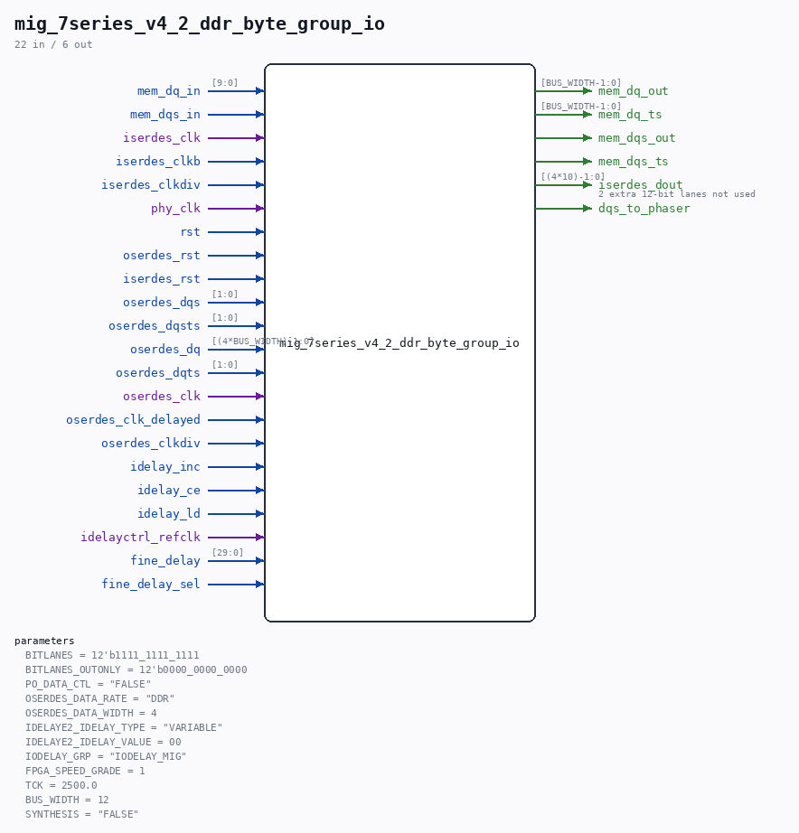

# mig_7series_v4_2_ddr_byte_group_io

Source: `/mnt/e/Dev/Repos/Ronny/nd-120/Verilog/fpga/nexys4ddr/ddr2-test/ip/ddr/ddr/user_design/rtl/phy/mig_7series_v4_2_ddr_byte_group_io.v`

> Generated by `Verilog/tests/module_doc.py` from the `//!`
> comments in the source. Do not edit by hand - edit the RTL comments and regenerate.

## Description

-- (c) Copyright 2023 Advanced Micro Devices, Inc. All rights reserved.
--
-- This file contains confidential and proprietary information
-- of AMD and is protected under U.S. and international copyright
-- and other intellectual property laws.
--
-- DISCLAIMER
-- This disclaimer is not a license and does not grant any
-- rights to the materials distributed herewith. Except as
-- otherwise provided in a valid license issued to you by
-- AMD, and to the maximum extent permitted by applicable
-- law: (1) THESE MATERIALS ARE MADE AVAILABLE "AS IS" AND
-- WITH ALL FAULTS, AND AMD HEREBY DISCLAIMS ALL WARRANTIES
-- AND CONDITIONS, EXPRESS, IMPLIED, OR STATUTORY, INCLUDING
-- BUT NOT LIMITED TO WARRANTIES OF MERCHANTABILITY, NON-
-- INFRINGEMENT, OR FITNESS FOR ANY PARTICULAR PURPOSE; and
-- (2) AMD shall not be liable (whether in contract or tort,
-- including negligence, or under any other theory of
-- liability) for any loss or damage of any kind or nature
-- related to, arising under or in connection with these
-- materials, including for any direct, or any indirect,
-- special, incidental, or consequential loss or damage
-- (including loss of data, profits, goodwill, or any type of
-- loss or damage suffered as a result of any action brought
-- by a third party) even if such damage or loss was
-- reasonably foreseeable or AMD had been advised of the
-- possibility of the same.
--
-- CRITICAL APPLICATIONS
-- AMD products are not designed or intended to be fail-
-- safe, or for use in any application requiring fail-safe
-- performance, such as life-support or safety devices or
-- systems, Class III medical devices, nuclear facilities,
-- applications related to the deployment of airbags, or any
-- other applications that could lead to death, personal
-- injury, or severe property or environmental damage
-- (individually and collectively, "Critical
-- Applications"). Customer assumes the sole risk and
-- liability of any use of AMD products in Critical
-- Applications, subject only to applicable laws and
-- regulations governing limitations on product liability.
--
-- THIS COPYRIGHT NOTICE AND DISCLAIMER MUST BE RETAINED AS
-- PART OF THIS FILE AT ALL TIMES.
//
//
//  Owner:        Gary Martin
//  Revision:     $Id: //depot/icm/proj/common/head/rtl/v32_cmt/rtl/phy/byte_group_io.v#4 $
//                $Author: $
//                $DateTime: $
//                $Change: $
//  Description:
//    This verilog file is a paramertizable I/O termination for
//    the single byte lane.
//    to create a N byte-lane wide phy.
//
//  History:
//  Date        Engineer    Description
//  04/01/2010  G. Martin   Initial Checkin.
//
//////////////////////////////////////////////////////////////////

## Parameters

| Parameter | Default |
|---|---|
| `BITLANES` | `12'b1111_1111_1111` |
| `BITLANES_OUTONLY` | `12'b0000_0000_0000` |
| `PO_DATA_CTL` | `"FALSE"` |
| `OSERDES_DATA_RATE` | `"DDR"` |
| `OSERDES_DATA_WIDTH` | `4` |
| `IDELAYE2_IDELAY_TYPE` | `"VARIABLE"` |
| `IDELAYE2_IDELAY_VALUE` | `00` |
| `IODELAY_GRP` | `"IODELAY_MIG"` |
| `FPGA_SPEED_GRADE` | `1` |
| `TCK` | `2500.0` |
| `BUS_WIDTH` | `12` |
| `SYNTHESIS` | `"FALSE"` |

## Ports

| Direction | Width | Name | Description |
|---|---|---|---|
| input | `[9:0]` | `mem_dq_in` |  |
| output | `[BUS_WIDTH-1:0]` | `mem_dq_out` |  |
| output | `[BUS_WIDTH-1:0]` | `mem_dq_ts` |  |
| input | `1` | `mem_dqs_in` |  |
| output | `1` | `mem_dqs_out` |  |
| output | `1` | `mem_dqs_ts` |  |
| output | `[(4*10)-1:0]` | `iserdes_dout` | 2 extra 12-bit lanes not used |
| output | `1` | `dqs_to_phaser` |  |
| input | `1` | `iserdes_clk` |  |
| input | `1` | `iserdes_clkb` |  |
| input | `1` | `iserdes_clkdiv` |  |
| input | `1` | `phy_clk` |  |
| input | `1` | `rst` |  |
| input | `1` | `oserdes_rst` |  |
| input | `1` | `iserdes_rst` |  |
| input | `[1:0]` | `oserdes_dqs` |  |
| input | `[1:0]` | `oserdes_dqsts` |  |
| input | `[(4*BUS_WIDTH)-1:0]` | `oserdes_dq` |  |
| input | `[1:0]` | `oserdes_dqts` |  |
| input | `1` | `oserdes_clk` |  |
| input | `1` | `oserdes_clk_delayed` |  |
| input | `1` | `oserdes_clkdiv` |  |
| input | `1` | `idelay_inc` |  |
| input | `1` | `idelay_ce` |  |
| input | `1` | `idelay_ld` |  |
| input | `1` | `idelayctrl_refclk` |  |
| input | `[29:0]` | `fine_delay` |  |
| input | `1` | `fine_delay_sel` |  |
