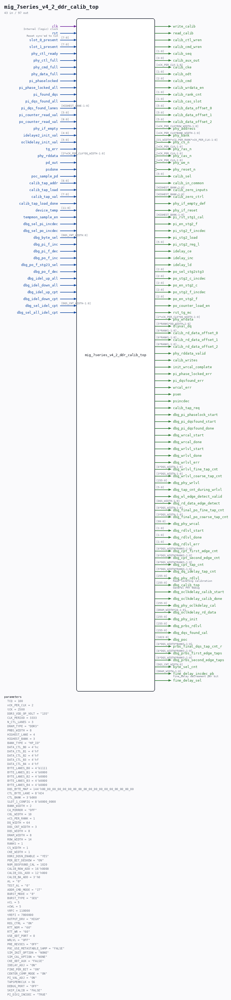

# mig_7series_v4_2_ddr_calib_top

Source: `/mnt/e/Dev/Repos/Ronny/nd-120/Verilog/fpga/nexys4ddr/ddr2-test/ip/ddr/ddr/user_design/rtl/phy/mig_7series_v4_2_ddr_calib_top.v`

> Generated by `Verilog/tests/module_doc.py` from the `//!`
> comments in the source. Do not edit by hand - edit the RTL comments and regenerate.

## Parameters

| Parameter | Default |
|---|---|
| `TCQ` | `100` |
| `nCK_PER_CLK` | `2` |
| `tCK` | `2500` |
| `DDR3_VDD_OP_VOLT` | `"135"` |
| `CLK_PERIOD` | `3333` |
| `N_CTL_LANES` | `3` |
| `DRAM_TYPE` | `"DDR3"` |
| `PRBS_WIDTH` | `8` |
| `HIGHEST_LANE` | `4` |
| `HIGHEST_BANK` | `3` |
| `BANK_TYPE` | `"HP_IO"` |
| `DATA_CTL_B0` | `4'hc` |
| `DATA_CTL_B1` | `4'hf` |
| `DATA_CTL_B2` | `4'hf` |
| `DATA_CTL_B3` | `4'hf` |
| `DATA_CTL_B4` | `4'hf` |
| `BYTE_LANES_B0` | `4'b1111` |
| `BYTE_LANES_B1` | `4'b0000` |
| `BYTE_LANES_B2` | `4'b0000` |
| `BYTE_LANES_B3` | `4'b0000` |
| `BYTE_LANES_B4` | `4'b0000` |
| `DQS_BYTE_MAP` | `144'h00_00_00_00_00_00_00_00_00_00_00_00_00_00_00_00_00_00` |
| `CTL_BYTE_LANE` | `8'hE4` |
| `CTL_BANK` | `3'b000` |
| `SLOT_1_CONFIG` | `8'b0000_0000` |
| `BANK_WIDTH` | `2` |
| `CA_MIRROR` | `"OFF"` |
| `COL_WIDTH` | `10` |
| `nCS_PER_RANK` | `1` |
| `DQ_WIDTH` | `64` |
| `DQS_CNT_WIDTH` | `3` |
| `DQS_WIDTH` | `8` |
| `DRAM_WIDTH` | `8` |
| `ROW_WIDTH` | `14` |
| `RANKS` | `1` |
| `CS_WIDTH` | `1` |
| `CKE_WIDTH` | `1` |
| `DDR2_DQSN_ENABLE` | `"YES"` |
| `PER_BIT_DESKEW` | `"ON"` |
| `NUM_DQSFOUND_CAL` | `1020` |
| `CALIB_ROW_ADD` | `16'h0000` |
| `CALIB_COL_ADD` | `12'h000` |
| `CALIB_BA_ADD` | `3'h0` |
| `AL` | `"0"` |
| `TEST_AL` | `"0"` |
| `ADDR_CMD_MODE` | `"1T"` |
| `BURST_MODE` | `"8"` |
| `BURST_TYPE` | `"SEQ"` |
| `nCL` | `5` |
| `nCWL` | `5` |
| `tRFC` | `110000` |
| `tREFI` | `7800000` |
| `OUTPUT_DRV` | `"HIGH"` |
| `REG_CTRL` | `"ON"` |
| `RTT_NOM` | `"60"` |
| `RTT_WR` | `"60"` |
| `USE_ODT_PORT` | `0` |
| `WRLVL` | `"OFF"` |
| `PRE_REV3ES` | `"OFF"` |
| `POC_USE_METASTABLE_SAMP` | `"FALSE"` |
| `SIM_INIT_OPTION` | `"NONE"` |
| `SIM_CAL_OPTION` | `"NONE"` |
| `CKE_ODT_AUX` | `"FALSE"` |
| `IDELAY_ADJ` | `"ON"` |
| `FINE_PER_BIT` | `"ON"` |
| `CENTER_COMP_MODE` | `"ON"` |
| `PI_VAL_ADJ` | `"ON"` |
| `TAPSPERKCLK` | `56` |
| `DEBUG_PORT` | `"OFF"` |
| `SKIP_CALIB` | `"FALSE"` |
| `PI_DIV2_INCDEC` | `"TRUE"` |

## Ports

| Direction | Width | Name | Description |
|---|---|---|---|
| input | `1` | `clk` | Internal (logic) clock |
| input | `1` | `rst` | Reset sync'ed to CLK |
| input | `[7:0]` | `slot_0_present` |  |
| input | `[7:0]` | `slot_1_present` |  |
| input | `1` | `phy_ctl_ready` |  |
| input | `1` | `phy_ctl_full` |  |
| input | `1` | `phy_cmd_full` |  |
| input | `1` | `phy_data_full` |  |
| output | `1` | `write_calib` |  |
| output | `1` | `read_calib` |  |
| output | `1` | `calib_ctl_wren` |  |
| output | `1` | `calib_cmd_wren` |  |
| output | `[1:0]` | `calib_seq` |  |
| output | `[3:0]` | `calib_aux_out` |  |
| output | `[nCK_PER_CLK-1:0]` | `calib_cke` |  |
| output | `[1:0]` | `calib_odt` |  |
| output | `[2:0]` | `calib_cmd` |  |
| output | `1` | `calib_wrdata_en` |  |
| output | `[1:0]` | `calib_rank_cnt` |  |
| output | `[1:0]` | `calib_cas_slot` |  |
| output | `[5:0]` | `calib_data_offset_0` |  |
| output | `[5:0]` | `calib_data_offset_1` |  |
| output | `[5:0]` | `calib_data_offset_2` |  |
| output | `[nCK_PER_CLK*ROW_WIDTH-1:0]` | `phy_address` |  |
| output | `[nCK_PER_CLK*BANK_WIDTH-1:0]` | `phy_bank` |  |
| output | `[CS_WIDTH*nCS_PER_RANK*nCK_PER_CLK-1:0]` | `phy_cs_n` *(active low)* |  |
| output | `[nCK_PER_CLK-1:0]` | `phy_ras_n` *(active low)* |  |
| output | `[nCK_PER_CLK-1:0]` | `phy_cas_n` *(active low)* |  |
| output | `[nCK_PER_CLK-1:0]` | `phy_we_n` *(active low)* |  |
| output | `1` | `phy_reset_n` *(active low)* |  |
| output | `[5:0]` | `calib_sel` |  |
| output | `1` | `calib_in_common` |  |
| output | `[HIGHEST_BANK-1:0]` | `calib_zero_inputs` |  |
| output | `[HIGHEST_BANK-1:0]` | `calib_zero_ctrl` |  |
| output | `1` | `phy_if_empty_def` |  |
| output | `1` | `phy_if_reset` |  |
| input | `1` | `pi_phaselocked` |  |
| input | `1` | `pi_phase_locked_all` |  |
| input | `1` | `pi_found_dqs` |  |
| input | `1` | `pi_dqs_found_all` |  |
| input | `[HIGHEST_LANE-1:0]` | `pi_dqs_found_lanes` |  |
| input | `[5:0]` | `pi_counter_read_val` |  |
| output | `[HIGHEST_BANK-1:0]` | `pi_rst_stg1_cal` |  |
| output | `1` | `pi_en_stg2_f` |  |
| output | `1` | `pi_stg2_f_incdec` |  |
| output | `1` | `pi_stg2_load` |  |
| output | `[5:0]` | `pi_stg2_reg_l` |  |
| output | `1` | `idelay_ce` |  |
| output | `1` | `idelay_inc` |  |
| output | `1` | `idelay_ld` |  |
| output | `[2:0]` | `po_sel_stg2stg3` |  |
| output | `[2:0]` | `po_stg2_c_incdec` |  |
| output | `[2:0]` | `po_en_stg2_c` |  |
| output | `[2:0]` | `po_stg2_f_incdec` |  |
| output | `[2:0]` | `po_en_stg2_f` |  |
| output | `1` | `po_counter_load_en` |  |
| input | `[8:0]` | `po_counter_read_val` |  |
| input | `1` | `phy_if_empty` |  |
| input | `[4:0]` | `idelaye2_init_val` |  |
| input | `[5:0]` | `oclkdelay_init_val` |  |
| input | `1` | `tg_err` |  |
| output | `1` | `rst_tg_mc` |  |
| output | `[2*nCK_PER_CLK*DQ_WIDTH-1:0]` | `phy_wrdata` |  |
| output | `[5*RANKS*DQ_WIDTH-1:0]` | `dlyval_dq` |  |
| input | `[2*nCK_PER_CLK*DQ_WIDTH-1:0]` | `phy_rddata` |  |
| output | `[6*RANKS-1:0]` | `calib_rd_data_offset_0` |  |
| output | `[6*RANKS-1:0]` | `calib_rd_data_offset_1` |  |
| output | `[6*RANKS-1:0]` | `calib_rd_data_offset_2` |  |
| output | `1` | `phy_rddata_valid` |  |
| output | `1` | `calib_writes` |  |
| output | `1` | `init_wrcal_complete` |  |
| output | `1` | `pi_phase_locked_err` |  |
| output | `1` | `pi_dqsfound_err` |  |
| output | `1` | `wrcal_err` |  |
| input | `1` | `pd_out` |  |
| output | `1` | `psen` |  |
| output | `1` | `psincdec` |  |
| input | `1` | `psdone` |  |
| input | `1` | `poc_sample_pd` |  |
| output | `1` | `calib_tap_req` |  |
| input | `[6:0]` | `calib_tap_addr` |  |
| input | `1` | `calib_tap_load` |  |
| input | `[7:0]` | `calib_tap_val` |  |
| input | `1` | `calib_tap_load_done` |  |
| output | `1` | `dbg_pi_phaselock_start` |  |
| output | `1` | `dbg_pi_dqsfound_start` |  |
| output | `1` | `dbg_pi_dqsfound_done` |  |
| output | `1` | `dbg_wrcal_start` |  |
| output | `1` | `dbg_wrcal_done` |  |
| output | `1` | `dbg_wrlvl_start` |  |
| output | `1` | `dbg_wrlvl_done` |  |
| output | `1` | `dbg_wrlvl_err` |  |
| output | `[6*DQS_WIDTH-1:0]` | `dbg_wrlvl_fine_tap_cnt` |  |
| output | `[3*DQS_WIDTH-1:0]` | `dbg_wrlvl_coarse_tap_cnt` |  |
| output | `[255:0]` | `dbg_phy_wrlvl` |  |
| output | `[5:0]` | `dbg_tap_cnt_during_wrlvl` |  |
| output | `1` | `dbg_wl_edge_detect_valid` |  |
| output | `[DQS_WIDTH-1:0]` | `dbg_rd_data_edge_detect` |  |
| output | `[6*DQS_WIDTH-1:0]` | `dbg_final_po_fine_tap_cnt` |  |
| output | `[3*DQS_WIDTH-1:0]` | `dbg_final_po_coarse_tap_cnt` |  |
| output | `[99:0]` | `dbg_phy_wrcal` |  |
| output | `[1:0]` | `dbg_rdlvl_start` |  |
| output | `[1:0]` | `dbg_rdlvl_done` |  |
| output | `[1:0]` | `dbg_rdlvl_err` |  |
| output | `[6*DQS_WIDTH*RANKS-1:0]` | `dbg_cpt_first_edge_cnt` |  |
| output | `[6*DQS_WIDTH*RANKS-1:0]` | `dbg_cpt_second_edge_cnt` |  |
| output | `[6*DQS_WIDTH*RANKS-1:0]` | `dbg_cpt_tap_cnt` |  |
| output | `[5*DQS_WIDTH*RANKS-1:0]` | `dbg_dq_idelay_tap_cnt` |  |
| input | `[11:0]` | `device_temp` |  |
| input | `1` | `tempmon_sample_en` |  |
| input | `1` | `dbg_sel_pi_incdec` |  |
| input | `1` | `dbg_sel_po_incdec` |  |
| input | `[DQS_CNT_WIDTH:0]` | `dbg_byte_sel` |  |
| input | `1` | `dbg_pi_f_inc` |  |
| input | `1` | `dbg_pi_f_dec` |  |
| input | `1` | `dbg_po_f_inc` |  |
| input | `1` | `dbg_po_f_stg23_sel` |  |
| input | `1` | `dbg_po_f_dec` |  |
| input | `1` | `dbg_idel_up_all` |  |
| input | `1` | `dbg_idel_down_all` |  |
| input | `1` | `dbg_idel_up_cpt` |  |
| input | `1` | `dbg_idel_down_cpt` |  |
| input | `[DQS_CNT_WIDTH-1:0]` | `dbg_sel_idel_cpt` |  |
| input | `1` | `dbg_sel_all_idel_cpt` |  |
| output | `[255:0]` | `dbg_phy_rdlvl` | Read leveling calibration |
| output | `[255:0]` | `dbg_calib_top` | General PHY debug |
| output | `1` | `dbg_oclkdelay_calib_start` |  |
| output | `1` | `dbg_oclkdelay_calib_done` |  |
| output | `[255:0]` | `dbg_phy_oclkdelay_cal` |  |
| output | `[DRAM_WIDTH*16-1:0]` | `dbg_oclkdelay_rd_data` |  |
| output | `[255:0]` | `dbg_phy_init` |  |
| output | `[255:0]` | `dbg_prbs_rdlvl` |  |
| output | `[255:0]` | `dbg_dqs_found_cal` |  |
| output | `[1023:0]` | `dbg_poc` |  |
| output | `[6*DQS_WIDTH*RANKS-1:0]` | `prbs_final_dqs_tap_cnt_r` |  |
| output | `[6*DQS_WIDTH*RANKS-1:0]` | `dbg_prbs_first_edge_taps` |  |
| output | `[6*DQS_WIDTH*RANKS-1:0]` | `dbg_prbs_second_edge_taps` |  |
| output | `[DQS_CNT_WIDTH:0]` | `byte_sel_cnt` |  |
| output | `[DRAM_WIDTH-1:0]` | `fine_delay_incdec_pb` | fine_delay decreament per bit |
| output | `1` | `fine_delay_sel` |  |
