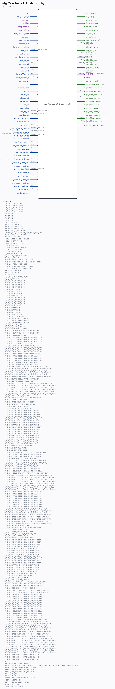

# mig_7series_v4_2_ddr_mc_phy

Source: `/mnt/e/Dev/Repos/Ronny/nd-120/Verilog/fpga/nexys4ddr/ddr2-test/ip/ddr/ddr/user_design/rtl/phy/mig_7series_v4_2_ddr_mc_phy.v`

> Generated by `Verilog/tests/module_doc.py` from the `//!`
> comments in the source. Do not edit by hand - edit the RTL comments and regenerate.

## Description

-- (c) Copyright 2010 - 2014 Xilinx, Inc. All rights reserved.
--
-- This file contains confidential and proprietary information
-- of Xilinx, Inc. and is protected under U.S. and
-- international copyright and other intellectual property
-- laws.
--
-- DISCLAIMER
-- This disclaimer is not a license and does not grant any
-- rights to the materials distributed herewith. Except as
-- otherwise provided in a valid license issued to you by
-- Xilinx, and to the maximum extent permitted by applicable
-- law: (1) THESE MATERIALS ARE MADE AVAILABLE "AS IS" AND
-- WITH ALL FAULTS, AND XILINX HEREBY DISCLAIMS ALL WARRANTIES
-- AND CONDITIONS, EXPRESS, IMPLIED, OR STATUTORY, INCLUDING
-- BUT NOT LIMITED TO WARRANTIES OF MERCHANTABILITY, NON-
-- INFRINGEMENT, OR FITNESS FOR ANY PARTICULAR PURPOSE; and
-- (2) Xilinx shall not be liable (whether in contract or tort,
-- including negligence, or under any other theory of
-- liability) for any loss or damage of any kind or nature
-- related to, arising under or in connection with these
-- materials, including for any direct, or any indirect,
-- special, incidental, or consequential loss or damage
-- (including loss of data, profits, goodwill, or any type of
-- loss or damage suffered as a result of any action brought
-- by a third party) even if such damage or loss was
-- reasonably foreseeable or Xilinx had been advised of the
-- possibility of the same.
--
-- CRITICAL APPLICATIONS
-- Xilinx products are not designed or intended to be fail-
-- safe, or for use in any application requiring fail-safe
-- performance, such as life-support or safety devices or
-- systems, Class III medical devices, nuclear facilities,
-- applications related to the deployment of airbags, or any
-- other applications that could lead to death, personal
-- injury, or severe property or environmental damage
-- (individually and collectively, "Critical
-- Applications"). A Customer assumes the sole risk and
-- liability of any use of Xilinx products in Critical
-- Applications, subject only to applicable laws and
-- regulations governing limitations on product liability.
--
-- THIS COPYRIGHT NOTICE AND DISCLAIMER MUST BE RETAINED AS
-- PART OF THIS FILE AT ALL TIMES.
//
//
//  Owner:        Gary Martin
//  Revision:     $Id: //depot/icm/proj/common/head/rtl/v32_cmt/rtl/phy/mc_phy.v#5 $
//                $Author: gary $
//                $DateTime: 2010/05/11 18:05:17 $
//                $Change: 490882 $
//  Description:
//    This verilog file is a parameterizable wrapper instantiating
//    up to 5 memory banks of 4-lane phy primitives. There
//    There are always 2 control banks leaving 18 lanes for data.
//
//  History:
//  Date        Engineer    Description
//  04/01/2010  G. Martin   Initial Checkin.
//
////////////////////////////////////////////////////////////

## Parameters

| Parameter | Default |
|---|---|
| `BYTE_LANES_B0` | `4'b1111` |
| `BYTE_LANES_B1` | `4'b0000` |
| `BYTE_LANES_B2` | `4'b0000` |
| `BYTE_LANES_B3` | `4'b0000` |
| `BYTE_LANES_B4` | `4'b0000` |
| `DATA_CTL_B0` | `4'hc` |
| `DATA_CTL_B1` | `4'hf` |
| `DATA_CTL_B2` | `4'hf` |
| `DATA_CTL_B3` | `4'hf` |
| `DATA_CTL_B4` | `4'hf` |
| `RCLK_SELECT_BANK` | `0` |
| `RCLK_SELECT_LANE` | `"B"` |
| `RCLK_SELECT_EDGE` | `4'b1111` |
| `GENERATE_DDR_CK_MAP` | `"0B"` |
| `BYTELANES_DDR_CK` | `72'h00_0000_0000_0000_0002` |
| `USE_PRE_POST_FIFO` | `"TRUE"` |
| `SYNTHESIS` | `"FALSE"` |
| `PO_CTL_COARSE_BYPASS` | `"FALSE"` |
| `PI_SEL_CLK_OFFSET` | `6` |
| `PHYCTL_CMD_FIFO` | `"FALSE"` |
| `PHY_CLK_RATIO` | `4` |
| `PHY_FOUR_WINDOW_CLOCKS` | `63` |
| `PHY_EVENTS_DELAY` | `18` |
| `PHY_COUNT_EN` | `"TRUE"` |
| `PHY_SYNC_MODE` | `"TRUE"` |
| `PHY_DISABLE_SEQ_MATCH` | `"FALSE"` |
| `MASTER_PHY_CTL` | `0` |
| `PHY_0_BITLANES` | `48'hdffd_fffe_dfff` |
| `PHY_0_BITLANES_OUTONLY` | `48'h0000_0000_0000` |
| `PHY_0_LANE_REMAP` | `16'h3210` |
| `PHY_0_GENERATE_IDELAYCTRL` | `"FALSE"` |
| `PHY_0_IODELAY_GRP` | `"IODELAY_MIG"` |
| `FPGA_SPEED_GRADE` | `1` |
| `BANK_TYPE` | `"HP_IO"` |
| `NUM_DDR_CK` | `1` |
| `PHY_0_DATA_CTL` | `DATA_CTL_B0` |
| `PHY_0_CMD_OFFSET` | `0` |
| `PHY_0_RD_CMD_OFFSET_0` | `0` |
| `PHY_0_RD_CMD_OFFSET_1` | `0` |
| `PHY_0_RD_CMD_OFFSET_2` | `0` |
| `PHY_0_RD_CMD_OFFSET_3` | `0` |
| `PHY_0_RD_DURATION_0` | `0` |
| `PHY_0_RD_DURATION_1` | `0` |
| `PHY_0_RD_DURATION_2` | `0` |
| `PHY_0_RD_DURATION_3` | `0` |
| `PHY_0_WR_CMD_OFFSET_0` | `0` |
| `PHY_0_WR_CMD_OFFSET_1` | `0` |
| `PHY_0_WR_CMD_OFFSET_2` | `0` |
| `PHY_0_WR_CMD_OFFSET_3` | `0` |
| `PHY_0_WR_DURATION_0` | `0` |
| `PHY_0_WR_DURATION_1` | `0` |
| `PHY_0_WR_DURATION_2` | `0` |
| `PHY_0_WR_DURATION_3` | `0` |
| `PHY_0_AO_WRLVL_EN` | `0` |
| `PHY_0_AO_TOGGLE` | `4'b0101` |
| `PHY_0_OF_ALMOST_FULL_VALUE` | `1` |
| `PHY_0_IF_ALMOST_EMPTY_VALUE` | `1` |
| `PHY_0_A_PI_FREQ_REF_DIV` | `"NONE"` |
| `PHY_0_A_PI_CLKOUT_DIV` | `2` |
| `PHY_0_A_PO_CLKOUT_DIV` | `2` |
| `PHY_0_A_BURST_MODE` | `"TRUE"` |
| `PHY_0_A_PI_OUTPUT_CLK_SRC` | `"DELAYED_REF"` |
| `PHY_0_A_PO_OUTPUT_CLK_SRC` | `"DELAYED_REF"` |
| `PHY_0_A_PO_OCLK_DELAY` | `25` |
| `PHY_0_B_PO_OCLK_DELAY` | `PHY_0_A_PO_OCLK_DELAY` |
| `PHY_0_C_PO_OCLK_DELAY` | `PHY_0_A_PO_OCLK_DELAY` |
| `PHY_0_D_PO_OCLK_DELAY` | `PHY_0_A_PO_OCLK_DELAY` |
| `PHY_0_A_PO_OCLKDELAY_INV` | `"FALSE"` |
| `PHY_0_A_OF_ARRAY_MODE` | `"ARRAY_MODE_8_X_4"` |
| `PHY_0_B_OF_ARRAY_MODE` | `PHY_0_A_OF_ARRAY_MODE` |
| `PHY_0_C_OF_ARRAY_MODE` | `PHY_0_A_OF_ARRAY_MODE` |
| `PHY_0_D_OF_ARRAY_MODE` | `PHY_0_A_OF_ARRAY_MODE` |
| `PHY_0_A_IF_ARRAY_MODE` | `"ARRAY_MODE_8_X_4"` |
| `PHY_0_B_IF_ARRAY_MODE` | `PHY_0_A_OF_ARRAY_MODE` |
| `PHY_0_C_IF_ARRAY_MODE` | `PHY_0_A_OF_ARRAY_MODE` |
| `PHY_0_D_IF_ARRAY_MODE` | `PHY_0_A_OF_ARRAY_MODE` |
| `PHY_0_A_OSERDES_DATA_RATE` | `"UNDECLARED"` |
| `PHY_0_A_OSERDES_DATA_WIDTH` | `"UNDECLARED"` |
| `PHY_0_B_OSERDES_DATA_RATE` | `PHY_0_A_OSERDES_DATA_RATE` |
| `PHY_0_B_OSERDES_DATA_WIDTH` | `PHY_0_A_OSERDES_DATA_WIDTH` |
| `PHY_0_C_OSERDES_DATA_RATE` | `PHY_0_A_OSERDES_DATA_RATE` |
| `PHY_0_C_OSERDES_DATA_WIDTH` | `PHY_0_A_OSERDES_DATA_WIDTH` |
| `PHY_0_D_OSERDES_DATA_RATE` | `PHY_0_A_OSERDES_DATA_RATE` |
| `PHY_0_D_OSERDES_DATA_WIDTH` | `PHY_0_A_OSERDES_DATA_WIDTH` |
| `PHY_0_A_IDELAYE2_IDELAY_TYPE` | `"VARIABLE"` |
| `PHY_0_A_IDELAYE2_IDELAY_VALUE` | `00` |
| `PHY_0_B_IDELAYE2_IDELAY_TYPE` | `PHY_0_A_IDELAYE2_IDELAY_TYPE` |
| `PHY_0_B_IDELAYE2_IDELAY_VALUE` | `PHY_0_A_IDELAYE2_IDELAY_VALUE` |
| `PHY_0_C_IDELAYE2_IDELAY_TYPE` | `PHY_0_A_IDELAYE2_IDELAY_TYPE` |
| `PHY_0_C_IDELAYE2_IDELAY_VALUE` | `PHY_0_A_IDELAYE2_IDELAY_VALUE` |
| `PHY_0_D_IDELAYE2_IDELAY_TYPE` | `PHY_0_A_IDELAYE2_IDELAY_TYPE` |
| `PHY_0_D_IDELAYE2_IDELAY_VALUE` | `PHY_0_A_IDELAYE2_IDELAY_VALUE` |
| `PHY_1_BITLANES` | `PHY_0_BITLANES` |
| `PHY_1_BITLANES_OUTONLY` | `48'h0000_0000_0000` |
| `PHY_1_LANE_REMAP` | `16'h3210` |
| `PHY_1_GENERATE_IDELAYCTRL` | `"FALSE"` |
| `PHY_1_IODELAY_GRP` | `PHY_0_IODELAY_GRP` |
| `PHY_1_DATA_CTL` | `DATA_CTL_B1` |
| `PHY_1_CMD_OFFSET` | `PHY_0_CMD_OFFSET` |
| `PHY_1_RD_CMD_OFFSET_0` | `PHY_0_RD_CMD_OFFSET_0` |
| `PHY_1_RD_CMD_OFFSET_1` | `PHY_0_RD_CMD_OFFSET_1` |
| `PHY_1_RD_CMD_OFFSET_2` | `PHY_0_RD_CMD_OFFSET_2` |
| `PHY_1_RD_CMD_OFFSET_3` | `PHY_0_RD_CMD_OFFSET_3` |
| `PHY_1_RD_DURATION_0` | `PHY_0_RD_DURATION_0` |
| `PHY_1_RD_DURATION_1` | `PHY_0_RD_DURATION_1` |
| `PHY_1_RD_DURATION_2` | `PHY_0_RD_DURATION_2` |
| `PHY_1_RD_DURATION_3` | `PHY_0_RD_DURATION_3` |
| `PHY_1_WR_CMD_OFFSET_0` | `PHY_0_WR_CMD_OFFSET_0` |
| `PHY_1_WR_CMD_OFFSET_1` | `PHY_0_WR_CMD_OFFSET_1` |
| `PHY_1_WR_CMD_OFFSET_2` | `PHY_0_WR_CMD_OFFSET_2` |
| `PHY_1_WR_CMD_OFFSET_3` | `PHY_0_WR_CMD_OFFSET_3` |
| `PHY_1_WR_DURATION_0` | `PHY_0_WR_DURATION_0` |
| `PHY_1_WR_DURATION_1` | `PHY_0_WR_DURATION_1` |
| `PHY_1_WR_DURATION_2` | `PHY_0_WR_DURATION_2` |
| `PHY_1_WR_DURATION_3` | `PHY_0_WR_DURATION_3` |
| `PHY_1_AO_WRLVL_EN` | `PHY_0_AO_WRLVL_EN` |
| `PHY_1_AO_TOGGLE` | `PHY_0_AO_TOGGLE` |
| `PHY_1_OF_ALMOST_FULL_VALUE` | `1` |
| `PHY_1_IF_ALMOST_EMPTY_VALUE` | `1` |
| `PHY_1_A_PI_FREQ_REF_DIV` | `PHY_0_A_PI_FREQ_REF_DIV` |
| `PHY_1_A_PI_CLKOUT_DIV` | `PHY_0_A_PI_CLKOUT_DIV` |
| `PHY_1_A_PO_CLKOUT_DIV` | `PHY_0_A_PO_CLKOUT_DIV` |
| `PHY_1_A_BURST_MODE` | `PHY_0_A_BURST_MODE` |
| `PHY_1_A_PI_OUTPUT_CLK_SRC` | `PHY_0_A_PI_OUTPUT_CLK_SRC` |
| `PHY_1_A_PO_OUTPUT_CLK_SRC` | `PHY_0_A_PO_OUTPUT_CLK_SRC` |
| `PHY_1_A_PO_OCLK_DELAY` | `PHY_0_A_PO_OCLK_DELAY` |
| `PHY_1_B_PO_OCLK_DELAY` | `PHY_1_A_PO_OCLK_DELAY` |
| `PHY_1_C_PO_OCLK_DELAY` | `PHY_1_A_PO_OCLK_DELAY` |
| `PHY_1_D_PO_OCLK_DELAY` | `PHY_1_A_PO_OCLK_DELAY` |
| `PHY_1_A_PO_OCLKDELAY_INV` | `PHY_0_A_PO_OCLKDELAY_INV` |
| `PHY_1_A_IDELAYE2_IDELAY_TYPE` | `PHY_0_A_IDELAYE2_IDELAY_TYPE` |
| `PHY_1_A_IDELAYE2_IDELAY_VALUE` | `PHY_0_A_IDELAYE2_IDELAY_VALUE` |
| `PHY_1_B_IDELAYE2_IDELAY_TYPE` | `PHY_1_A_IDELAYE2_IDELAY_TYPE` |
| `PHY_1_B_IDELAYE2_IDELAY_VALUE` | `PHY_1_A_IDELAYE2_IDELAY_VALUE` |
| `PHY_1_C_IDELAYE2_IDELAY_TYPE` | `PHY_1_A_IDELAYE2_IDELAY_TYPE` |
| `PHY_1_C_IDELAYE2_IDELAY_VALUE` | `PHY_1_A_IDELAYE2_IDELAY_VALUE` |
| `PHY_1_D_IDELAYE2_IDELAY_TYPE` | `PHY_1_A_IDELAYE2_IDELAY_TYPE` |
| `PHY_1_D_IDELAYE2_IDELAY_VALUE` | `PHY_1_A_IDELAYE2_IDELAY_VALUE` |
| `PHY_1_A_OF_ARRAY_MODE` | `PHY_0_A_OF_ARRAY_MODE` |
| `PHY_1_B_OF_ARRAY_MODE` | `PHY_0_A_OF_ARRAY_MODE` |
| `PHY_1_C_OF_ARRAY_MODE` | `PHY_0_A_OF_ARRAY_MODE` |
| `PHY_1_D_OF_ARRAY_MODE` | `PHY_0_A_OF_ARRAY_MODE` |
| `PHY_1_A_IF_ARRAY_MODE` | `PHY_0_A_IF_ARRAY_MODE` |
| `PHY_1_B_IF_ARRAY_MODE` | `PHY_0_A_OF_ARRAY_MODE` |
| `PHY_1_C_IF_ARRAY_MODE` | `PHY_0_A_OF_ARRAY_MODE` |
| `PHY_1_D_IF_ARRAY_MODE` | `PHY_0_A_OF_ARRAY_MODE` |
| `PHY_1_A_OSERDES_DATA_RATE` | `PHY_0_A_OSERDES_DATA_RATE` |
| `PHY_1_A_OSERDES_DATA_WIDTH` | `PHY_0_A_OSERDES_DATA_WIDTH` |
| `PHY_1_B_OSERDES_DATA_RATE` | `PHY_0_A_OSERDES_DATA_RATE` |
| `PHY_1_B_OSERDES_DATA_WIDTH` | `PHY_0_A_OSERDES_DATA_WIDTH` |
| `PHY_1_C_OSERDES_DATA_RATE` | `PHY_0_A_OSERDES_DATA_RATE` |
| `PHY_1_C_OSERDES_DATA_WIDTH` | `PHY_0_A_OSERDES_DATA_WIDTH` |
| `PHY_1_D_OSERDES_DATA_RATE` | `PHY_0_A_OSERDES_DATA_RATE` |
| `PHY_1_D_OSERDES_DATA_WIDTH` | `PHY_0_A_OSERDES_DATA_WIDTH` |
| `PHY_2_BITLANES` | `PHY_0_BITLANES` |
| `PHY_2_BITLANES_OUTONLY` | `48'h0000_0000_0000` |
| `PHY_2_LANE_REMAP` | `16'h3210` |
| `PHY_2_GENERATE_IDELAYCTRL` | `"FALSE"` |
| `PHY_2_IODELAY_GRP` | `PHY_0_IODELAY_GRP` |
| `PHY_2_DATA_CTL` | `DATA_CTL_B2` |
| `PHY_2_CMD_OFFSET` | `PHY_0_CMD_OFFSET` |
| `PHY_2_RD_CMD_OFFSET_0` | `PHY_0_RD_CMD_OFFSET_0` |
| `PHY_2_RD_CMD_OFFSET_1` | `PHY_0_RD_CMD_OFFSET_1` |
| `PHY_2_RD_CMD_OFFSET_2` | `PHY_0_RD_CMD_OFFSET_2` |
| `PHY_2_RD_CMD_OFFSET_3` | `PHY_0_RD_CMD_OFFSET_3` |
| `PHY_2_RD_DURATION_0` | `PHY_0_RD_DURATION_0` |
| `PHY_2_RD_DURATION_1` | `PHY_0_RD_DURATION_1` |
| `PHY_2_RD_DURATION_2` | `PHY_0_RD_DURATION_2` |
| `PHY_2_RD_DURATION_3` | `PHY_0_RD_DURATION_3` |
| `PHY_2_WR_CMD_OFFSET_0` | `PHY_0_WR_CMD_OFFSET_0` |
| `PHY_2_WR_CMD_OFFSET_1` | `PHY_0_WR_CMD_OFFSET_1` |
| `PHY_2_WR_CMD_OFFSET_2` | `PHY_0_WR_CMD_OFFSET_2` |
| `PHY_2_WR_CMD_OFFSET_3` | `PHY_0_WR_CMD_OFFSET_3` |
| `PHY_2_WR_DURATION_0` | `PHY_0_WR_DURATION_0` |
| `PHY_2_WR_DURATION_1` | `PHY_0_WR_DURATION_1` |
| `PHY_2_WR_DURATION_2` | `PHY_0_WR_DURATION_2` |
| `PHY_2_WR_DURATION_3` | `PHY_0_WR_DURATION_3` |
| `PHY_2_AO_WRLVL_EN` | `PHY_0_AO_WRLVL_EN` |
| `PHY_2_AO_TOGGLE` | `PHY_0_AO_TOGGLE` |
| `PHY_2_OF_ALMOST_FULL_VALUE` | `1` |
| `PHY_2_IF_ALMOST_EMPTY_VALUE` | `1` |
| `PHY_2_A_PI_FREQ_REF_DIV` | `PHY_0_A_PI_FREQ_REF_DIV` |
| `PHY_2_A_PI_CLKOUT_DIV` | `PHY_0_A_PI_CLKOUT_DIV` |
| `PHY_2_A_PO_CLKOUT_DIV` | `PHY_0_A_PO_CLKOUT_DIV` |
| `PHY_2_A_BURST_MODE` | `PHY_0_A_BURST_MODE` |
| `PHY_2_A_PI_OUTPUT_CLK_SRC` | `PHY_0_A_PI_OUTPUT_CLK_SRC` |
| `PHY_2_A_PO_OUTPUT_CLK_SRC` | `PHY_0_A_PO_OUTPUT_CLK_SRC` |
| `PHY_2_A_OF_ARRAY_MODE` | `PHY_0_A_OF_ARRAY_MODE` |
| `PHY_2_B_OF_ARRAY_MODE` | `PHY_0_A_OF_ARRAY_MODE` |
| `PHY_2_C_OF_ARRAY_MODE` | `PHY_0_A_OF_ARRAY_MODE` |
| `PHY_2_D_OF_ARRAY_MODE` | `PHY_0_A_OF_ARRAY_MODE` |
| `PHY_2_A_IF_ARRAY_MODE` | `PHY_0_A_IF_ARRAY_MODE` |
| `PHY_2_B_IF_ARRAY_MODE` | `PHY_0_A_OF_ARRAY_MODE` |
| `PHY_2_C_IF_ARRAY_MODE` | `PHY_0_A_OF_ARRAY_MODE` |
| `PHY_2_D_IF_ARRAY_MODE` | `PHY_0_A_OF_ARRAY_MODE` |
| `PHY_2_A_PO_OCLK_DELAY` | `PHY_0_A_PO_OCLK_DELAY` |
| `PHY_2_B_PO_OCLK_DELAY` | `PHY_2_A_PO_OCLK_DELAY` |
| `PHY_2_C_PO_OCLK_DELAY` | `PHY_2_A_PO_OCLK_DELAY` |
| `PHY_2_D_PO_OCLK_DELAY` | `PHY_2_A_PO_OCLK_DELAY` |
| `PHY_2_A_PO_OCLKDELAY_INV` | `PHY_0_A_PO_OCLKDELAY_INV` |
| `PHY_2_A_OSERDES_DATA_RATE` | `PHY_0_A_OSERDES_DATA_RATE` |
| `PHY_2_A_OSERDES_DATA_WIDTH` | `PHY_0_A_OSERDES_DATA_WIDTH` |
| `PHY_2_B_OSERDES_DATA_RATE` | `PHY_0_A_OSERDES_DATA_RATE` |
| `PHY_2_B_OSERDES_DATA_WIDTH` | `PHY_0_A_OSERDES_DATA_WIDTH` |
| `PHY_2_C_OSERDES_DATA_RATE` | `PHY_0_A_OSERDES_DATA_RATE` |
| `PHY_2_C_OSERDES_DATA_WIDTH` | `PHY_0_A_OSERDES_DATA_WIDTH` |
| `PHY_2_D_OSERDES_DATA_RATE` | `PHY_0_A_OSERDES_DATA_RATE` |
| `PHY_2_D_OSERDES_DATA_WIDTH` | `PHY_0_A_OSERDES_DATA_WIDTH` |
| `PHY_2_A_IDELAYE2_IDELAY_TYPE` | `PHY_0_A_IDELAYE2_IDELAY_TYPE` |
| `PHY_2_A_IDELAYE2_IDELAY_VALUE` | `PHY_0_A_IDELAYE2_IDELAY_VALUE` |
| `PHY_2_B_IDELAYE2_IDELAY_TYPE` | `PHY_2_A_IDELAYE2_IDELAY_TYPE` |
| `PHY_2_B_IDELAYE2_IDELAY_VALUE` | `PHY_2_A_IDELAYE2_IDELAY_VALUE` |
| `PHY_2_C_IDELAYE2_IDELAY_TYPE` | `PHY_2_A_IDELAYE2_IDELAY_TYPE` |
| `PHY_2_C_IDELAYE2_IDELAY_VALUE` | `PHY_2_A_IDELAYE2_IDELAY_VALUE` |
| `PHY_2_D_IDELAYE2_IDELAY_TYPE` | `PHY_2_A_IDELAYE2_IDELAY_TYPE` |
| `PHY_2_D_IDELAYE2_IDELAY_VALUE` | `PHY_2_A_IDELAYE2_IDELAY_VALUE` |
| `PHY_0_IS_LAST_BANK` | `((BYTE_LANES_B1 != 0` |
| `PHY_1_IS_LAST_BANK` | `((BYTE_LANES_B1 != 0` |
| `PHY_2_IS_LAST_BANK` | `(BYTE_LANES_B2 != 0` |
| `TCK` | `2500` |
| `N_LANES` | `(0+BYTE_LANES_B0[0]` |
| `HIGHEST_BANK` | `(BYTE_LANES_B4 != 0 ? 5 : (BYTE_LANES_B3 != 0 ? 4 : (BYTE_LANES_B2 != 0 ? 3 :  (BYTE_LANES_B1 != 0  ? 2 : 1` |
| `HIGHEST_LANE_B0` | `((PHY_0_IS_LAST_BANK == "FALSE"` |
| `HIGHEST_LANE_B1` | `(HIGHEST_BANK > 2` |
| `HIGHEST_LANE_B2` | `(HIGHEST_BANK > 3` |
| `HIGHEST_LANE_B3` | `0` |
| `HIGHEST_LANE_B4` | `0` |
| `HIGHEST_LANE` | `(HIGHEST_LANE_B4 != 0` |
| `LP_DDR_CK_WIDTH` | `2` |
| `GENERATE_SIGNAL_SPLIT` | `"FALSE"` |
| `CKE_ODT_AUX` | `"FALSE"` |
| `PI_DIV2_INCDEC` | `"FALSE"` |

## Ports

| Direction | Width | Name | Description |
|---|---|---|---|
| input | `1` | `rst` |  |
| input | `1` | `ddr_rst_in_n` *(active low)* |  |
| input | `1` | `phy_clk` |  |
| input | `1` | `clk_div2` |  |
| input | `1` | `freq_refclk` |  |
| input | `1` | `mem_refclk` |  |
| input | `1` | `mem_refclk_div4` |  |
| input | `1` | `pll_lock` |  |
| input | `1` | `sync_pulse` |  |
| input | `1` | `auxout_clk` |  |
| input | `1` | `idelayctrl_refclk` |  |
| input | `[HIGHEST_LANE*80-1:0]` | `phy_dout` |  |
| input | `1` | `phy_cmd_wr_en` |  |
| input | `1` | `phy_data_wr_en` |  |
| input | `1` | `phy_rd_en` |  |
| input | `[31:0]` | `phy_ctl_wd` |  |
| input | `[3:0]` | `aux_in_1` |  |
| input | `[3:0]` | `aux_in_2` |  |
| input | `[5:0]` | `data_offset_1` |  |
| input | `[5:0]` | `data_offset_2` |  |
| input | `1` | `phy_ctl_wr` |  |
| input | `1` | `if_rst` |  |
| input | `1` | `if_empty_def` |  |
| input | `1` | `cke_in` |  |
| input | `1` | `idelay_ce` |  |
| input | `1` | `idelay_ld` |  |
| input | `1` | `idelay_inc` |  |
| input | `1` | `phyGo` |  |
| input | `1` | `input_sink` |  |
| output | `1` | `if_a_empty` |  |
| output | `1` | `if_empty` |  |
| output | `1` | `if_empty_or` |  |
| output | `1` | `if_empty_and` |  |
| output | `1` | `of_ctl_a_full` |  |
| output | `1` | `of_data_a_full` |  |
| output | `1` | `of_ctl_full` |  |
| output | `1` | `of_data_full` |  |
| output | `1` | `pre_data_a_full` |  |
| output | `[HIGHEST_LANE*80-1:0]` | `phy_din` |  |
| output | `1` | `phy_ctl_a_full` |  |
| output | `[3:0]` | `phy_ctl_full` |  |
| output | `[HIGHEST_LANE*12-1:0]` | `mem_dq_out` |  |
| output | `[HIGHEST_LANE*12-1:0]` | `mem_dq_ts` |  |
| input | `[HIGHEST_LANE*10-1:0]` | `mem_dq_in` |  |
| output | `[HIGHEST_LANE-1:0]` | `mem_dqs_out` |  |
| output | `[HIGHEST_LANE-1:0]` | `mem_dqs_ts` |  |
| input | `[HIGHEST_LANE-1:0]` | `mem_dqs_in` |  |
| output | `1` | `phy_ctl_ready` | to fabric |
| output | `1` | `rst_out` | to memory |
| output | `[(NUM_DDR_CK*LP_DDR_CK_WIDTH)-1:0]` | `ddr_clk` |  |
| output | `1` | `mcGo` |  |
| output | `1` | `ref_dll_lock` |  |
| input | `1` | `phy_write_calib` |  |
| input | `1` | `phy_read_calib` |  |
| input | `[5:0]` | `calib_sel` |  |
| input | `[HIGHEST_BANK-1:0]` | `calib_zero_inputs` | bit calib_sel[2], one per bank |
| input | `[HIGHEST_BANK-1:0]` | `calib_zero_ctrl` | one  bit per bank, zero's only control lane calibration inputs |
| input | `[HIGHEST_LANE-1:0]` | `calib_zero_lanes` | one bit per lane |
| input | `1` | `calib_in_common` |  |
| input | `[2:0]` | `po_fine_enable` |  |
| input | `[2:0]` | `po_coarse_enable` |  |
| input | `[2:0]` | `po_fine_inc` |  |
| input | `[2:0]` | `po_coarse_inc` |  |
| input | `1` | `po_counter_load_en` |  |
| input | `[2:0]` | `po_sel_fine_oclk_delay` |  |
| input | `[8:0]` | `po_counter_load_val` |  |
| input | `1` | `po_counter_read_en` |  |
| output | `1` | `po_coarse_overflow` |  |
| output | `1` | `po_fine_overflow` |  |
| output | `[8:0]` | `po_counter_read_val` |  |
| input | `[HIGHEST_BANK-1:0]` | `pi_rst_dqs_find` |  |
| input | `1` | `pi_fine_enable` |  |
| input | `1` | `pi_fine_inc` |  |
| input | `1` | `pi_counter_load_en` |  |
| input | `1` | `pi_counter_read_en` |  |
| input | `[5:0]` | `pi_counter_load_val` |  |
| output | `1` | `pi_fine_overflow` |  |
| output | `[5:0]` | `pi_counter_read_val` |  |
| output | `1` | `pi_phase_locked` |  |
| output | `1` | `pi_phase_locked_all` |  |
| output | `1` | `pi_dqs_found` |  |
| output | `1` | `pi_dqs_found_all` |  |
| output | `1` | `pi_dqs_found_any` |  |
| output | `[HIGHEST_LANE-1:0]` | `pi_phase_locked_lanes` |  |
| output | `[HIGHEST_LANE-1:0]` | `pi_dqs_found_lanes` |  |
| output | `1` | `pi_dqs_out_of_range` |  |
| input | `[29:0]` | `fine_delay` |  |
| input | `1` | `fine_delay_sel` |  |
