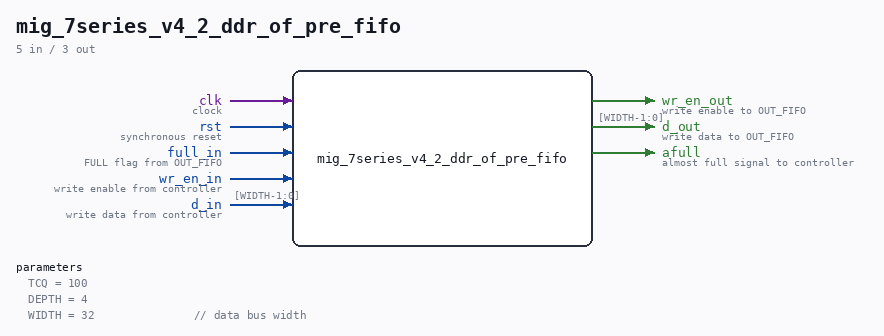

# mig_7series_v4_2_ddr_of_pre_fifo

Source: `/mnt/e/Dev/Repos/Ronny/nd-120/Verilog/fpga/nexys4ddr/ddr2-test/ip/ddr/ddr/user_design/rtl/phy/mig_7series_v4_2_ddr_of_pre_fifo.v`

> Generated by `Verilog/tests/module_doc.py` from the `//!`
> comments in the source. Do not edit by hand - edit the RTL comments and regenerate.

## Parameters

| Parameter | Default |
|---|---|
| `TCQ` | `100` |
| `DEPTH` | `4` |
| `WIDTH` | `32               // data bus width` |

## Ports

| Direction | Width | Name | Description |
|---|---|---|---|
| input | `1` | `clk` | clock |
| input | `1` | `rst` | synchronous reset |
| input | `1` | `full_in` | FULL flag from OUT_FIFO |
| input | `1` | `wr_en_in` | write enable from controller |
| input | `[WIDTH-1:0]` | `d_in` | write data from controller |
| output | `1` | `wr_en_out` | write enable to OUT_FIFO |
| output | `[WIDTH-1:0]` | `d_out` | write data to OUT_FIFO |
| output | `1` | `afull` | almost full signal to controller |
