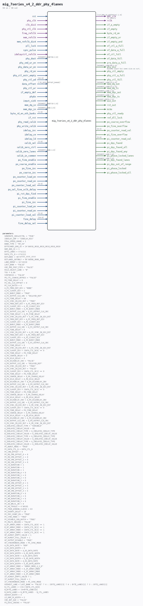

# mig_7series_v4_2_ddr_phy_4lanes

Source: `/mnt/e/Dev/Repos/Ronny/nd-120/Verilog/fpga/nexys4ddr/ddr2-test/ip/ddr/ddr/user_design/rtl/phy/mig_7series_v4_2_ddr_phy_4lanes.v`

> Generated by `Verilog/tests/module_doc.py` from the `//!`
> comments in the source. Do not edit by hand - edit the RTL comments and regenerate.

## Description

-- (c) Copyright 2011 - 2014 Xilinx, Inc. All rights reserved.
--
-- This file contains confidential and proprietary information
-- of Xilinx, Inc. and is protected under U.S. and
-- international copyright and other intellectual property
-- laws.
--
-- DISCLAIMER
-- This disclaimer is not a license and does not grant any
-- rights to the materials distributed herewith. Except as
-- otherwise provided in a valid license issued to you by
-- Xilinx, and to the maximum extent permitted by applicable
-- law: (1) THESE MATERIALS ARE MADE AVAILABLE "AS IS" AND
-- WITH ALL FAULTS, AND XILINX HEREBY DISCLAIMS ALL WARRANTIES
-- AND CONDITIONS, EXPRESS, IMPLIED, OR STATUTORY, INCLUDING
-- BUT NOT LIMITED TO WARRANTIES OF MERCHANTABILITY, NON-
-- INFRINGEMENT, OR FITNESS FOR ANY PARTICULAR PURPOSE; and
-- (2) Xilinx shall not be liable (whether in contract or tort,
-- including negligence, or under any other theory of
-- liability) for any loss or damage of any kind or nature
-- related to, arising under or in connection with these
-- materials, including for any direct, or any indirect,
-- special, incidental, or consequential loss or damage
-- (including loss of data, profits, goodwill, or any type of
-- loss or damage suffered as a result of any action brought
-- by a third party) even if such damage or loss was
-- reasonably foreseeable or Xilinx had been advised of the
-- possibility of the same.
--
-- CRITICAL APPLICATIONS
-- Xilinx products are not designed or intended to be fail-
-- safe, or for use in any application requiring fail-safe
-- performance, such as life-support or safety devices or
-- systems, Class III medical devices, nuclear facilities,
-- applications related to the deployment of airbags, or any
-- other applications that could lead to death, personal
-- injury, or severe property or environmental damage
-- (individually and collectively, "Critical
-- Applications"). A Customer assumes the sole risk and
-- liability of any use of Xilinx products in Critical
-- Applications, subject only to applicable laws and
-- regulations governing limitations on product liability.
--
-- THIS COPYRIGHT NOTICE AND DISCLAIMER MUST BE RETAINED AS
-- PART OF THIS FILE AT ALL TIMES.
//
// THIS NOTICE MUST BE RETAINED AS PART OF THIS FILE AT ALL TIMES.
//
//
//  Owner:        Gary Martin
//  Revision:     $Id: //depot/icm/proj/common/head/rtl/v32_cmt/rtl/phy/phy_4lanes.v#6 $
//                $Author: gary $
//                $DateTime: 2010/05/11 18:05:17 $
//                $Change: 490882 $
//  Description:
//    This verilog file is the parameterizable 4-byte lane phy primitive top
//    This module may be ganged to create an N-lane phy.
//
//  History:
//  Date        Engineer    Description
//  04/01/2010  G. Martin   Initial Checkin.
//
///////////////////////////////////////////////////////////

## Parameters

| Parameter | Default |
|---|---|
| `GENERATE_IDELAYCTRL` | `"TRUE"` |
| `IODELAY_GRP` | `"IODELAY_MIG"` |
| `FPGA_SPEED_GRADE` | `1` |
| `BANK_TYPE` | `"HP_IO"` |
| `BYTELANES_DDR_CK` | `24'b0010_0010_0010_0010_0010_0010` |
| `NUM_DDR_CK` | `1` |
| `BYTE_LANES` | `4'b1111` |
| `DATA_CTL_N` | `4'b1111` |
| `BITLANES` | `48'hffff_ffff_ffff` |
| `BITLANES_OUTONLY` | `48'h0000_0000_0000` |
| `LANE_REMAP` | `16'h3210` |
| `LAST_BANK` | `"FALSE"` |
| `USE_PRE_POST_FIFO` | `"FALSE"` |
| `RCLK_SELECT_LANE` | `"B"` |
| `TCK` | `0.00` |
| `SYNTHESIS` | `"FALSE"` |
| `PO_CTL_COARSE_BYPASS` | `"FALSE"` |
| `PO_FINE_DELAY` | `0` |
| `PI_SEL_CLK_OFFSET` | `0` |
| `PC_CLK_RATIO` | `4` |
| `A_PI_FREQ_REF_DIV` | `"NONE"` |
| `A_PI_CLKOUT_DIV` | `2` |
| `A_PI_BURST_MODE` | `"TRUE"` |
| `A_PI_OUTPUT_CLK_SRC` | `"DELAYED_REF"` |
| `A_PI_FINE_DELAY` | `60` |
| `A_PI_SYNC_IN_DIV_RST` | `"TRUE"` |
| `B_PI_FREQ_REF_DIV` | `A_PI_FREQ_REF_DIV` |
| `B_PI_CLKOUT_DIV` | `A_PI_CLKOUT_DIV` |
| `B_PI_BURST_MODE` | `A_PI_BURST_MODE` |
| `B_PI_OUTPUT_CLK_SRC` | `A_PI_OUTPUT_CLK_SRC` |
| `B_PI_FINE_DELAY` | `A_PI_FINE_DELAY` |
| `B_PI_SYNC_IN_DIV_RST` | `A_PI_SYNC_IN_DIV_RST` |
| `C_PI_FREQ_REF_DIV` | `A_PI_FREQ_REF_DIV` |
| `C_PI_CLKOUT_DIV` | `A_PI_CLKOUT_DIV` |
| `C_PI_BURST_MODE` | `A_PI_BURST_MODE` |
| `C_PI_OUTPUT_CLK_SRC` | `A_PI_OUTPUT_CLK_SRC` |
| `C_PI_FINE_DELAY` | `0` |
| `C_PI_SYNC_IN_DIV_RST` | `A_PI_SYNC_IN_DIV_RST` |
| `D_PI_FREQ_REF_DIV` | `A_PI_FREQ_REF_DIV` |
| `D_PI_CLKOUT_DIV` | `A_PI_CLKOUT_DIV` |
| `D_PI_BURST_MODE` | `A_PI_BURST_MODE` |
| `D_PI_OUTPUT_CLK_SRC` | `A_PI_OUTPUT_CLK_SRC` |
| `D_PI_FINE_DELAY` | `0` |
| `D_PI_SYNC_IN_DIV_RST` | `A_PI_SYNC_IN_DIV_RST` |
| `A_PO_CLKOUT_DIV` | `(DATA_CTL_N[0] == 0` |
| `A_PO_FINE_DELAY` | `PO_FINE_DELAY` |
| `A_PO_COARSE_DELAY` | `0` |
| `A_PO_OCLK_DELAY` | `0` |
| `A_PO_OCLKDELAY_INV` | `"FALSE"` |
| `A_PO_OUTPUT_CLK_SRC` | `"DELAYED_REF"` |
| `A_PO_SYNC_IN_DIV_RST` | `"TRUE"` |
| `A_PO_SYNC_IN_DIV_RST` | `"FALSE"` |
| `B_PO_CLKOUT_DIV` | `(DATA_CTL_N[1] == 0` |
| `B_PO_FINE_DELAY` | `PO_FINE_DELAY` |
| `B_PO_COARSE_DELAY` | `A_PO_COARSE_DELAY` |
| `B_PO_OCLK_DELAY` | `A_PO_OCLK_DELAY` |
| `B_PO_OCLKDELAY_INV` | `A_PO_OCLKDELAY_INV` |
| `B_PO_OUTPUT_CLK_SRC` | `A_PO_OUTPUT_CLK_SRC` |
| `B_PO_SYNC_IN_DIV_RST` | `A_PO_SYNC_IN_DIV_RST` |
| `C_PO_CLKOUT_DIV` | `(DATA_CTL_N[2] == 0` |
| `C_PO_FINE_DELAY` | `PO_FINE_DELAY` |
| `C_PO_COARSE_DELAY` | `A_PO_COARSE_DELAY` |
| `C_PO_OCLK_DELAY` | `A_PO_OCLK_DELAY` |
| `C_PO_OCLKDELAY_INV` | `A_PO_OCLKDELAY_INV` |
| `C_PO_OUTPUT_CLK_SRC` | `A_PO_OUTPUT_CLK_SRC` |
| `C_PO_SYNC_IN_DIV_RST` | `A_PO_SYNC_IN_DIV_RST` |
| `D_PO_CLKOUT_DIV` | `(DATA_CTL_N[3] == 0` |
| `D_PO_FINE_DELAY` | `PO_FINE_DELAY` |
| `D_PO_COARSE_DELAY` | `A_PO_COARSE_DELAY` |
| `D_PO_OCLK_DELAY` | `A_PO_OCLK_DELAY` |
| `D_PO_OCLKDELAY_INV` | `A_PO_OCLKDELAY_INV` |
| `D_PO_OUTPUT_CLK_SRC` | `A_PO_OUTPUT_CLK_SRC` |
| `D_PO_SYNC_IN_DIV_RST` | `A_PO_SYNC_IN_DIV_RST` |
| `A_IDELAYE2_IDELAY_TYPE` | `"VARIABLE"` |
| `A_IDELAYE2_IDELAY_VALUE` | `00` |
| `B_IDELAYE2_IDELAY_TYPE` | `A_IDELAYE2_IDELAY_TYPE` |
| `B_IDELAYE2_IDELAY_VALUE` | `A_IDELAYE2_IDELAY_VALUE` |
| `C_IDELAYE2_IDELAY_TYPE` | `A_IDELAYE2_IDELAY_TYPE` |
| `C_IDELAYE2_IDELAY_VALUE` | `A_IDELAYE2_IDELAY_VALUE` |
| `D_IDELAYE2_IDELAY_TYPE` | `A_IDELAYE2_IDELAY_TYPE` |
| `D_IDELAYE2_IDELAY_VALUE` | `A_IDELAYE2_IDELAY_VALUE` |
| `PC_BURST_MODE` | `"TRUE"` |
| `PC_DATA_CTL_N` | `DATA_CTL_N` |
| `PC_CMD_OFFSET` | `0` |
| `PC_RD_CMD_OFFSET_0` | `0` |
| `PC_RD_CMD_OFFSET_1` | `0` |
| `PC_RD_CMD_OFFSET_2` | `0` |
| `PC_RD_CMD_OFFSET_3` | `0` |
| `PC_CO_DURATION` | `1` |
| `PC_DI_DURATION` | `1` |
| `PC_DO_DURATION` | `1` |
| `PC_RD_DURATION_0` | `0` |
| `PC_RD_DURATION_1` | `0` |
| `PC_RD_DURATION_2` | `0` |
| `PC_RD_DURATION_3` | `0` |
| `PC_WR_CMD_OFFSET_0` | `5` |
| `PC_WR_CMD_OFFSET_1` | `5` |
| `PC_WR_CMD_OFFSET_2` | `5` |
| `PC_WR_CMD_OFFSET_3` | `5` |
| `PC_WR_DURATION_0` | `6` |
| `PC_WR_DURATION_1` | `6` |
| `PC_WR_DURATION_2` | `6` |
| `PC_WR_DURATION_3` | `6` |
| `PC_AO_WRLVL_EN` | `0` |
| `PC_AO_TOGGLE` | `4'b0101` |
| `PC_FOUR_WINDOW_CLOCKS` | `63` |
| `PC_EVENTS_DELAY` | `18` |
| `PC_PHY_COUNT_EN` | `"TRUE"` |
| `PC_SYNC_MODE` | `"TRUE"` |
| `PC_DISABLE_SEQ_MATCH` | `"TRUE"` |
| `PC_MULTI_REGION` | `"FALSE"` |
| `A_OF_ARRAY_MODE` | `(DATA_CTL_N[0] == 1` |
| `B_OF_ARRAY_MODE` | `(DATA_CTL_N[1] == 1` |
| `C_OF_ARRAY_MODE` | `(DATA_CTL_N[2] == 1` |
| `D_OF_ARRAY_MODE` | `(DATA_CTL_N[3] == 1` |
| `OF_ALMOST_EMPTY_VALUE` | `1` |
| `OF_ALMOST_FULL_VALUE` | `1` |
| `OF_OUTPUT_DISABLE` | `"TRUE"` |
| `OF_SYNCHRONOUS_MODE` | `PC_SYNC_MODE` |
| `A_OS_DATA_RATE` | `"DDR"` |
| `A_OS_DATA_WIDTH` | `4` |
| `B_OS_DATA_RATE` | `A_OS_DATA_RATE` |
| `B_OS_DATA_WIDTH` | `A_OS_DATA_WIDTH` |
| `C_OS_DATA_RATE` | `A_OS_DATA_RATE` |
| `C_OS_DATA_WIDTH` | `A_OS_DATA_WIDTH` |
| `D_OS_DATA_RATE` | `A_OS_DATA_RATE` |
| `D_OS_DATA_WIDTH` | `A_OS_DATA_WIDTH` |
| `A_IF_ARRAY_MODE` | `"ARRAY_MODE_4_X_8"` |
| `B_IF_ARRAY_MODE` | `A_IF_ARRAY_MODE` |
| `C_IF_ARRAY_MODE` | `A_IF_ARRAY_MODE` |
| `D_IF_ARRAY_MODE` | `A_IF_ARRAY_MODE` |
| `IF_ALMOST_EMPTY_VALUE` | `1` |
| `IF_ALMOST_FULL_VALUE` | `1` |
| `IF_SYNCHRONOUS_MODE` | `PC_SYNC_MODE` |
| `HIGHEST_LANE` | `LAST_BANK == "FALSE" ? 4 : (BYTE_LANES[3] ? 4 : BYTE_LANES[2] ? 3 : BYTE_LANES[1] ? 2 : 1` |
| `N_CTL_LANES` | `((0+(!DATA_CTL_N[0]` |
| `N_BYTE_LANES` | `(0+BYTE_LANES[0]` |
| `N_DATA_LANES` | `N_BYTE_LANES - N_CTL_LANES` |
| `AUXOUT_WIDTH` | `4` |
| `LP_DDR_CK_WIDTH` | `2` |
| `CKE_ODT_AUX` | `"FALSE"` |
| `PI_DIV2_INCDEC` | `"FALSE"` |

## Ports

| Direction | Width | Name | Description |
|---|---|---|---|
| input | `1` | `rst` |  |
| input | `1` | `phy_clk` |  |
| input | `1` | `clk_div2` |  |
| input | `1` | `phy_ctl_clk` |  |
| input | `1` | `freq_refclk` |  |
| input | `1` | `mem_refclk` |  |
| input | `1` | `mem_refclk_div4` |  |
| input | `1` | `pll_lock` |  |
| input | `1` | `sync_pulse` |  |
| input | `1` | `idelayctrl_refclk` |  |
| input | `[HIGHEST_LANE*80-1:0]` | `phy_dout` |  |
| input | `1` | `phy_cmd_wr_en` |  |
| input | `1` | `phy_data_wr_en` |  |
| input | `1` | `phy_rd_en` |  |
| input | `1` | `phy_ctl_mstr_empty` |  |
| input | `[31:0]` | `phy_ctl_wd` |  |
| input | `[`PC_DATA_OFFSET_RANGE]` | `data_offset` |  |
| input | `1` | `phy_ctl_wr` |  |
| input | `1` | `if_empty_def` |  |
| input | `1` | `phyGo` |  |
| input | `1` | `input_sink` |  |
| output | `[(LP_DDR_CK_WIDTH*24)-1:0]` | `ddr_clk` | to memory |
| output | `1` | `rclk` |  |
| output | `1` | `if_a_empty` |  |
| output | `1` | `if_empty` |  |
| output | `1` | `byte_rd_en` |  |
| output | `1` | `if_empty_or` |  |
| output | `1` | `if_empty_and` |  |
| output | `1` | `of_ctl_a_full` |  |
| output | `1` | `of_data_a_full` |  |
| output | `1` | `of_ctl_full` |  |
| output | `1` | `of_data_full` |  |
| output | `1` | `pre_data_a_full` |  |
| output | `[HIGHEST_LANE*80-1:0]` | `phy_din` | assume input bus same size as output bus |
| output | `1` | `phy_ctl_empty` |  |
| output | `1` | `phy_ctl_a_full` |  |
| output | `1` | `phy_ctl_full` |  |
| output | `[HIGHEST_LANE*12-1:0]` | `mem_dq_out` |  |
| output | `[HIGHEST_LANE*12-1:0]` | `mem_dq_ts` |  |
| input | `[HIGHEST_LANE*10-1:0]` | `mem_dq_in` |  |
| output | `[HIGHEST_LANE-1:0]` | `mem_dqs_out` |  |
| output | `[HIGHEST_LANE-1:0]` | `mem_dqs_ts` |  |
| input | `[HIGHEST_LANE-1:0]` | `mem_dqs_in` |  |
| input | `[1:0]` | `byte_rd_en_oth_banks` |  |
| output | `[AUXOUT_WIDTH-1:0]` | `aux_out` |  |
| output | `1` | `rst_out` |  |
| output | `1` | `mcGo` |  |
| output | `1` | `phy_ctl_ready` |  |
| output | `1` | `ref_dll_lock` |  |
| input | `1` | `if_rst` |  |
| input | `1` | `phy_read_calib` |  |
| input | `1` | `phy_write_calib` |  |
| input | `1` | `idelay_inc` |  |
| input | `1` | `idelay_ce` |  |
| input | `1` | `idelay_ld` |  |
| input | `[2:0]` | `calib_sel` |  |
| input | `1` | `calib_zero_ctrl` |  |
| input | `[HIGHEST_LANE-1:0]` | `calib_zero_lanes` |  |
| input | `1` | `calib_in_common` |  |
| input | `1` | `po_fine_enable` |  |
| input | `1` | `po_coarse_enable` |  |
| input | `1` | `po_fine_inc` |  |
| input | `1` | `po_coarse_inc` |  |
| input | `1` | `po_counter_load_en` |  |
| input | `1` | `po_counter_read_en` |  |
| input | `[8:0]` | `po_counter_load_val` |  |
| input | `1` | `po_sel_fine_oclk_delay` |  |
| output | `1` | `po_coarse_overflow` |  |
| output | `1` | `po_fine_overflow` |  |
| output | `[8:0]` | `po_counter_read_val` |  |
| input | `1` | `pi_rst_dqs_find` |  |
| input | `1` | `pi_fine_enable` |  |
| input | `1` | `pi_fine_inc` |  |
| input | `1` | `pi_counter_load_en` |  |
| input | `1` | `pi_counter_read_en` |  |
| input | `[5:0]` | `pi_counter_load_val` |  |
| output | `1` | `pi_fine_overflow` |  |
| output | `[5:0]` | `pi_counter_read_val` |  |
| output | `1` | `pi_dqs_found` |  |
| output | `1` | `pi_dqs_found_all` |  |
| output | `1` | `pi_dqs_found_any` |  |
| output | `[HIGHEST_LANE-1:0]` | `pi_phase_locked_lanes` |  |
| output | `[HIGHEST_LANE-1:0]` | `pi_dqs_found_lanes` |  |
| output | `1` | `pi_dqs_out_of_range` |  |
| output | `1` | `pi_phase_locked` |  |
| output | `1` | `pi_phase_locked_all` |  |
| input | `[29:0]` | `fine_delay` |  |
| input | `1` | `fine_delay_sel` |  |
