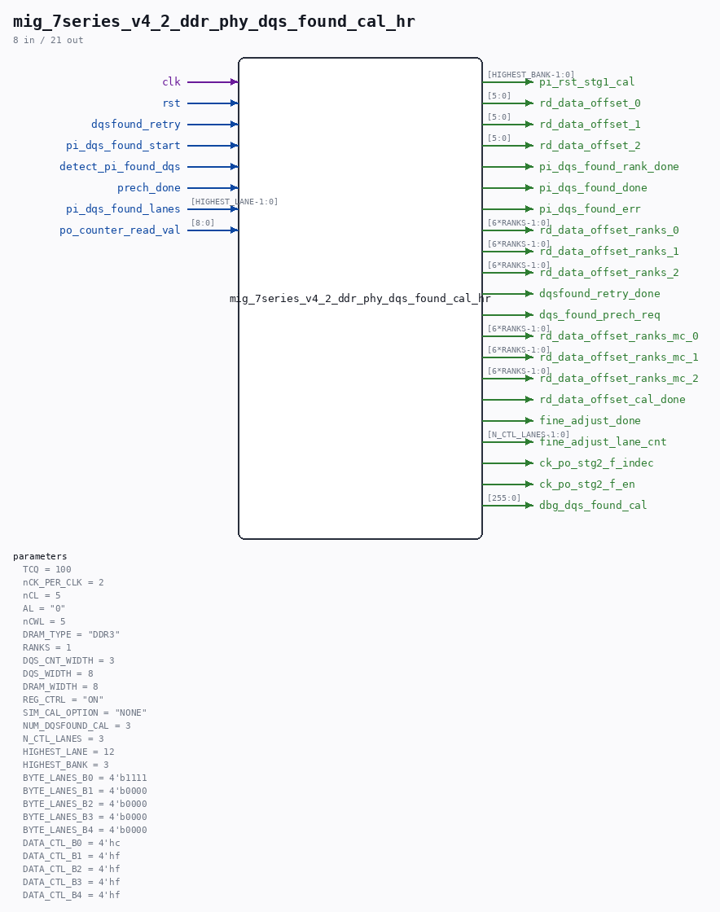

# mig_7series_v4_2_ddr_phy_dqs_found_cal_hr

Source: `/mnt/e/Dev/Repos/Ronny/nd-120/Verilog/fpga/nexys4ddr/ddr2-test/ip/ddr/ddr/user_design/rtl/phy/mig_7series_v4_2_ddr_phy_dqs_found_cal_hr.v`

> Generated by `Verilog/tests/module_doc.py` from the `//!`
> comments in the source. Do not edit by hand - edit the RTL comments and regenerate.

## Parameters

| Parameter | Default |
|---|---|
| `TCQ` | `100` |
| `nCK_PER_CLK` | `2` |
| `nCL` | `5` |
| `AL` | `"0"` |
| `nCWL` | `5` |
| `DRAM_TYPE` | `"DDR3"` |
| `RANKS` | `1` |
| `DQS_CNT_WIDTH` | `3` |
| `DQS_WIDTH` | `8` |
| `DRAM_WIDTH` | `8` |
| `REG_CTRL` | `"ON"` |
| `SIM_CAL_OPTION` | `"NONE"` |
| `NUM_DQSFOUND_CAL` | `3` |
| `N_CTL_LANES` | `3` |
| `HIGHEST_LANE` | `12` |
| `HIGHEST_BANK` | `3` |
| `BYTE_LANES_B0` | `4'b1111` |
| `BYTE_LANES_B1` | `4'b0000` |
| `BYTE_LANES_B2` | `4'b0000` |
| `BYTE_LANES_B3` | `4'b0000` |
| `BYTE_LANES_B4` | `4'b0000` |
| `DATA_CTL_B0` | `4'hc` |
| `DATA_CTL_B1` | `4'hf` |
| `DATA_CTL_B2` | `4'hf` |
| `DATA_CTL_B3` | `4'hf` |
| `DATA_CTL_B4` | `4'hf` |

## Ports

| Direction | Width | Name | Description |
|---|---|---|---|
| input | `1` | `clk` |  |
| input | `1` | `rst` |  |
| input | `1` | `dqsfound_retry` |  |
| input | `1` | `pi_dqs_found_start` |  |
| input | `1` | `detect_pi_found_dqs` |  |
| input | `1` | `prech_done` |  |
| input | `[HIGHEST_LANE-1:0]` | `pi_dqs_found_lanes` |  |
| output | `[HIGHEST_BANK-1:0]` | `pi_rst_stg1_cal` |  |
| output | `[5:0]` | `rd_data_offset_0` |  |
| output | `[5:0]` | `rd_data_offset_1` |  |
| output | `[5:0]` | `rd_data_offset_2` |  |
| output | `1` | `pi_dqs_found_rank_done` |  |
| output | `1` | `pi_dqs_found_done` |  |
| output | `1` | `pi_dqs_found_err` |  |
| output | `[6*RANKS-1:0]` | `rd_data_offset_ranks_0` |  |
| output | `[6*RANKS-1:0]` | `rd_data_offset_ranks_1` |  |
| output | `[6*RANKS-1:0]` | `rd_data_offset_ranks_2` |  |
| output | `1` | `dqsfound_retry_done` |  |
| output | `1` | `dqs_found_prech_req` |  |
| output | `[6*RANKS-1:0]` | `rd_data_offset_ranks_mc_0` |  |
| output | `[6*RANKS-1:0]` | `rd_data_offset_ranks_mc_1` |  |
| output | `[6*RANKS-1:0]` | `rd_data_offset_ranks_mc_2` |  |
| input | `[8:0]` | `po_counter_read_val` |  |
| output | `1` | `rd_data_offset_cal_done` |  |
| output | `1` | `fine_adjust_done` |  |
| output | `[N_CTL_LANES-1:0]` | `fine_adjust_lane_cnt` |  |
| output | `1` | `ck_po_stg2_f_indec` |  |
| output | `1` | `ck_po_stg2_f_en` |  |
| output | `[255:0]` | `dbg_dqs_found_cal` |  |
