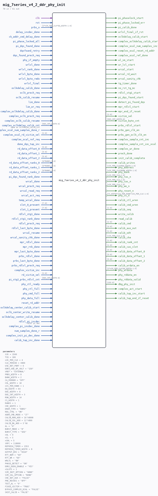

# mig_7series_v4_2_ddr_phy_init

Source: `/mnt/e/Dev/Repos/Ronny/nd-120/Verilog/fpga/nexys4ddr/ddr2-test/ip/ddr/ddr/user_design/rtl/phy/mig_7series_v4_2_ddr_phy_init.v`

> Generated by `Verilog/tests/module_doc.py` from the `//!`
> comments in the source. Do not edit by hand - edit the RTL comments and regenerate.

## Parameters

| Parameter | Default |
|---|---|
| `tCK` | `1500` |
| `TCQ` | `100` |
| `nCK_PER_CLK` | `4` |
| `CLK_PERIOD` | `3000` |
| `USE_ODT_PORT` | `0` |
| `DDR3_VDD_OP_VOLT` | `"150"` |
| `VREF` | `"EXTERNAL"` |
| `PRBS_WIDTH` | `8` |
| `BANK_WIDTH` | `2` |
| `CA_MIRROR` | `"OFF"` |
| `COL_WIDTH` | `10` |
| `nCS_PER_RANK` | `1` |
| `DQ_WIDTH` | `64` |
| `DQS_WIDTH` | `8` |
| `DQS_CNT_WIDTH` | `3` |
| `ROW_WIDTH` | `14` |
| `CS_WIDTH` | `1` |
| `RANKS` | `1` |
| `CKE_WIDTH` | `1` |
| `DRAM_TYPE` | `"DDR3"` |
| `REG_CTRL` | `"ON"` |
| `ADDR_CMD_MODE` | `"1T"` |
| `CALIB_ROW_ADD` | `16'h0000` |
| `CALIB_COL_ADD` | `12'h000` |
| `CALIB_BA_ADD` | `3'h0` |
| `AL` | `"0"` |
| `BURST_MODE` | `"8"` |
| `BURST_TYPE` | `"SEQ"` |
| `nAL` | `0` |
| `nCL` | `5` |
| `nCWL` | `5` |
| `tRFC` | `110000` |
| `REFRESH_TIMER` | `1553` |
| `REFRESH_TIMER_WIDTH` | `8` |
| `OUTPUT_DRV` | `"HIGH"` |
| `RTT_NOM` | `"60"` |
| `RTT_WR` | `"60"` |
| `WRLVL` | `"ON"` |
| `PHASE_DETECT` | `"ON"` |
| `DDR2_DQSN_ENABLE` | `"YES"` |
| `nSLOTS` | `1` |
| `SIM_INIT_OPTION` | `"NONE"` |
| `SIM_CAL_OPTION` | `"NONE"` |
| `CKE_ODT_AUX` | `"FALSE"` |
| `PRE_REV3ES` | `"OFF"` |
| `TEST_AL` | `"0"` |
| `FIXED_VICTIM` | `"TRUE"` |
| `BYPASS_COMPLEX_OCAL` | `"FALSE"` |
| `SKIP_CALIB` | `"FALSE"` |

## Ports

| Direction | Width | Name | Description |
|---|---|---|---|
| input | `1` | `clk` |  |
| input | `1` | `rst` |  |
| input | `[2*nCK_PER_CLK*DQ_WIDTH-1:0]` | `prbs_o` |  |
| input | `1` | `delay_incdec_done` |  |
| input | `1` | `ck_addr_cmd_delay_done` |  |
| input | `1` | `pi_phase_locked_all` |  |
| input | `1` | `pi_dqs_found_done` |  |
| input | `1` | `dqsfound_retry` |  |
| input | `1` | `dqs_found_prech_req` |  |
| output | `1` | `pi_phaselock_start` |  |
| output | `1` | `pi_phase_locked_err` |  |
| output | `1` | `pi_calib_done` |  |
| input | `1` | `phy_if_empty` |  |
| input | `1` | `wrlvl_done` |  |
| input | `1` | `wrlvl_rank_done` |  |
| input | `1` | `wrlvl_byte_done` |  |
| input | `1` | `wrlvl_byte_redo` |  |
| input | `1` | `wrlvl_final` |  |
| output | `1` | `wrlvl_final_if_rst` |  |
| input | `1` | `oclkdelay_calib_done` |  |
| input | `1` | `oclk_prech_req` |  |
| input | `1` | `oclk_calib_resume` |  |
| input | `1` | `lim_done` |  |
| input | `1` | `lim_wr_req` |  |
| output | `1` | `oclkdelay_calib_start` |  |
| input | `1` | `complex_oclkdelay_calib_done` |  |
| input | `1` | `complex_oclk_prech_req` |  |
| input | `1` | `complex_oclk_calib_resume` |  |
| output | `1` | `complex_oclkdelay_calib_start` |  |
| input | `[DQS_CNT_WIDTH:0]` | `complex_oclkdelay_calib_cnt` | same as oclkdelay_calib_cnt |
| output | `1` | `complex_ocal_num_samples_inc` |  |
| input | `1` | `complex_ocal_num_samples_done_r` |  |
| input | `[2:0]` | `complex_ocal_rd_victim_sel` |  |
| output | `1` | `complex_ocal_reset_rd_addr` |  |
| input | `1` | `complex_ocal_ref_req` |  |
| output | `1` | `complex_ocal_ref_done` |  |
| input | `1` | `done_dqs_tap_inc` |  |
| input | `[5:0]` | `rd_data_offset_0` |  |
| input | `[5:0]` | `rd_data_offset_1` |  |
| input | `[5:0]` | `rd_data_offset_2` |  |
| input | `[6*RANKS-1:0]` | `rd_data_offset_ranks_0` |  |
| input | `[6*RANKS-1:0]` | `rd_data_offset_ranks_1` |  |
| input | `[6*RANKS-1:0]` | `rd_data_offset_ranks_2` |  |
| input | `1` | `pi_dqs_found_rank_done` |  |
| input | `1` | `wrcal_done` |  |
| input | `1` | `wrcal_prech_req` |  |
| input | `1` | `wrcal_read_req` |  |
| input | `1` | `wrcal_act_req` |  |
| input | `1` | `temp_wrcal_done` |  |
| input | `[7:0]` | `slot_0_present` |  |
| input | `[7:0]` | `slot_1_present` |  |
| output | `1` | `wl_sm_start` |  |
| output | `1` | `wr_lvl_start` |  |
| output | `1` | `wrcal_start` |  |
| output | `1` | `wrcal_rd_wait` |  |
| output | `1` | `wrcal_sanity_chk` |  |
| output | `1` | `tg_timer_done` |  |
| output | `1` | `no_rst_tg_mc` |  |
| input | `1` | `rdlvl_stg1_done` |  |
| input | `1` | `rdlvl_stg1_rank_done` |  |
| output | `1` | `rdlvl_stg1_start` |  |
| output | `1` | `pi_dqs_found_start` |  |
| output | `1` | `detect_pi_found_dqs` |  |
| input | `1` | `rdlvl_prech_req` |  |
| input | `1` | `rdlvl_last_byte_done` |  |
| input | `1` | `wrcal_resume` |  |
| input | `1` | `wrcal_sanity_chk_done` |  |
| input | `1` | `mpr_rdlvl_done` |  |
| input | `1` | `mpr_rnk_done` |  |
| input | `1` | `mpr_last_byte_done` |  |
| output | `1` | `mpr_rdlvl_start` |  |
| output | `1` | `mpr_end_if_reset` |  |
| input | `1` | `prbs_rdlvl_done` |  |
| input | `1` | `prbs_last_byte_done` |  |
| input | `1` | `prbs_rdlvl_prech_req` |  |
| input | `1` | `complex_victim_inc` |  |
| input | `[2:0]` | `rd_victim_sel` |  |
| input | `[DQS_CNT_WIDTH:0]` | `pi_stg2_prbs_rdlvl_cnt` |  |
| output | `[2:0]` | `victim_sel` |  |
| output | `[DQS_CNT_WIDTH:0]` | `victim_byte_cnt` |  |
| output | `1` | `prbs_rdlvl_start` |  |
| output | `1` | `prbs_gen_clk_en` |  |
| output | `1` | `prbs_gen_oclk_clk_en` |  |
| output | `1` | `complex_sample_cnt_inc` |  |
| output | `1` | `complex_sample_cnt_inc_ocal` |  |
| output | `1` | `complex_wr_done` |  |
| output | `1` | `prech_done` |  |
| output | `1` | `init_calib_complete` |  |
| output | `1` | `calib_writes` |  |
| output | `[nCK_PER_CLK*ROW_WIDTH-1:0]` | `phy_address` |  |
| output | `[nCK_PER_CLK*BANK_WIDTH-1:0]` | `phy_bank` |  |
| output | `[nCK_PER_CLK-1:0]` | `phy_ras_n` *(active low)* |  |
| output | `[nCK_PER_CLK-1:0]` | `phy_cas_n` *(active low)* |  |
| output | `[nCK_PER_CLK-1:0]` | `phy_we_n` *(active low)* |  |
| output | `1` | `phy_reset_n` *(active low)* |  |
| output | `[CS_WIDTH*nCS_PER_RANK*nCK_PER_CLK-1:0]` | `phy_cs_n` *(active low)* |  |
| input | `1` | `phy_ctl_ready` |  |
| input | `1` | `phy_ctl_full` |  |
| input | `1` | `phy_cmd_full` |  |
| input | `1` | `phy_data_full` |  |
| output | `1` | `calib_ctl_wren` |  |
| output | `1` | `calib_cmd_wren` |  |
| output | `[1:0]` | `calib_seq` |  |
| output | `1` | `write_calib` |  |
| output | `1` | `read_calib` |  |
| output | `[2:0]` | `calib_cmd` |  |
| output | `[3:0]` | `calib_aux_out` |  |
| output | `[1:0]` | `calib_odt` |  |
| output | `[nCK_PER_CLK-1:0]` | `calib_cke` |  |
| output | `[1:0]` | `calib_rank_cnt` |  |
| output | `[1:0]` | `calib_cas_slot` |  |
| output | `[5:0]` | `calib_data_offset_0` |  |
| output | `[5:0]` | `calib_data_offset_1` |  |
| output | `[5:0]` | `calib_data_offset_2` |  |
| output | `1` | `calib_wrdata_en` |  |
| output | `[2*nCK_PER_CLK*DQ_WIDTH-1:0]` | `phy_wrdata` |  |
| output | `1` | `phy_rddata_en` |  |
| output | `1` | `phy_rddata_valid` |  |
| output | `[255:0]` | `dbg_phy_init` |  |
| input | `1` | `reset_rd_addr` |  |
| input | `1` | `oclkdelay_center_calib_start` |  |
| input | `1` | `oclk_center_write_resume` |  |
| input | `1` | `oclkdelay_center_calib_done` |  |
| input | `1` | `rdlvl_pi_incdec` | rdlvl pi dec |
| input | `1` | `complex_pi_incdec_done` |  |
| input | `1` | `num_samples_done_r` |  |
| input | `1` | `complex_init_pi_dec_done` |  |
| output | `1` | `complex_act_start` |  |
| output | `1` | `calib_tap_inc_start` |  |
| output | `1` | `calib_tap_end_if_reset` |  |
| input | `1` | `calib_tap_inc_done` |  |
