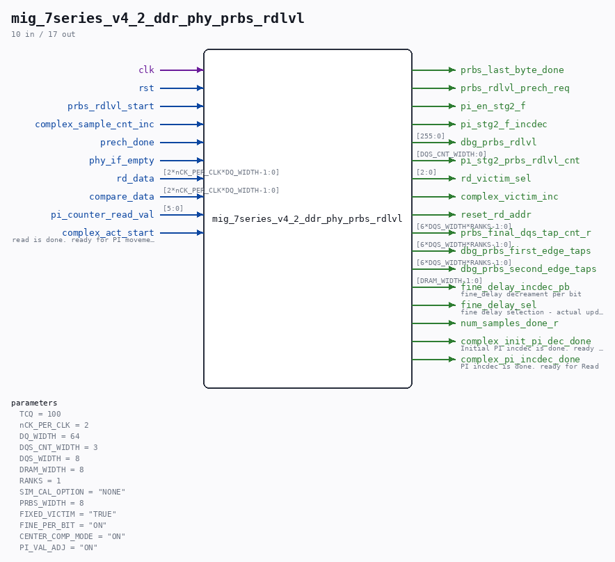

# mig_7series_v4_2_ddr_phy_prbs_rdlvl

Source: `/mnt/e/Dev/Repos/Ronny/nd-120/Verilog/fpga/nexys4ddr/ddr2-test/ip/ddr/ddr/user_design/rtl/phy/mig_7series_v4_2_ddr_phy_prbs_rdlvl.v`

> Generated by `Verilog/tests/module_doc.py` from the `//!`
> comments in the source. Do not edit by hand - edit the RTL comments and regenerate.

## Parameters

| Parameter | Default |
|---|---|
| `TCQ` | `100` |
| `nCK_PER_CLK` | `2` |
| `DQ_WIDTH` | `64` |
| `DQS_CNT_WIDTH` | `3` |
| `DQS_WIDTH` | `8` |
| `DRAM_WIDTH` | `8` |
| `RANKS` | `1` |
| `SIM_CAL_OPTION` | `"NONE"` |
| `PRBS_WIDTH` | `8` |
| `FIXED_VICTIM` | `"TRUE"` |
| `FINE_PER_BIT` | `"ON"` |
| `CENTER_COMP_MODE` | `"ON"` |
| `PI_VAL_ADJ` | `"ON"` |

## Ports

| Direction | Width | Name | Description |
|---|---|---|---|
| input | `1` | `clk` |  |
| input | `1` | `rst` |  |
| input | `1` | `prbs_rdlvl_start` |  |
| output | `1` | `prbs_last_byte_done` |  |
| output | `1` | `prbs_rdlvl_prech_req` |  |
| input | `1` | `complex_sample_cnt_inc` |  |
| input | `1` | `prech_done` |  |
| input | `1` | `phy_if_empty` |  |
| input | `[2*nCK_PER_CLK*DQ_WIDTH-1:0]` | `rd_data` |  |
| input | `[2*nCK_PER_CLK*DQ_WIDTH-1:0]` | `compare_data` |  |
| input | `[5:0]` | `pi_counter_read_val` |  |
| output | `1` | `pi_en_stg2_f` |  |
| output | `1` | `pi_stg2_f_incdec` |  |
| output | `[255:0]` | `dbg_prbs_rdlvl` |  |
| output | `[DQS_CNT_WIDTH:0]` | `pi_stg2_prbs_rdlvl_cnt` |  |
| output | `[2:0]` | `rd_victim_sel` |  |
| output | `1` | `complex_victim_inc` |  |
| output | `1` | `reset_rd_addr` |  |
| output | `[6*DQS_WIDTH*RANKS-1:0]` | `prbs_final_dqs_tap_cnt_r` |  |
| output | `[6*DQS_WIDTH*RANKS-1:0]` | `dbg_prbs_first_edge_taps` |  |
| output | `[6*DQS_WIDTH*RANKS-1:0]` | `dbg_prbs_second_edge_taps` |  |
| output | `[DRAM_WIDTH-1:0]` | `fine_delay_incdec_pb` | fine_delay decreament per bit |
| output | `1` | `fine_delay_sel` | fine delay selection - actual update of fine delay |
| output | `1` | `num_samples_done_r` |  |
| input | `1` | `complex_act_start` | read is done. ready for PI movement |
| output | `1` | `complex_init_pi_dec_done` | Initial PI incdec is done. ready for start |
| output | `1` | `complex_pi_incdec_done` | PI incdec is done. ready for Read |
