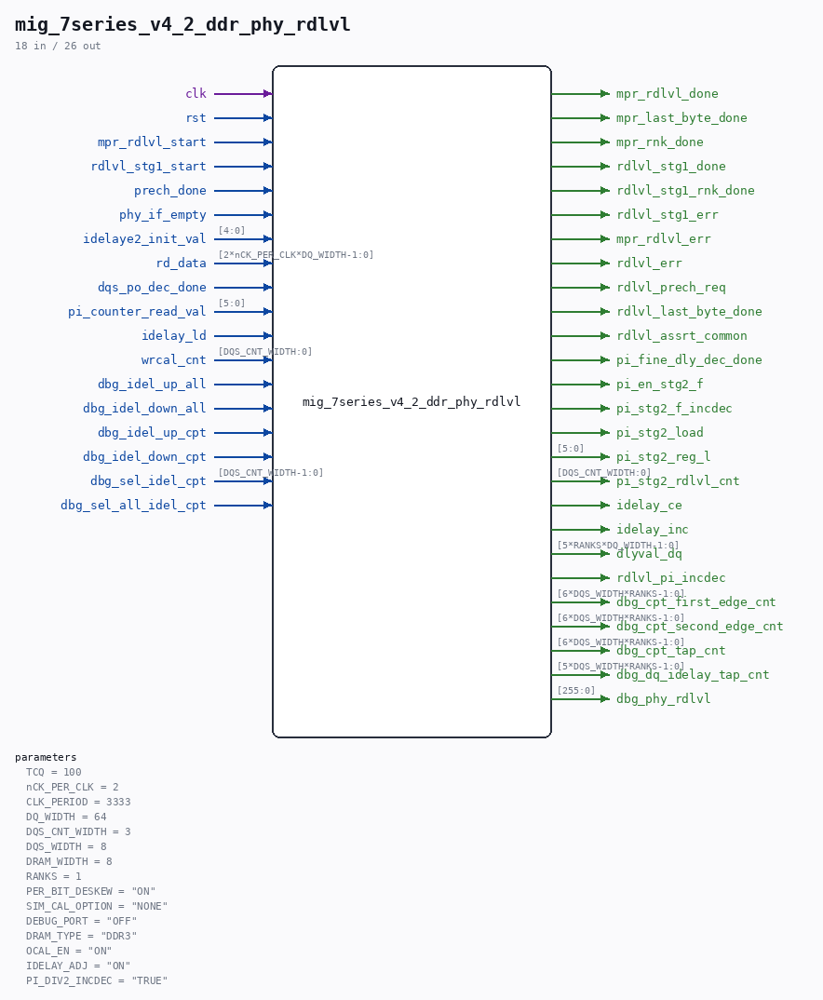

# mig_7series_v4_2_ddr_phy_rdlvl

Source: `/mnt/e/Dev/Repos/Ronny/nd-120/Verilog/fpga/nexys4ddr/ddr2-test/ip/ddr/ddr/user_design/rtl/phy/mig_7series_v4_2_ddr_phy_rdlvl.v`

> Generated by `Verilog/tests/module_doc.py` from the `//!`
> comments in the source. Do not edit by hand - edit the RTL comments and regenerate.

## Parameters

| Parameter | Default |
|---|---|
| `TCQ` | `100` |
| `nCK_PER_CLK` | `2` |
| `CLK_PERIOD` | `3333` |
| `DQ_WIDTH` | `64` |
| `DQS_CNT_WIDTH` | `3` |
| `DQS_WIDTH` | `8` |
| `DRAM_WIDTH` | `8` |
| `RANKS` | `1` |
| `PER_BIT_DESKEW` | `"ON"` |
| `SIM_CAL_OPTION` | `"NONE"` |
| `DEBUG_PORT` | `"OFF"` |
| `DRAM_TYPE` | `"DDR3"` |
| `OCAL_EN` | `"ON"` |
| `IDELAY_ADJ` | `"ON"` |
| `PI_DIV2_INCDEC` | `"TRUE"` |

## Ports

| Direction | Width | Name | Description |
|---|---|---|---|
| input | `1` | `clk` |  |
| input | `1` | `rst` |  |
| input | `1` | `mpr_rdlvl_start` |  |
| output | `1` | `mpr_rdlvl_done` |  |
| output | `1` | `mpr_last_byte_done` |  |
| output | `1` | `mpr_rnk_done` |  |
| input | `1` | `rdlvl_stg1_start` |  |
| output | `1` | `rdlvl_stg1_done` |  |
| output | `1` | `rdlvl_stg1_rnk_done` |  |
| output | `1` | `rdlvl_stg1_err` |  |
| output | `1` | `mpr_rdlvl_err` |  |
| output | `1` | `rdlvl_err` |  |
| output | `1` | `rdlvl_prech_req` |  |
| output | `1` | `rdlvl_last_byte_done` |  |
| output | `1` | `rdlvl_assrt_common` |  |
| input | `1` | `prech_done` |  |
| input | `1` | `phy_if_empty` |  |
| input | `[4:0]` | `idelaye2_init_val` |  |
| input | `[2*nCK_PER_CLK*DQ_WIDTH-1:0]` | `rd_data` |  |
| input | `1` | `dqs_po_dec_done` |  |
| input | `[5:0]` | `pi_counter_read_val` |  |
| output | `1` | `pi_fine_dly_dec_done` |  |
| output | `1` | `pi_en_stg2_f` |  |
| output | `1` | `pi_stg2_f_incdec` |  |
| output | `1` | `pi_stg2_load` |  |
| output | `[5:0]` | `pi_stg2_reg_l` |  |
| output | `[DQS_CNT_WIDTH:0]` | `pi_stg2_rdlvl_cnt` |  |
| output | `1` | `idelay_ce` |  |
| output | `1` | `idelay_inc` |  |
| input | `1` | `idelay_ld` |  |
| input | `[DQS_CNT_WIDTH:0]` | `wrcal_cnt` |  |
| output | `[5*RANKS*DQ_WIDTH-1:0]` | `dlyval_dq` |  |
| output | `1` | `rdlvl_pi_incdec` |  |
| output | `[6*DQS_WIDTH*RANKS-1:0]` | `dbg_cpt_first_edge_cnt` |  |
| output | `[6*DQS_WIDTH*RANKS-1:0]` | `dbg_cpt_second_edge_cnt` |  |
| output | `[6*DQS_WIDTH*RANKS-1:0]` | `dbg_cpt_tap_cnt` |  |
| output | `[5*DQS_WIDTH*RANKS-1:0]` | `dbg_dq_idelay_tap_cnt` |  |
| input | `1` | `dbg_idel_up_all` |  |
| input | `1` | `dbg_idel_down_all` |  |
| input | `1` | `dbg_idel_up_cpt` |  |
| input | `1` | `dbg_idel_down_cpt` |  |
| input | `[DQS_CNT_WIDTH-1:0]` | `dbg_sel_idel_cpt` |  |
| input | `1` | `dbg_sel_all_idel_cpt` |  |
| output | `[255:0]` | `dbg_phy_rdlvl` |  |
