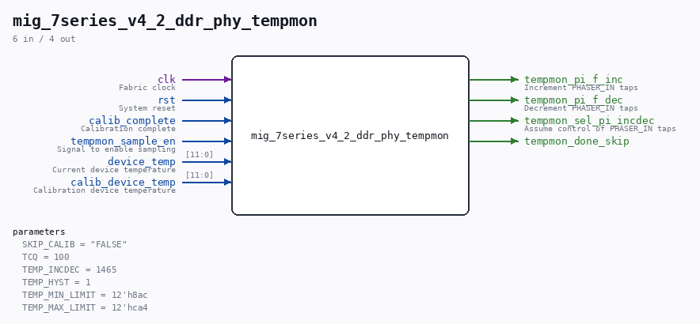

# mig_7series_v4_2_ddr_phy_tempmon

Source: `/mnt/e/Dev/Repos/Ronny/nd-120/Verilog/fpga/nexys4ddr/ddr2-test/ip/ddr/ddr/user_design/rtl/phy/mig_7series_v4_2_ddr_phy_tempmon.v`

> Generated by `Verilog/tests/module_doc.py` from the `//!`
> comments in the source. Do not edit by hand - edit the RTL comments and regenerate.

## Parameters

| Parameter | Default |
|---|---|
| `SKIP_CALIB` | `"FALSE"` |
| `TCQ` | `100` |
| `TEMP_INCDEC` | `1465` |
| `TEMP_HYST` | `1` |
| `TEMP_MIN_LIMIT` | `12'h8ac` |
| `TEMP_MAX_LIMIT` | `12'hca4` |

## Ports

| Direction | Width | Name | Description |
|---|---|---|---|
| input | `1` | `clk` | Fabric clock |
| input | `1` | `rst` | System reset |
| input | `1` | `calib_complete` | Calibration complete |
| input | `1` | `tempmon_sample_en` | Signal to enable sampling |
| input | `[11:0]` | `device_temp` | Current device temperature |
| input | `[11:0]` | `calib_device_temp` | Calibration device temperature |
| output | `1` | `tempmon_pi_f_inc` | Increment PHASER_IN taps |
| output | `1` | `tempmon_pi_f_dec` | Decrement PHASER_IN taps |
| output | `1` | `tempmon_sel_pi_incdec` | Assume control of PHASER_IN taps |
| output | `1` | `tempmon_done_skip` |  |
