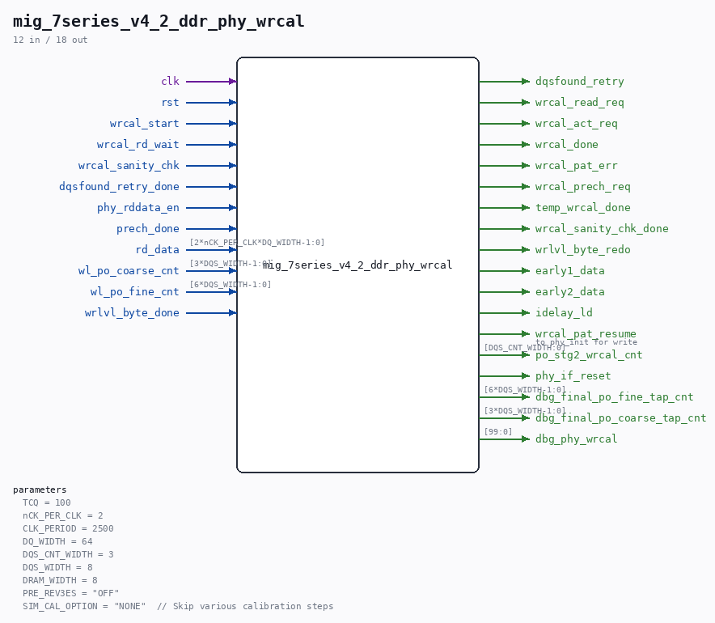

# mig_7series_v4_2_ddr_phy_wrcal

Source: `/mnt/e/Dev/Repos/Ronny/nd-120/Verilog/fpga/nexys4ddr/ddr2-test/ip/ddr/ddr/user_design/rtl/phy/mig_7series_v4_2_ddr_phy_wrcal.v`

> Generated by `Verilog/tests/module_doc.py` from the `//!`
> comments in the source. Do not edit by hand - edit the RTL comments and regenerate.

## Parameters

| Parameter | Default |
|---|---|
| `TCQ` | `100` |
| `nCK_PER_CLK` | `2` |
| `CLK_PERIOD` | `2500` |
| `DQ_WIDTH` | `64` |
| `DQS_CNT_WIDTH` | `3` |
| `DQS_WIDTH` | `8` |
| `DRAM_WIDTH` | `8` |
| `PRE_REV3ES` | `"OFF"` |
| `SIM_CAL_OPTION` | `"NONE"  // Skip various calibration steps` |

## Ports

| Direction | Width | Name | Description |
|---|---|---|---|
| input | `1` | `clk` |  |
| input | `1` | `rst` |  |
| input | `1` | `wrcal_start` |  |
| input | `1` | `wrcal_rd_wait` |  |
| input | `1` | `wrcal_sanity_chk` |  |
| input | `1` | `dqsfound_retry_done` |  |
| input | `1` | `phy_rddata_en` |  |
| output | `1` | `dqsfound_retry` |  |
| output | `1` | `wrcal_read_req` |  |
| output | `1` | `wrcal_act_req` |  |
| output | `1` | `wrcal_done` |  |
| output | `1` | `wrcal_pat_err` |  |
| output | `1` | `wrcal_prech_req` |  |
| output | `1` | `temp_wrcal_done` |  |
| output | `1` | `wrcal_sanity_chk_done` |  |
| input | `1` | `prech_done` |  |
| input | `[2*nCK_PER_CLK*DQ_WIDTH-1:0]` | `rd_data` |  |
| input | `[3*DQS_WIDTH-1:0]` | `wl_po_coarse_cnt` |  |
| input | `[6*DQS_WIDTH-1:0]` | `wl_po_fine_cnt` |  |
| input | `1` | `wrlvl_byte_done` |  |
| output | `1` | `wrlvl_byte_redo` |  |
| output | `1` | `early1_data` |  |
| output | `1` | `early2_data` |  |
| output | `1` | `idelay_ld` |  |
| output | `1` | `wrcal_pat_resume` | to phy_init for write |
| output | `[DQS_CNT_WIDTH:0]` | `po_stg2_wrcal_cnt` |  |
| output | `1` | `phy_if_reset` |  |
| output | `[6*DQS_WIDTH-1:0]` | `dbg_final_po_fine_tap_cnt` |  |
| output | `[3*DQS_WIDTH-1:0]` | `dbg_final_po_coarse_tap_cnt` |  |
| output | `[99:0]` | `dbg_phy_wrcal` |  |
