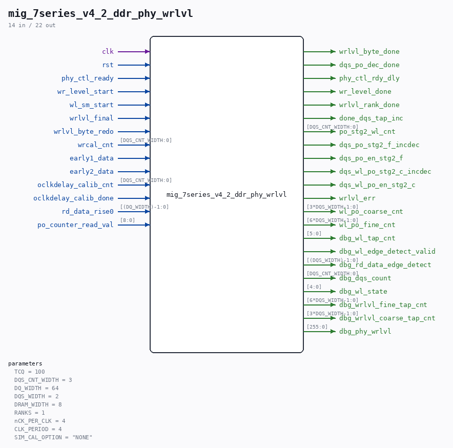

# mig_7series_v4_2_ddr_phy_wrlvl

Source: `/mnt/e/Dev/Repos/Ronny/nd-120/Verilog/fpga/nexys4ddr/ddr2-test/ip/ddr/ddr/user_design/rtl/phy/mig_7series_v4_2_ddr_phy_wrlvl.v`

> Generated by `Verilog/tests/module_doc.py` from the `//!`
> comments in the source. Do not edit by hand - edit the RTL comments and regenerate.

## Parameters

| Parameter | Default |
|---|---|
| `TCQ` | `100` |
| `DQS_CNT_WIDTH` | `3` |
| `DQ_WIDTH` | `64` |
| `DQS_WIDTH` | `2` |
| `DRAM_WIDTH` | `8` |
| `RANKS` | `1` |
| `nCK_PER_CLK` | `4` |
| `CLK_PERIOD` | `4` |
| `SIM_CAL_OPTION` | `"NONE"` |

## Ports

| Direction | Width | Name | Description |
|---|---|---|---|
| input | `1` | `clk` |  |
| input | `1` | `rst` |  |
| input | `1` | `phy_ctl_ready` |  |
| input | `1` | `wr_level_start` |  |
| input | `1` | `wl_sm_start` |  |
| input | `1` | `wrlvl_final` |  |
| input | `1` | `wrlvl_byte_redo` |  |
| input | `[DQS_CNT_WIDTH:0]` | `wrcal_cnt` |  |
| input | `1` | `early1_data` |  |
| input | `1` | `early2_data` |  |
| input | `[DQS_CNT_WIDTH:0]` | `oclkdelay_calib_cnt` |  |
| input | `1` | `oclkdelay_calib_done` |  |
| input | `[(DQ_WIDTH)-1:0]` | `rd_data_rise0` |  |
| output | `1` | `wrlvl_byte_done` |  |
| output | `1` | `dqs_po_dec_done` |  |
| output | `1` | `phy_ctl_rdy_dly` |  |
| output | `1` | `wr_level_done` |  |
| output | `1` | `wrlvl_rank_done` |  |
| output | `1` | `done_dqs_tap_inc` |  |
| output | `[DQS_CNT_WIDTH:0]` | `po_stg2_wl_cnt` |  |
| output | `1` | `dqs_po_stg2_f_incdec` |  |
| output | `1` | `dqs_po_en_stg2_f` |  |
| output | `1` | `dqs_wl_po_stg2_c_incdec` |  |
| output | `1` | `dqs_wl_po_en_stg2_c` |  |
| input | `[8:0]` | `po_counter_read_val` |  |
| output | `1` | `wrlvl_err` |  |
| output | `[3*DQS_WIDTH-1:0]` | `wl_po_coarse_cnt` |  |
| output | `[6*DQS_WIDTH-1:0]` | `wl_po_fine_cnt` |  |
| output | `[5:0]` | `dbg_wl_tap_cnt` |  |
| output | `1` | `dbg_wl_edge_detect_valid` |  |
| output | `[(DQS_WIDTH)-1:0]` | `dbg_rd_data_edge_detect` |  |
| output | `[DQS_CNT_WIDTH:0]` | `dbg_dqs_count` |  |
| output | `[4:0]` | `dbg_wl_state` |  |
| output | `[6*DQS_WIDTH-1:0]` | `dbg_wrlvl_fine_tap_cnt` |  |
| output | `[3*DQS_WIDTH-1:0]` | `dbg_wrlvl_coarse_tap_cnt` |  |
| output | `[255:0]` | `dbg_phy_wrlvl` |  |
