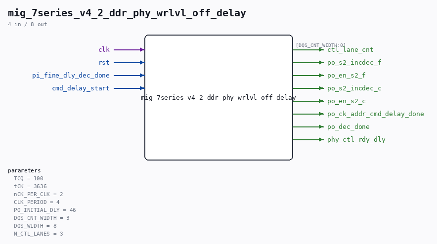

# mig_7series_v4_2_ddr_phy_wrlvl_off_delay

Source: `/mnt/e/Dev/Repos/Ronny/nd-120/Verilog/fpga/nexys4ddr/ddr2-test/ip/ddr/ddr/user_design/rtl/phy/mig_7series_v4_2_ddr_phy_wrlvl_off_delay.v`

> Generated by `Verilog/tests/module_doc.py` from the `//!`
> comments in the source. Do not edit by hand - edit the RTL comments and regenerate.

## Parameters

| Parameter | Default |
|---|---|
| `TCQ` | `100` |
| `tCK` | `3636` |
| `nCK_PER_CLK` | `2` |
| `CLK_PERIOD` | `4` |
| `PO_INITIAL_DLY` | `46` |
| `DQS_CNT_WIDTH` | `3` |
| `DQS_WIDTH` | `8` |
| `N_CTL_LANES` | `3` |

## Ports

| Direction | Width | Name | Description |
|---|---|---|---|
| input | `1` | `clk` |  |
| input | `1` | `rst` |  |
| input | `1` | `pi_fine_dly_dec_done` |  |
| input | `1` | `cmd_delay_start` |  |
| output | `[DQS_CNT_WIDTH:0]` | `ctl_lane_cnt` |  |
| output | `1` | `po_s2_incdec_f` |  |
| output | `1` | `po_en_s2_f` |  |
| output | `1` | `po_s2_incdec_c` |  |
| output | `1` | `po_en_s2_c` |  |
| output | `1` | `po_ck_addr_cmd_delay_done` |  |
| output | `1` | `po_dec_done` |  |
| output | `1` | `phy_ctl_rdy_dly` |  |
