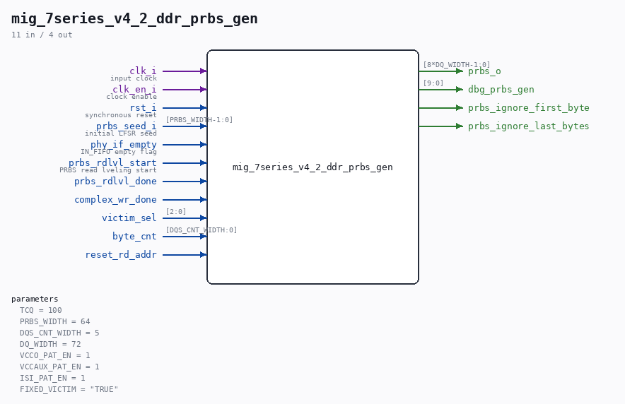

# mig_7series_v4_2_ddr_prbs_gen

Source: `/mnt/e/Dev/Repos/Ronny/nd-120/Verilog/fpga/nexys4ddr/ddr2-test/ip/ddr/ddr/user_design/rtl/phy/mig_7series_v4_2_ddr_prbs_gen.v`

> Generated by `Verilog/tests/module_doc.py` from the `//!`
> comments in the source. Do not edit by hand - edit the RTL comments and regenerate.

## Parameters

| Parameter | Default |
|---|---|
| `TCQ` | `100` |
| `PRBS_WIDTH` | `64` |
| `DQS_CNT_WIDTH` | `5` |
| `DQ_WIDTH` | `72` |
| `VCCO_PAT_EN` | `1` |
| `VCCAUX_PAT_EN` | `1` |
| `ISI_PAT_EN` | `1` |
| `FIXED_VICTIM` | `"TRUE"` |

## Ports

| Direction | Width | Name | Description |
|---|---|---|---|
| input | `1` | `clk_i` | input clock |
| input | `1` | `clk_en_i` | clock enable |
| input | `1` | `rst_i` | synchronous reset |
| input | `[PRBS_WIDTH-1:0]` | `prbs_seed_i` | initial LFSR seed |
| input | `1` | `phy_if_empty` | IN_FIFO empty flag |
| input | `1` | `prbs_rdlvl_start` | PRBS read lveling start |
| input | `1` | `prbs_rdlvl_done` |  |
| input | `1` | `complex_wr_done` |  |
| input | `[2:0]` | `victim_sel` |  |
| input | `[DQS_CNT_WIDTH:0]` | `byte_cnt` |  |
| output | `[8*DQ_WIDTH-1:0]` | `prbs_o` |  |
| output | `[9:0]` | `dbg_prbs_gen` |  |
| input | `1` | `reset_rd_addr` |  |
| output | `1` | `prbs_ignore_first_byte` |  |
| output | `1` | `prbs_ignore_last_bytes` |  |
