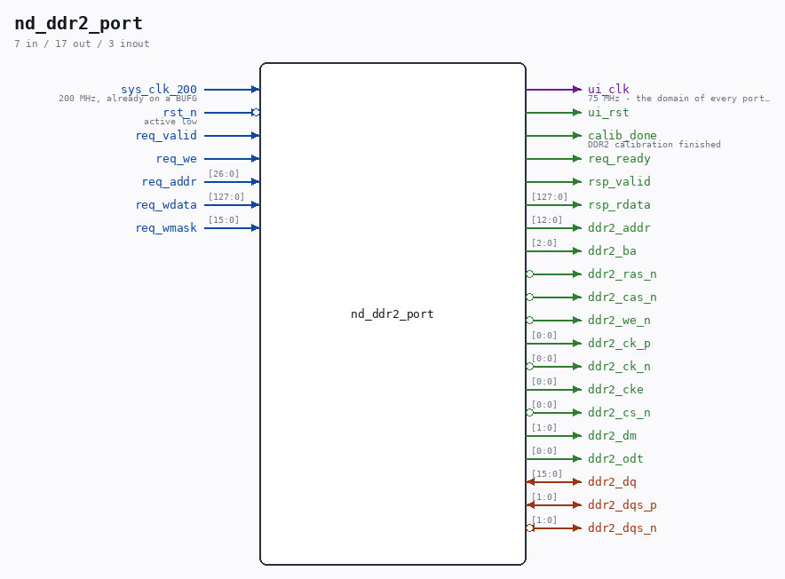

# nd_ddr2_port

Source: `/mnt/e/Dev/Repos/Ronny/nd-120/Verilog/fpga/nexys4ddr/ddr2/nd_ddr2_port.v`

> Generated by `Verilog/tests/module_doc.py` from the `//!`
> comments in the source. Do not edit by hand - edit the RTL comments and regenerate.

## Description

nd_ddr2_port - reusable access port to the Nexys 4 DDR's 128 MiB DDR2
One place that owns the MIG controller and hides its two-handshake
command interface behind a plain request/response port. Everything that
needs DDR2 on this board uses THIS module:
- the memory test in the SD-FAT tool (sd-fat-test/nd_memtest_ddr2.v)
- the ND-120 sheet-49 main-memory backend, when that is built
(see ../EXTENSIONS-PLAN.md - the backend needs a latency answer
first, which the memory test measures and reports)
Why a wrapper at all: MIG's native interface has TWO independent
handshakes that can complete in either order - the command is taken when
app_en & app_rdy, the write data when app_wdf_wren & app_wdf_rdy - and a
request must be held until its own handshake fires, then dropped in the
SAME cycle it is taken or the command is issued twice. That is easy to
get wrong once and impossible to get wrong twice if it lives here.
PORT CONTRACT (everything below is in the ui_clk domain)
req_valid  hold high until req_ready is high in the same cycle
req_we     1 = write, 0 = read
req_addr   address in 16-BIT UNITS and a MULTIPLE OF 8: one transfer
moves 128 bits = 8 units. Valid range 0 .. 2^26-1 (the
device is 64M x 16 = 128 MiB; app_addr's top bit is unused)
req_wdata  128 bits; req_wmask is MIG's active-low byte mask (0 = write
that byte), so a partial-word update needs no read-modify-
write
rsp_valid  one cycle: read data is on rsp_rdata, or a write is done
One operation is outstanding at a time - simple, and far faster than any
ND-120 access rate. Pipelining is a later optimisation, not a change of
contract.
The MIG core itself is generated by ../ddr2-test/gen_mig.tcl from
Digilent's own project file; its port list is read out of the generated
ip/ddr/ddr_stub.v, never assumed.
Clocking: sys_clk_200 must be 200 MHz and ALREADY BUFFERED - the MIG
project sets SystemClock = "No Buffer", so no IBUF/BUFG is inserted for
it inside the core. ui_clk comes back out at 75 MHz (600 Mbps, 4:1 PHY).
Last reviewed: 20-AUG-2026
Ronny Hansen

## Ports

| Direction | Width | Name | Description |
|---|---|---|---|
| input | `1` | `sys_clk_200` | 200 MHz, already on a BUFG |
| input | `1` | `rst_n` *(active low)* | active low |
| output | `1` | `ui_clk` | 75 MHz - the domain of every port signal below |
| output | `1` | `ui_rst` |  |
| output | `1` | `calib_done` | DDR2 calibration finished |
| input | `1` | `req_valid` |  |
| input | `1` | `req_we` |  |
| input | `[26:0]` | `req_addr` |  |
| input | `[127:0]` | `req_wdata` |  |
| input | `[15:0]` | `req_wmask` |  |
| output | `1` | `req_ready` |  |
| output | `1` | `rsp_valid` |  |
| output | `[127:0]` | `rsp_rdata` |  |
| inout | `[15:0]` | `ddr2_dq` |  |
| inout | `[1:0]` | `ddr2_dqs_p` |  |
| inout | `[1:0]` | `ddr2_dqs_n` *(active low)* |  |
| output | `[12:0]` | `ddr2_addr` |  |
| output | `[2:0]` | `ddr2_ba` |  |
| output | `1` | `ddr2_ras_n` *(active low)* |  |
| output | `1` | `ddr2_cas_n` *(active low)* |  |
| output | `1` | `ddr2_we_n` *(active low)* |  |
| output | `[0:0]` | `ddr2_ck_p` |  |
| output | `[0:0]` | `ddr2_ck_n` *(active low)* |  |
| output | `[0:0]` | `ddr2_cke` |  |
| output | `[0:0]` | `ddr2_cs_n` *(active low)* |  |
| output | `[1:0]` | `ddr2_dm` |  |
| output | `[0:0]` | `ddr2_odt` |  |
