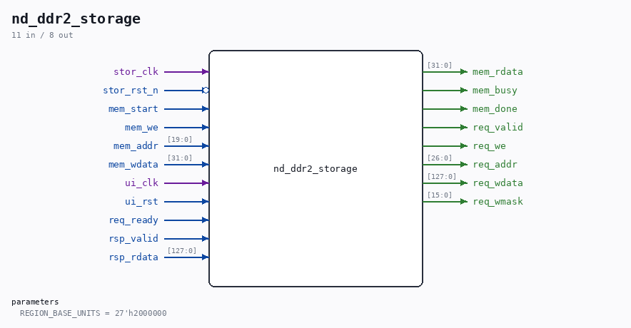

# nd_ddr2_storage

Source: `/mnt/e/Dev/Repos/Ronny/nd-120/Verilog/fpga/nexys4ddr/ddr2/nd_ddr2_storage.v`

> Generated by `Verilog/tests/module_doc.py` from the `//!`
> comments in the source. Do not edit by hand - edit the RTL comments and regenerate.

## Description

nd_ddr2_storage - the nd_storage region, held in DDR2
nd_storage keeps a REGION of block storage that its Phase-4 tag
directory uses as a CACHE of the disc images on the SD card
(Verilog/SD-FAT/circuit/nd_storage_cache.v): the disc classes are
cached, tape and floppy go direct to the card, and writes go through to
the card. On the Tang Nano 20K that region lives in the upper half of
the single SDRAM chip, reached through MEM_RAM_49_SDRAM's
ND_STORAGE_PORT because the CPU's main memory shares the same chip.
This board has DDR2 that nothing else uses yet, so the region connects
to it DIRECTLY through ../ddr2/nd_ddr2_port.v - no detour through the
CPU memory path. When ND-120 main memory later moves into DDR2 as well,
nd_ddr2_port is the place that arbitrates the two clients.
THE PORT CONTRACT (from nd_storage_engine.v, matched exactly):
mem_start  1-cycle pulse, only legal while mem_busy = 0
mem_we / mem_addr / mem_wdata  stable from mem_start until mem_done
mem_rdata  valid at mem_done and held afterwards
mem_busy   level, high for the whole operation
mem_done   1-cycle pulse
ADDRESS MAPPING
mem_addr[19:0] indexes 32-bit words: 1M words = 4 MB of region.
One DDR2 transfer is 128 bits = four of those words, and app_addr
counts 16-bit units with 8 units per transfer, so:
transfer index = mem_addr[19:2]
word in transfer = mem_addr[1:0]
req_addr = REGION_BASE_UNITS + {mem_addr[19:2], 3'b000}
A write updates ONE 32-bit word, so it uses the byte mask rather than
a read-modify-write: MIG's mask is active low, so the four bytes of
the selected lane are 0 and the other twelve are 1.
CLOCK DOMAINS: the storage stack runs on stor_clk (27 MHz here), the
controller on ui_clk (75 MHz). The request crosses as a toggle with the
payload held stable behind it, and completion comes back as a second
toggle - the same shape MEM_RAM_49_SDRAM uses on the Tang.
Last reviewed: 20-AUG-2026
Ronny Hansen

## Parameters

| Parameter | Default |
|---|---|
| `REGION_BASE_UNITS` | `27'h2000000` |

## Ports

| Direction | Width | Name | Description |
|---|---|---|---|
| input | `1` | `stor_clk` |  |
| input | `1` | `stor_rst_n` *(active low)* |  |
| input | `1` | `mem_start` |  |
| input | `1` | `mem_we` |  |
| input | `[19:0]` | `mem_addr` |  |
| input | `[31:0]` | `mem_wdata` |  |
| output | `[31:0]` | `mem_rdata` |  |
| output | `1` | `mem_busy` |  |
| output | `1` | `mem_done` |  |
| input | `1` | `ui_clk` |  |
| input | `1` | `ui_rst` |  |
| output | `1` | `req_valid` |  |
| output | `1` | `req_we` |  |
| output | `[26:0]` | `req_addr` |  |
| output | `[127:0]` | `req_wdata` |  |
| output | `[15:0]` | `req_wmask` |  |
| input | `1` | `req_ready` |  |
| input | `1` | `rsp_valid` |  |
| input | `[127:0]` | `rsp_rdata` |  |
