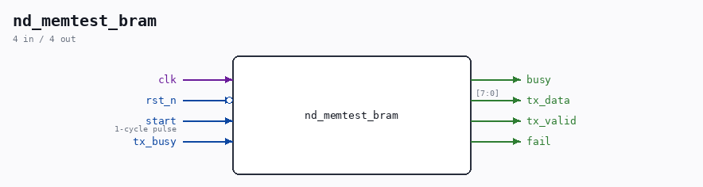

# nd_memtest_bram

Source: `/mnt/e/Dev/Repos/Ronny/nd-120/Verilog/fpga/nexys4ddr/sd-fat-test/nd_memtest_bram.v`

> Generated by `Verilog/tests/module_doc.py` from the `//!`
> comments in the source. Do not edit by hand - edit the RTL comments and regenerate.

## Description

ND-120 memory-path test as a character stream
Same test as fpga/basys3/mem-test/basys3_mem_test_top.v - it isolates
MEM_RAM_49 (-> SIP1M9 sync BRAM, ramSize=3) from the whole CPU and
drives the EXACT DRAM RAS/CAS/AA protocol the real controller uses
(measured via DBG_MEM: row valid at RAS fall, AA -> column while CAS is
still high, both strobes low a few cycles, read data captured while RAS
is deasserted and CAS still low), then writes, reads back and verifies
a set of addresses.
The difference from the Basys3 version is only the OUTPUT: that one
owns a UART, this one emits bytes through a tx_data/tx_valid/tx_busy
handshake so it can be a command inside the SD-FAT test menu and share
that design's UART.
Same vectors as the Basys3 run, so the two boards are directly
comparable: if this PASSES the ND-120 BRAM memory path is sound and a
memory fault lives in the CPU/MAC integration; if it FAILS the fault is
here, where it can be iterated on without the CPU in the way.
Report (one line per vector, then a verdict):
NDMEM START
ND 00000 W A5 R A5 OK
...
NDMEM PASS   (or NDMEM FAIL n)
Last reviewed: 20-AUG-2026
Ronny Hansen

## Ports

| Direction | Width | Name | Description |
|---|---|---|---|
| input | `1` | `clk` |  |
| input | `1` | `rst_n` *(active low)* |  |
| input | `1` | `start` | 1-cycle pulse |
| output | `1` | `busy` |  |
| output | `[7:0]` | `tx_data` |  |
| output | `1` | `tx_valid` |  |
| input | `1` | `tx_busy` |  |
| output | `1` | `fail` |  |
