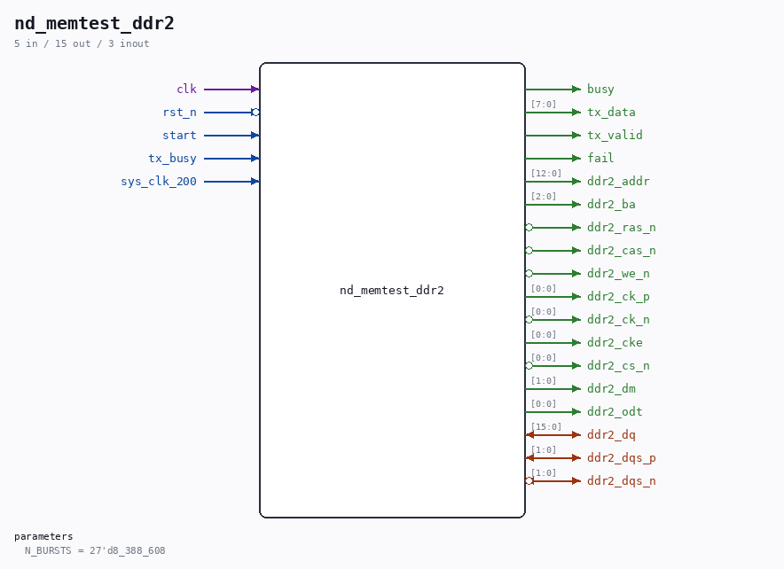

# nd_memtest_ddr2

Source: `/mnt/e/Dev/Repos/Ronny/nd-120/Verilog/fpga/nexys4ddr/sd-fat-test/nd_memtest_ddr2.v`

> Generated by `Verilog/tests/module_doc.py` from the `//!`
> comments in the source. Do not edit by hand - edit the RTL comments and regenerate.

## Description

DDR2 memory test for the Nexys 4 DDR, as a character stream
Runs as menu command M in the SD-FAT tool. Two jobs:
1. VALIDATE the memory. Writes an address-derived pattern over the
whole 128 MiB, reads it back and verifies every word.
2. MEASURE WORST-CASE READ LATENCY, in ui_clk cycles, from the cycle a
read is accepted to the cycle its data comes back. This is not a
nice-to-have: it is the number that decides how ND-120 main memory
can be built on this board at all.
The ND-120's sheet-49 memory protocol has a FIXED deadline and no
wait states - measured over 25,008 accesses, the column address is
known at cycle N+1 and read data must be valid by the start of N+4
(Verilog/docs/nd120-dram-memory.md). That is three CPU cycles: 180 ns
at 16.667 MHz, 90 ns at 33.333 MHz. One ui_clk cycle is 13.33 ns, so
the budget is about 13 ui_clk cycles at the slow CPU clock. If the
measured worst case fits, a direct sheet-49 backend is possible; if
it does not - and a DDR2 refresh alone is tRFC = 127.5 ns - then the
backend needs a cache in front, or the CPU clock must be stalled on
a miss. See ../EXTENSIONS-PLAN.md section "Stage 2".
The controller itself lives in ../ddr2/nd_ddr2_port.v, shared with the
future ND-120 memory backend - this test exercises the SAME access path
the CPU will use, which is the point of testing it here.
CLOCK DOMAINS: the test runs in ui_clk (75 MHz), the console at
27.027 MHz. start, busy, fail and every character cross with two-flop
synchronisers and a request/acknowledge toggle; the data byte is held
stable until the far side takes it. build.tcl declares the two clocks
asynchronous - without that Vivado times the crossings as related clocks
and demands 0.333 ns, which nothing can meet (measured: -3.304 ns).
Report:
DDR2 CALIB OK
DDR2 WRITE 00 ... (one line per 16 MiB)
DDR2 READ 00 ...
DDR2 RDLAT MAX 000n CYC
DDR2 PASS      (or DDR2 FAIL AT xxxxxxx then DDR2 ERRS nnnn)
Last reviewed: 20-AUG-2026
Ronny Hansen

## Parameters

| Parameter | Default |
|---|---|
| `N_BURSTS` | `27'd8_388_608` |

## Ports

| Direction | Width | Name | Description |
|---|---|---|---|
| input | `1` | `clk` |  |
| input | `1` | `rst_n` *(active low)* |  |
| input | `1` | `start` |  |
| output | `1` | `busy` |  |
| output | `[7:0]` | `tx_data` |  |
| output | `1` | `tx_valid` |  |
| input | `1` | `tx_busy` |  |
| output | `1` | `fail` |  |
| input | `1` | `sys_clk_200` |  |
| inout | `[15:0]` | `ddr2_dq` |  |
| inout | `[1:0]` | `ddr2_dqs_p` |  |
| inout | `[1:0]` | `ddr2_dqs_n` *(active low)* |  |
| output | `[12:0]` | `ddr2_addr` |  |
| output | `[2:0]` | `ddr2_ba` |  |
| output | `1` | `ddr2_ras_n` *(active low)* |  |
| output | `1` | `ddr2_cas_n` *(active low)* |  |
| output | `1` | `ddr2_we_n` *(active low)* |  |
| output | `[0:0]` | `ddr2_ck_p` |  |
| output | `[0:0]` | `ddr2_ck_n` *(active low)* |  |
| output | `[0:0]` | `ddr2_cke` |  |
| output | `[0:0]` | `ddr2_cs_n` *(active low)* |  |
| output | `[1:0]` | `ddr2_dm` |  |
| output | `[0:0]` | `ddr2_odt` |  |
