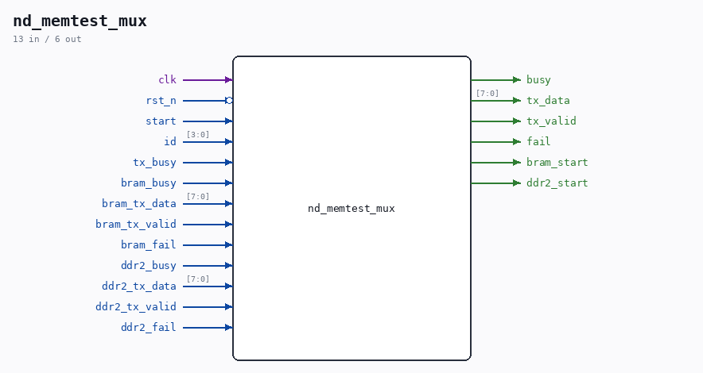

# nd_memtest_mux

Source: `/mnt/e/Dev/Repos/Ronny/nd-120/Verilog/fpga/nexys4ddr/sd-fat-test/nd_memtest_mux.v`

> Generated by `Verilog/tests/module_doc.py` from the `//!`
> comments in the source. Do not edit by hand - edit the RTL comments and regenerate.

## Description

Dispatcher for the SD-FAT test's external memory commands
sd_fat_test_top (built with SDFAT_EXT_TEST) hands out a command id and
waits for busy to clear, while the selected test prints through the
shared UART. This module routes the id to the right test and answers
for the ones that are not compiled into this bitstream, so an
unimplemented command prints a line instead of hanging the menu.
id 0  M  DDR2 - only present when NEXYS_DDR2_TEST is defined
id 1  B  ND-120 memory path (MEM_RAM_49 on BRAM), always present
Only one test can run at a time: the menu waits for busy to clear
before it accepts another key, so the character mux is a plain priority
select with no arbitration needed.
Last reviewed: 20-AUG-2026
Ronny Hansen

## Ports

| Direction | Width | Name | Description |
|---|---|---|---|
| input | `1` | `clk` |  |
| input | `1` | `rst_n` *(active low)* |  |
| input | `1` | `start` |  |
| input | `[3:0]` | `id` |  |
| output | `1` | `busy` |  |
| output | `[7:0]` | `tx_data` |  |
| output | `1` | `tx_valid` |  |
| input | `1` | `tx_busy` |  |
| output | `1` | `fail` |  |
| output | `1` | `bram_start` |  |
| input | `1` | `bram_busy` |  |
| input | `[7:0]` | `bram_tx_data` |  |
| input | `1` | `bram_tx_valid` |  |
| input | `1` | `bram_fail` |  |
| output | `1` | `ddr2_start` |  |
| input | `1` | `ddr2_busy` |  |
| input | `[7:0]` | `ddr2_tx_data` |  |
| input | `1` | `ddr2_tx_valid` |  |
| input | `1` | `ddr2_fail` |  |
