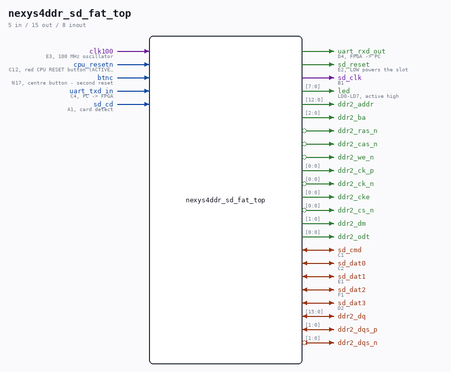

# nexys4ddr_sd_fat_top

Source: `/mnt/e/Dev/Repos/Ronny/nd-120/Verilog/fpga/nexys4ddr/sd-fat-test/nexys4ddr_sd_fat_top.v`

> Generated by `Verilog/tests/module_doc.py` from the `//!`
> comments in the source. Do not edit by hand - edit the RTL comments and regenerate.

## Description

Nexys 4 DDR wrapper for the SD-FAT test (sd_fat_test_top)
The test design itself is board-independent (single clock domain, all
SD/UART speeds derived from CLK_FREQ by enable dividers) and is reused
unchanged from the Tang Nano 20K build, exactly as the Basys3 wrapper
does. This wrapper provides:
- 27.027 MHz from the 100 MHz oscillator (MMCM x10 / 37), the same
CLK_FREQ the Tang hardware-proven build uses, so every divider,
watchdog and baud constant stays at its validated value
- reset: CPU RESET (active low) or BTNC, plus MMCM lock
- LED polarity: the test drives active LOW, the board is active HIGH
- UART to the FT2232 at 9600 8N1
THE BOARD DIFFERENCE THAT MATTERS: the microSD slot is ON THE BOARD,
not on a Pmod, and its power is gated. Reference manual section 12:
after configuration the on-board microcontroller releases the SD bus
and "the SD_RESET signal needs to be actively driven low by the FPGA
to power the microSD card slot". Without that the slot is dead and
every command times out. sd_reset is therefore driven low here.
Pins (../Nexys-4-DDR-Master.xdc): SD_SCK B1, SD_CMD C1,
SD_DAT C2/E1/F1/D2, SD_CD A1, SD_RESET E2.
Build: vivado -mode batch -source build.tcl   (see README.md)
Last reviewed: 20-AUG-2026
Ronny Hansen

## Ports

| Direction | Width | Name | Description |
|---|---|---|---|
| input | `1` | `clk100` | E3, 100 MHz oscillator |
| input | `1` | `cpu_resetn` | C12, red CPU RESET button (ACTIVE LOW) |
| input | `1` | `btnc` | N17, centre button - second reset |
| input | `1` | `uart_txd_in` | C4, PC -> FPGA |
| output | `1` | `uart_rxd_out` | D4, FPGA -> PC |
| output | `1` | `sd_reset` | E2, LOW powers the slot |
| input | `1` | `sd_cd` | A1, card detect |
| output | `1` | `sd_clk` | B1 |
| inout | `1` | `sd_cmd` | C1 |
| inout | `1` | `sd_dat0` | C2 |
| inout | `1` | `sd_dat1` | E1 |
| inout | `1` | `sd_dat2` | F1 |
| inout | `1` | `sd_dat3` | D2 |
| output | `[7:0]` | `led` | LD0-LD7, active high |
| inout | `[15:0]` | `ddr2_dq` |  |
| inout | `[1:0]` | `ddr2_dqs_p` |  |
| inout | `[1:0]` | `ddr2_dqs_n` *(active low)* |  |
| output | `[12:0]` | `ddr2_addr` |  |
| output | `[2:0]` | `ddr2_ba` |  |
| output | `1` | `ddr2_ras_n` *(active low)* |  |
| output | `1` | `ddr2_cas_n` *(active low)* |  |
| output | `1` | `ddr2_we_n` *(active low)* |  |
| output | `[0:0]` | `ddr2_ck_p` |  |
| output | `[0:0]` | `ddr2_ck_n` *(active low)* |  |
| output | `[0:0]` | `ddr2_cke` |  |
| output | `[0:0]` | `ddr2_cs_n` *(active low)* |  |
| output | `[1:0]` | `ddr2_dm` |  |
| output | `[0:0]` | `ddr2_odt` |  |
