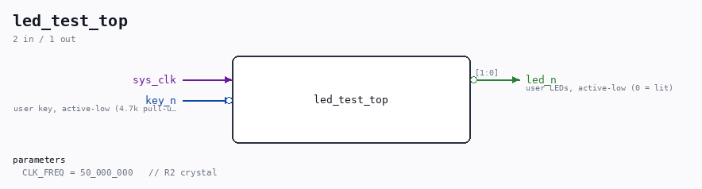

# led_test_top

Source: `/mnt/e/Dev/Repos/Ronny/nd-120/Verilog/fpga/qmtech-a35t/led-test/led_test_top.v`

> Generated by `Verilog/tests/module_doc.py` from the `//!`
> comments in the source. Do not edit by hand - edit the RTL comments and regenerate.

## Parameters

| Parameter | Default |
|---|---|
| `CLK_FREQ` | `50_000_000   // R2 crystal` |

## Ports

| Direction | Width | Name | Description |
|---|---|---|---|
| input | `1` | `sys_clk` |  |
| input | `1` | `key_n` *(active low)* | user key, active-low (4.7k pull-up) |
| output | `[1:0]` | `led_n` *(active low)* | user LEDs, active-low (0 = lit) |
