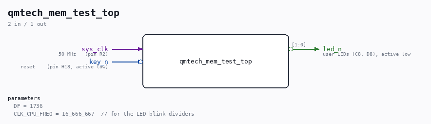

# qmtech_mem_test_top

Source: `/mnt/e/Dev/Repos/Ronny/nd-120/Verilog/fpga/qmtech-a35t/mem-test/qmtech_mem_test_top.v`

> Generated by `Verilog/tests/module_doc.py` from the `//!`
> comments in the source. Do not edit by hand - edit the RTL comments and regenerate.

## Description

QMTECH XC7A35T standalone memory test for the ND-120 BRAM path
Port of ../../basys3/mem-test/basys3_mem_test_top.v - same die, same
MEM_RAM_49 (-> SIP1M9 sync BRAM, ramSize=3), same DRAM RAS/CAS/AA
protocol, same test vectors and FSM, so results are directly comparable
with the Basys3 run (which PASSES on silicon).
Board differences vs the Basys3 version:
- 50 MHz input clock (Basys3: 100 MHz) -> MMCM mult 20.0 instead of
10.0, same 16.667 MHz clk_cpu.
- No on-board UART: msg_printer still runs (it paces the FSM exactly
as on Basys3) but its TX is an internal mark_debug net for ILA, not
a pin.
- Report on the two active-low LEDs:
running          led_n[0] fast blink (4 Hz), led_n[1] off
done + PASS      led_n[0] slow blink (1 Hz), led_n[1] off
done + FAIL      led_n[0] solid on,          led_n[1] solid on
- Reset = user key on H18, active low (Basys3 btn1 is active high).

## Parameters

| Parameter | Default |
|---|---|
| `DF` | `1736` |
| `CLK_CPU_FREQ` | `16_666_667  // for the LED blink dividers` |

## Ports

| Direction | Width | Name | Description |
|---|---|---|---|
| input | `1` | `sys_clk` | 50 MHz   (pin R2) |
| input | `1` | `key_n` *(active low)* | reset    (pin H18, active low) |
| output | `[1:0]` | `led_n` *(active low)* | user LEDs (C8, D8), active low |
