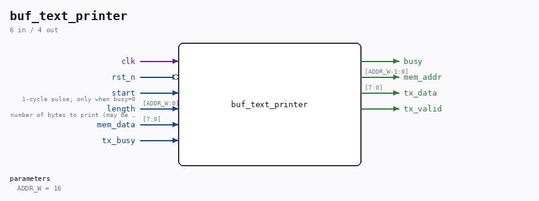

# buf_text_printer

Source: `/mnt/e/Dev/Repos/Ronny/nd-120/Verilog/fpga/tang-nano-20k/sd-fat-test/src/buf_text_printer.v`

> Generated by `Verilog/tests/module_doc.py` from the `//!`
> comments in the source. Do not edit by hand - edit the RTL comments and regenerate.

## Description

Raw text printer for the SD-FAT test
Streams length bytes from the byte buffer (BRAM read port, 1-cycle
read latency) verbatim to the shared uart_tx. Used by the LIST menu
command: the directory-name packer has already stored the file names
with CR LF terminators, so no formatting is needed here.
Last reviewed: 10-JUL-2026
Ronny Hansen

## Parameters

| Parameter | Default |
|---|---|
| `ADDR_W` | `16` |

## Ports

| Direction | Width | Name | Description |
|---|---|---|---|
| input | `1` | `clk` |  |
| input | `1` | `rst_n` *(active low)* |  |
| input | `1` | `start` | 1-cycle pulse; only when busy=0 |
| input | `[ADDR_W:0]` | `length` | number of bytes to print (may be 0) |
| output | `1` | `busy` |  |
| output | `[ADDR_W-1:0]` | `mem_addr` |  |
| input | `[7:0]` | `mem_data` |  |
| output | `[7:0]` | `tx_data` |  |
| output | `1` | `tx_valid` |  |
| input | `1` | `tx_busy` |  |
