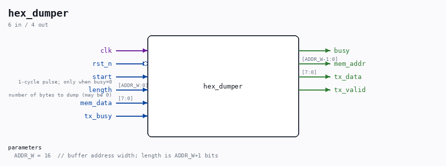

# hex_dumper

Source: `/mnt/e/Dev/Repos/Ronny/nd-120/Verilog/fpga/tang-nano-20k/sd-fat-test/src/hex_dumper.v`

> Generated by `Verilog/tests/module_doc.py` from the `//!`
> comments in the source. Do not edit by hand - edit the RTL comments and regenerate.

## Description

Hex/octal dumper for the SD-FAT test
Streams the contents of a byte buffer (BRAM read port, 1-cycle read
latency) as an ASCII dump through the shared uart_tx:
000000: 8D 0A 30 30 36 30 30 30  30 8D 0A B1 36 B4 33 B1
...                       (16 bytes/line, extra space after byte 8,
a space after EVERY byte incl. the last)
OCTAL WORDS AFTER LEADER: 105015 030060 ...  (first 8 words from
the first NONZERO byte - BPUN tapes
begin with a zero leader)
LENGTH: 000000002342 BYTES
DONE
The octal line prints the first min(8, length/2) 16-bit words,
MSB-first byte order (BPUN fields are 16-bit MSB-first words).
All line ends are CR LF. Plain ASCII only.
NOTE: \r is not a legal Verilog string escape - CR must be octal \015.
Last reviewed: 10-JUL-2026
Ronny Hansen

## Parameters

| Parameter | Default |
|---|---|
| `ADDR_W` | `16  // buffer address width; length is ADDR_W+1 bits` |

## Ports

| Direction | Width | Name | Description |
|---|---|---|---|
| input | `1` | `clk` |  |
| input | `1` | `rst_n` *(active low)* |  |
| input | `1` | `start` | 1-cycle pulse; only when busy=0 |
| input | `[ADDR_W:0]` | `length` | number of bytes to dump (may be 0) |
| output | `1` | `busy` |  |
| output | `[ADDR_W-1:0]` | `mem_addr` |  |
| input | `[7:0]` | `mem_data` |  |
| output | `[7:0]` | `tx_data` |  |
| output | `1` | `tx_valid` |  |
| input | `1` | `tx_busy` |  |
