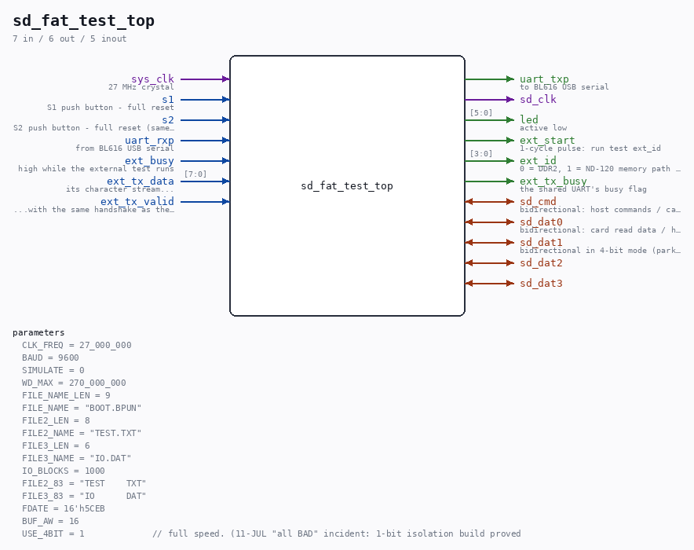

# sd_fat_test_top

Source: `/mnt/e/Dev/Repos/Ronny/nd-120/Verilog/fpga/tang-nano-20k/sd-fat-test/src/sd_fat_test_top.v`

> Generated by `Verilog/tests/module_doc.py` from the `//!`
> comments in the source. Do not edit by hand - edit the RTL comments and regenerate.

## Description

Tang Nano 20K SD + FAT test (Milestone 1 of the SD-BPUN device plan)
Interactive UART menu (BL616 USB serial, 9600 8N1) over the reusable
SD/FAT library in Verilog/SD-FAT/:
SD: OK                     (persistent card status)
1=LIST 2=DUMP BOOT.BPUN 3=COPY TO TEST.TXT H=HELP
#
1  re-init the card, mount FAT16/FAT32, list the root directory:
size (or <DIR>), date and name of every file and subdirectory
2342  10-JAN-2025  BOOT.BPUN
<DIR>  11-JUL-2026  HDD
then a disk-info line: card capacity (from the CMD9 CSD), volume
size (total sectors) and free space (one FAT #0 scan counting
free entries; a SCANNING line is printed first - a 32 GB card
takes seconds):
CARD 30436 MB  VOL 30425 MB  FREE 30298 MB
2  find BOOT.BPUN, buffer it (64 KB BRAM) and hex/octal-dump it
3  COPY: read BOOT.BPUN into the buffer, then make TEST.TXT an exact
copy. If TEST.TXT's allocation is big enough its data sectors are
rewritten in place and only the size field is patched; if it is
TOO SMALL (or empty) it is REPLACED: sd_fat_rewrite frees the old
cluster chain, allocates a fresh contiguous chain and patches the
directory entry, then the data is written. TEST.TXT must already
exist on the card (any size).
4  WRBLK1: write a counter pattern (1024 big-endian 16-bit words,
word[w] = w) into 1-kiloword block 1 of BOOT.BPUN. ND-120 block
framing: 1 block = 1024 words = 2048 bytes = 4 SD sectors; block
N of a file lives at file_first_sector + 4*N. Refuses when the
file is smaller than (N+1)*2048 bytes (a shorter file's cluster
chain ends inside the block - writing there would corrupt the
NEXT file). Validate with 2 (DUMP): block 1 shows the pattern,
blocks 0 and 2 are untouched.
8  BLOCK: dump 1-kiloword block N of the target file WITHOUT
buffering the file. The reader runs with no_stream=1 (directory
match only), the 4 sectors of the block are read one at a time
through the sd_writer engine's READ path and dumped. Cost and
memory are the same for a 7 KB file and a 75 MB one - which is the
point: command 2 cannot look at anything past its 64 KB buffer.
The block number is typed on the console in decimal.
9  SECTOR: dump one ABSOLUTE SD sector, number typed in decimal, with
the FAT not consulted at all. This is what separates "the
directory entry points at the wrong place" from "the card really
holds zeros there" - the two look identical through command 2.
R  RANGE: read a run of consecutive blocks (start block and count
typed on the console) the same streaming way, keeping only a
16-bit checksum of every word and a block count - the data never
reaches the console, because a 1000-block hex dump at 9600 baud
would take about six hours. One progress line per 64 blocks, then
a summary: blocks, sectors, checksum, 27 MHz cycles of card
traffic, PASS or FAIL. A failed card read stops the run and names
the exact sector and block - that is what this command is for:
every earlier check read a SINGLE block, and SINTRAN segment
handling is the first thing that reads many in a row.
N  set the target file name at runtime (root directory only, 8.3
name, length-exact - that is all sd_file_reader can match)
H  detailed help; any other key reprints the menu
S1 / S2 (either button) full reset
DEFAULT BUILD IS READ-ONLY (src/sd_fat_test_config.vh): 3, 4, 6 are
compiled out and the sd_writer engine's rd_mode is tied to a constant
1. A write-capable bitstream must never be pointed at a card that is
being diagnosed.
Robustness: every wait state has a watchdog - no card, no file,
unmountable filesystem, stuck reads and failed writes all print an
ERROR line and fall back to the menu; the menu SD: line shows
NOT CHECKED / NO CARD / ERROR / OK.
SD pins per the Sipeed Tang Nano 20K schematic (verified against
sipeed/TangNano-20K-example, nestang and snestang constraint files):
CLK=83 CMD=82 DAT0=84 DAT1=85 DAT2=80 DAT3=81. CMD and DAT0-3 are
bidirectional per the SD specification; the ONLY tristate drivers sit
here at the top-level pads (repo rule: no 'z' inside the FPGA fabric).
LEDs (active low): [0] alive  [1] FS mounted  [2] file found
[3] command done  [4] truncated  [5] error
Single 27 MHz clock domain - no PLL, no derived clocks (the SD
library and sd_writer divide their bus clocks with enable-style
dividers). Reader CLK_DIV=1 (init 137 kHz - inside the spec's
100-400 kHz identification band - data 3.375 MHz); writer CLKDIV=1
(13.5 MHz bit clock, inside the mandatory 25 MHz default-speed limit).
Speed tests: menu 6 writes IO.DAT in CMD25 multi-block bursts (ACMD23
pre-erase + up to 128 sectors per burst + CMD12), menu 7 reads it back
in CMD18 bursts through the same MIT engine - the file reader only
mounts the filesystem and locates the file. With USE_4BIT=1 (default,
speed-plan rung c) every writer-engine operation switches the card to
the 4-bit DAT bus via CMD55+ACMD6 and moves data on DAT3..DAT0; the
reader keeps its proven 1-bit path for mount/locate.
Design plan: Verilog/docs/sd-bpun-device-plan.md (section 9).
Last reviewed: 11-JUL-2026
Ronny Hansen

## Parameters

| Parameter | Default |
|---|---|
| `CLK_FREQ` | `27_000_000` |
| `BAUD` | `9600` |
| `SIMULATE` | `0` |
| `WD_MAX` | `270_000_000` |
| `FILE_NAME_LEN` | `9` |
| `FILE_NAME` | `"BOOT.BPUN"` |
| `FILE2_LEN` | `8` |
| `FILE2_NAME` | `"TEST.TXT"` |
| `FILE3_LEN` | `6` |
| `FILE3_NAME` | `"IO.DAT"` |
| `IO_BLOCKS` | `1000` |
| `FILE2_83` | `"TEST    TXT"` |
| `FILE3_83` | `"IO      DAT"` |
| `FDATE` | `16'h5CEB` |
| `BUF_AW` | `16` |
| `USE_4BIT` | `1             // full speed. (11-JUL "all BAD" incident: 1-bit isolation build proved card+logic healthy; suspect was the snooped RCA` |

## Ports

| Direction | Width | Name | Description |
|---|---|---|---|
| input | `1` | `sys_clk` | 27 MHz crystal |
| input | `1` | `s1` | S1 push button - full reset |
| input | `1` | `s2` | S2 push button - full reset (same, for convenience) |
| input | `1` | `uart_rxp` | from BL616 USB serial |
| output | `1` | `uart_txp` | to BL616 USB serial |
| output | `1` | `sd_clk` |  |
| inout | `1` | `sd_cmd` | bidirectional: host commands / card responses |
| inout | `1` | `sd_dat0` | bidirectional: card read data / host write data |
| inout | `1` | `sd_dat1` | bidirectional in 4-bit mode (parked high otherwise) |
| inout | `1` | `sd_dat2` |  |
| inout | `1` | `sd_dat3` |  |
| output | `[5:0]` | `led` | active low |
| output | `1` | `ext_start` | 1-cycle pulse: run test ext_id |
| output | `[3:0]` | `ext_id` | 0 = DDR2, 1 = ND-120 memory path (BRAM) |
| input | `1` | `ext_busy` | high while the external test runs |
| input | `[7:0]` | `ext_tx_data` | its character stream... |
| input | `1` | `ext_tx_valid` | ...with the same handshake as the others |
| output | `1` | `ext_tx_busy` | the shared UART's busy flag |
