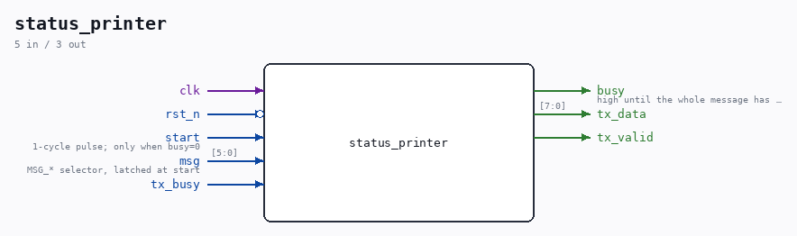

# status_printer

Source: `/mnt/e/Dev/Repos/Ronny/nd-120/Verilog/fpga/tang-nano-20k/sd-fat-test/src/status_printer.v`

> Generated by `Verilog/tests/module_doc.py` from the `//!`
> comments in the source. Do not edit by hand - edit the RTL comments and regenerate.

## Description

Status message printer for the SD-FAT test
Streams one of a set of fixed ASCII status lines through an external
uart_tx (shared with hex_dumper, muxed by the top level). Same byte
pump pattern as sdram-test/src/msg_printer.v.
NOTE: \r is not a legal Verilog string escape - CR must be octal \015.
Every message must stay within 64 characters: strchar's window is
[8*64-1:0] and idx is 6 bits, so a longer string is silently truncated
and then wraps. That is why the menu is TWO messages.
Last reviewed: 10-AUG-2026
Ronny Hansen

## Ports

| Direction | Width | Name | Description |
|---|---|---|---|
| input | `1` | `clk` |  |
| input | `1` | `rst_n` *(active low)* |  |
| input | `1` | `start` | 1-cycle pulse; only when busy=0 |
| input | `[5:0]` | `msg` | MSG_* selector, latched at start |
| output | `1` | `busy` | high until the whole message has left the UART |
| output | `[7:0]` | `tx_data` |  |
| output | `1` | `tx_valid` |  |
| input | `1` | `tx_busy` |  |
