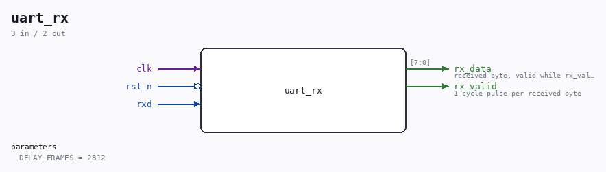

# uart_rx

Source: `/mnt/e/Dev/Repos/Ronny/nd-120/Verilog/fpga/tang-nano-20k/sd-fat-test/src/uart_rx.v`

> Generated by `Verilog/tests/module_doc.py` from the `//!`
> comments in the source. Do not edit by hand - edit the RTL comments and regenerate.

## Description

UART receiver (8N1)
RX state machine borrowed from the ND-120 SC2661 EPCI model
(Verilog/Shared/support/SC2661_UART.v), with the EPCI register
interface stripped away. Half-bit start alignment, mid-bit sampling.
Last reviewed: 8-JUL-2026
Ronny Hansen

## Parameters

| Parameter | Default |
|---|---|
| `DELAY_FRAMES` | `2812` |

## Ports

| Direction | Width | Name | Description |
|---|---|---|---|
| input | `1` | `clk` |  |
| input | `1` | `rst_n` *(active low)* |  |
| input | `1` | `rxd` |  |
| output | `[7:0]` | `rx_data` | received byte, valid while rx_valid is high |
| output | `1` | `rx_valid` | 1-cycle pulse per received byte |
