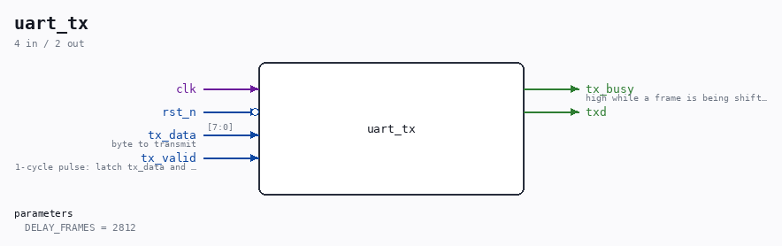

# uart_tx

Source: `/mnt/e/Dev/Repos/Ronny/nd-120/Verilog/fpga/tang-nano-20k/sd-fat-test/src/uart_tx.v`

> Generated by `Verilog/tests/module_doc.py` from the `//!`
> comments in the source. Do not edit by hand - edit the RTL comments and regenerate.

## Description

UART transmitter (8N1)
TX state machine borrowed from the ND-120 SC2661 EPCI model
(Verilog/Shared/support/SC2661_UART.v), with the EPCI register
interface stripped away. Same states, same bit timing.
Last reviewed: 8-JUL-2026
Ronny Hansen

## Parameters

| Parameter | Default |
|---|---|
| `DELAY_FRAMES` | `2812` |

## Ports

| Direction | Width | Name | Description |
|---|---|---|---|
| input | `1` | `clk` |  |
| input | `1` | `rst_n` *(active low)* |  |
| input | `[7:0]` | `tx_data` | byte to transmit |
| input | `1` | `tx_valid` | 1-cycle pulse: latch tx_data and start (only when tx_busy=0) |
| output | `1` | `tx_busy` | high while a frame is being shifted out |
| output | `1` | `txd` |  |
