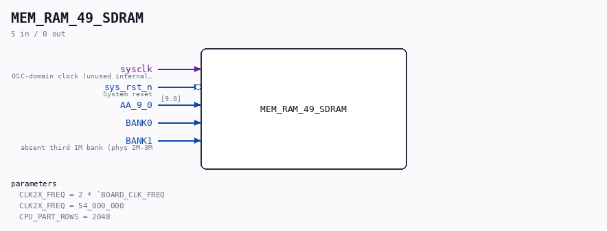

# MEM_RAM_49_SDRAM

Source: `/mnt/e/Dev/Repos/Ronny/nd-120/Verilog/fpga/tang-nano-20k/sdram-bridge/MEM_RAM_49_SDRAM.v`

> Generated by `Verilog/tests/module_doc.py` from the `//!`
> comments in the source. Do not edit by hand - edit the RTL comments and regenerate.

## Description

ND120 CPU, MM&M
MEM/RAM - SDRAM backend (Tang Nano 20K)
Drop-in replacement for the sheet-49 RAM (MEM_RAM_49) that maps the
ND-120 DRAM protocol onto the board's 8 MB embedded SDRAM through
the 18-bit-word controller (sdram18.v).
Protocol contract (measured, docs/nd120-dram-memory.md section 4;
N = OSC cycle of the RAS rising edge, fast = 2x OSC, edge-aligned):
N   : row on AA_9_0, MWRITE50_n and BANKx valid
N+1 : column on AA_9_0
N+2 : CAS rises, write data DD_17_0_IN valid
N+4 : read data must be on DD_17_0_OUT (held while CAS high)
N+5 : RAS falls, CAS tail one more cycle
Next access no earlier than N+11.
Capacity: 2M x 18-bit words = BANK0 + BANK2 (1M words each) = 4 MB.
BANK1 is not populated: never written, reads as 0, so the ND-120's
boot-time memory sizing simply detects two banks. (The board PAL
decodes phys banks in the order BANK0,BANK2,BANK1 - so the CONTIGUOUS
second 2 MB is BANK2, and BANK0+BANK2 is the real 4 MB; see line 373.)
ND_SDRAM_PACK16 (docs/nd120-parity-refactor-order.md, semantics
pinned by docs/nd120-parity-analysis.md): only the 16 DATA bits are
stored, two adjacent ND words per 32-bit SDRAM location, so
BANK0+BANK2 (still the full 4 MB, boot sizing unchanged) fold into
the LOWER half of the chip (location bit 20 = 0); the upper half is
RESERVED for the nd_storage disk-image cache (nd-storage-design.md
section 5.2). Parity is COMPUTED on the read path (DD[8]/DD[17]
regenerated as odd parity, CORR_n always "correct") - licensed by the
parity analysis: no self-test or runtime path reads stored parity.
The CPU/storage split is parameterized at ND-row granularity
(CPU_PART_ROWS) so a future build can trade CPU memory for cache.
ND_STORAGE_PORT (requires ND_SDRAM_PACK16): adds the nd_storage
device port of nd-storage-design.md section 5.2 - a start/busy/done
mem port (stor_clk domain, toggle-CDC into clk2x) that reads/writes
whole 32-bit locations at {1'b1, mem_addr[19:0]}, i.e. ONLY the
upper-half storage region: the leading 1 is forced HERE, so device
traffic physically cannot reach the CPU's half of the chip. Device
ops are granted exactly like refresh - in the guaranteed-idle B_POST
slot after each CPU access (>= 14 free fast cycles before the
earliest next access under the N+11 rule; one op is 5 cycles), in
B_TAIL (absent-row accesses leave the controller idle), and in
B_IDLE behind the same idle_cnt watchdog guard - so CPU accesses
always win and the measured protocol timing is untouched. Without
the define the module is bit-identical to the plain pack16 build.
Refresh is generated HERE (the board logic's refresh chain is
inactive - see docs/nd120-dram-memory.md section 4): primarily in
the guaranteed-idle slot right after each access, plus an idle
watchdog when the CPU leaves memory alone.
Last reviewed: 11-JUL-2026
Ronny Hansen

## Parameters

| Parameter | Default |
|---|---|
| `CLK2X_FREQ` | `2 * `BOARD_CLK_FREQ` |
| `CLK2X_FREQ` | `54_000_000` |
| `CPU_PART_ROWS` | `2048` |

## Ports

| Direction | Width | Name | Description |
|---|---|---|---|
| input | `1` | `sysclk` | OSC-domain clock (unused internally; kept for symmetry) |
| input | `1` | `sys_rst_n` *(active low)* | System reset |
| input | `[9:0]` | `AA_9_0` |  |
| input | `1` | `BANK0` |  |
| input | `1` | `BANK1` | absent third 1M bank (phys 2M-3M |
