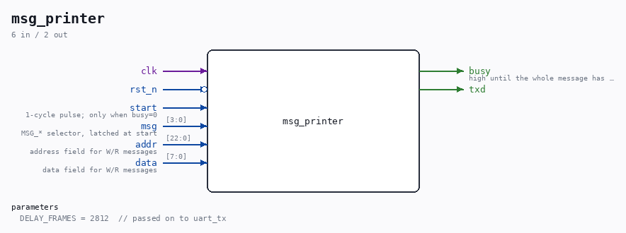

# msg_printer

Source: `/mnt/e/Dev/Repos/Ronny/nd-120/Verilog/fpga/tang-nano-20k/sdram-test/src/msg_printer.v`

> Generated by `Verilog/tests/module_doc.py` from the `//!`
> comments in the source. Do not edit by hand - edit the RTL comments and regenerate.

## Description

UART message printer for the SDRAM test
Formats fixed messages and read/write trace lines like
"W 200000=3E"   (write:  address=data, hex)
"R 200000=3E OK" / "R 200000=7F ERR"
and streams them out through uart_tx, one byte at a time.
Last reviewed: 8-JUL-2026
Ronny Hansen

## Parameters

| Parameter | Default |
|---|---|
| `DELAY_FRAMES` | `2812  // passed on to uart_tx` |

## Ports

| Direction | Width | Name | Description |
|---|---|---|---|
| input | `1` | `clk` |  |
| input | `1` | `rst_n` *(active low)* |  |
| input | `1` | `start` | 1-cycle pulse; only when busy=0 |
| input | `[3:0]` | `msg` | MSG_* selector, latched at start |
| input | `[22:0]` | `addr` | address field for W/R messages |
| input | `[7:0]` | `data` | data field for W/R messages |
| output | `1` | `busy` | high until the whole message has left the UART |
| output | `1` | `txd` |  |
