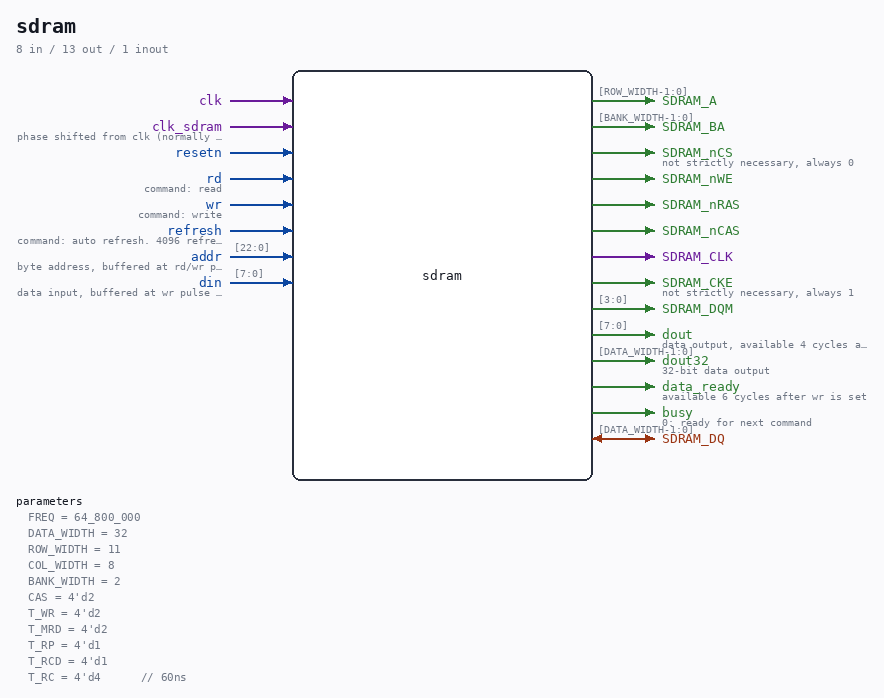

# sdram

Source: `/mnt/e/Dev/Repos/Ronny/nd-120/Verilog/fpga/tang-nano-20k/sdram-test/src/sdram.v`

> Generated by `Verilog/tests/module_doc.py` from the `//!`
> comments in the source. Do not edit by hand - edit the RTL comments and regenerate.

## Parameters

| Parameter | Default |
|---|---|
| `FREQ` | `64_800_000` |
| `DATA_WIDTH` | `32` |
| `ROW_WIDTH` | `11` |
| `COL_WIDTH` | `8` |
| `BANK_WIDTH` | `2` |
| `CAS` | `4'd2` |
| `T_WR` | `4'd2` |
| `T_MRD` | `4'd2` |
| `T_RP` | `4'd1` |
| `T_RCD` | `4'd1` |
| `T_RC` | `4'd4      // 60ns` |

## Ports

| Direction | Width | Name | Description |
|---|---|---|---|
| inout | `[DATA_WIDTH-1:0]` | `SDRAM_DQ` |  |
| output | `[ROW_WIDTH-1:0]` | `SDRAM_A` |  |
| output | `[BANK_WIDTH-1:0]` | `SDRAM_BA` |  |
| output | `1` | `SDRAM_nCS` | not strictly necessary, always 0 |
| output | `1` | `SDRAM_nWE` |  |
| output | `1` | `SDRAM_nRAS` |  |
| output | `1` | `SDRAM_nCAS` |  |
| output | `1` | `SDRAM_CLK` |  |
| output | `1` | `SDRAM_CKE` | not strictly necessary, always 1 |
| output | `[3:0]` | `SDRAM_DQM` |  |
| input | `1` | `clk` |  |
| input | `1` | `clk_sdram` | phase shifted from clk (normally 180-degrees) |
| input | `1` | `resetn` |  |
| input | `1` | `rd` | command: read |
| input | `1` | `wr` | command: write |
| input | `1` | `refresh` | command: auto refresh. 4096 refresh cycles in 64ms. Once per 15us. |
| input | `[22:0]` | `addr` | byte address, buffered at rd/wr pulse time |
| input | `[7:0]` | `din` | data input, buffered at wr pulse time |
| output | `[7:0]` | `dout` | data output, available 4 cycles after rd becomes 1 |
| output | `[DATA_WIDTH-1:0]` | `dout32` | 32-bit data output |
| output | `1` | `data_ready` | available 6 cycles after wr is set |
| output | `1` | `busy` | 0: ready for next command |
