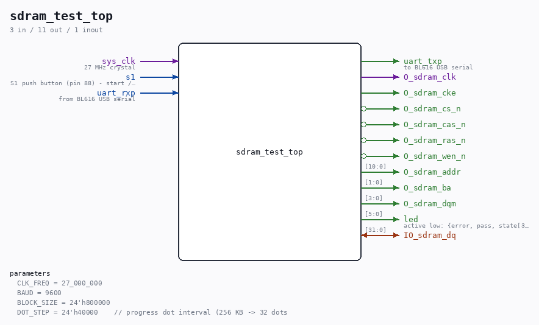

# sdram_test_top

Source: `/mnt/e/Dev/Repos/Ronny/nd-120/Verilog/fpga/tang-nano-20k/sdram-test/src/sdram_test_top.v`

> Generated by `Verilog/tests/module_doc.py` from the `//!`
> comments in the source. Do not edit by hand - edit the RTL comments and regenerate.

## Description

Tang Nano 20K embedded-SDRAM test
Exercises the 8 MB on-package SDRAM (64 Mbit, 32-bit SDR) through the
nand2mario byte-based controller (src/sdram.v) and reports every step
over UART at 9600 baud 8N1 so the read/write behaviour is visible on a
terminal (the BL616 USB serial port of the board).
Test sequence (started by pressing S1 or sending any UART character):
1. Verbose demo: write 4 bytes to 4 spread addresses (different
banks, first/last byte), read them back; every operation is
printed as "W aaaaaa=dd" / "R aaaaaa=dd OK".
2. Block test: write ALL 8 MB with an address-derived pattern, then
read and verify every byte. A progress dot is printed every
DOT_STEP bytes. Ends with PASS or FAIL.
SDRAM auto-refresh runs continuously (one refresh per 15 us).
Last reviewed: 8-JUL-2026
Ronny Hansen

## Parameters

| Parameter | Default |
|---|---|
| `CLK_FREQ` | `27_000_000` |
| `BAUD` | `9600` |
| `BLOCK_SIZE` | `24'h800000` |
| `DOT_STEP` | `24'h40000    // progress dot interval (256 KB -> 32 dots` |

## Ports

| Direction | Width | Name | Description |
|---|---|---|---|
| input | `1` | `sys_clk` | 27 MHz crystal |
| input | `1` | `s1` | S1 push button (pin 88) - start / restart |
| input | `1` | `uart_rxp` | from BL616 USB serial |
| output | `1` | `uart_txp` | to BL616 USB serial |
| output | `1` | `O_sdram_clk` |  |
| output | `1` | `O_sdram_cke` |  |
| output | `1` | `O_sdram_cs_n` *(active low)* |  |
| output | `1` | `O_sdram_cas_n` *(active low)* |  |
| output | `1` | `O_sdram_ras_n` *(active low)* |  |
| output | `1` | `O_sdram_wen_n` *(active low)* |  |
| inout | `[31:0]` | `IO_sdram_dq` |  |
| output | `[10:0]` | `O_sdram_addr` |  |
| output | `[1:0]` | `O_sdram_ba` |  |
| output | `[3:0]` | `O_sdram_dqm` |  |
| output | `[5:0]` | `led` | active low: {error, pass, state[3:0]} |
