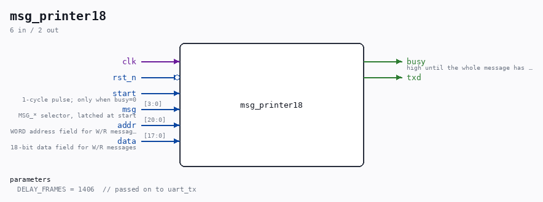

# msg_printer18

Source: `/mnt/e/Dev/Repos/Ronny/nd-120/Verilog/fpga/tang-nano-20k/sdram18-test/src/msg_printer18.v`

> Generated by `Verilog/tests/module_doc.py` from the `//!`
> comments in the source. Do not edit by hand - edit the RTL comments and regenerate.

## Description

UART message printer for the sdram18 test
Same as sdram-test's msg_printer.v but sized for the 18-bit-word
controller: 21-bit WORD address (6 hex digits) and 18-bit data
(5 hex digits):
"W 100000=3E3E3"
"R 100000=3E3E3 OK" / "R 100000=00201 ERR"
Last reviewed: 9-JUL-2026
Ronny Hansen

## Parameters

| Parameter | Default |
|---|---|
| `DELAY_FRAMES` | `1406  // passed on to uart_tx` |

## Ports

| Direction | Width | Name | Description |
|---|---|---|---|
| input | `1` | `clk` |  |
| input | `1` | `rst_n` *(active low)* |  |
| input | `1` | `start` | 1-cycle pulse; only when busy=0 |
| input | `[3:0]` | `msg` | MSG_* selector, latched at start |
| input | `[20:0]` | `addr` | WORD address field for W/R messages |
| input | `[17:0]` | `data` | 18-bit data field for W/R messages |
| output | `1` | `busy` | high until the whole message has left the UART |
| output | `1` | `txd` |  |
