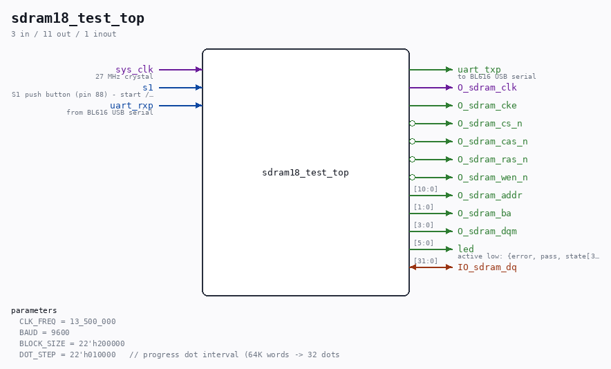

# sdram18_test_top

Source: `/mnt/e/Dev/Repos/Ronny/nd-120/Verilog/fpga/tang-nano-20k/sdram18-test/src/sdram18_test_top.v`

> Generated by `Verilog/tests/module_doc.py` from the `//!`
> comments in the source. Do not edit by hand - edit the RTL comments and regenerate.

## Description

Tang Nano 20K - sdram18.v hardware validation test
Drives the ND-120 18-bit-word SDRAM controller
(../sdram-bridge/sdram18.v) EXACTLY as the full ND-120 build does:
same PLL (Gowin_rPLL_ND120 with TANG_SLOW_BRINGUP -> 13.5 MHz clk +
13.5 MHz shifted chip clock), same FREQ parameter, same one-word
rd/wr/refresh handshake. The original sdram-test validated the 32-bit
byte-based sdram.v at 27 MHz; THIS test validates the 18-bit adaptation
at the slow-bring-up frequency - the exact configuration the deposit
bug was localized to (see docs/HANDOFF-basys3-memory-write.md).
Test sequence (started by S1 or any UART character, 9600 8N1):
1. Verbose demo: 4 words at spread WORD addresses (col[9:8] bits
exercised, bank bit, last word), written then read back, each op
printed as "W aaaaaa=ddddd" / "R aaaaaa=ddddd OK|ERR" (hex,
6-digit word address, 5-digit 18-bit data).
2. Block test: write ALL 2M words with an address-derived 18-bit
pattern (parity bits included), read back and verify.
Progress dot every 64K words. Ends with PASS or FAIL.
Last reviewed: 9-JUL-2026
Ronny Hansen

## Parameters

| Parameter | Default |
|---|---|
| `CLK_FREQ` | `13_500_000` |
| `BAUD` | `9600` |
| `BLOCK_SIZE` | `22'h200000` |
| `DOT_STEP` | `22'h010000   // progress dot interval (64K words -> 32 dots` |

## Ports

| Direction | Width | Name | Description |
|---|---|---|---|
| input | `1` | `sys_clk` | 27 MHz crystal |
| input | `1` | `s1` | S1 push button (pin 88) - start / restart |
| input | `1` | `uart_rxp` | from BL616 USB serial |
| output | `1` | `uart_txp` | to BL616 USB serial |
| output | `1` | `O_sdram_clk` |  |
| output | `1` | `O_sdram_cke` |  |
| output | `1` | `O_sdram_cs_n` *(active low)* |  |
| output | `1` | `O_sdram_cas_n` *(active low)* |  |
| output | `1` | `O_sdram_ras_n` *(active low)* |  |
| output | `1` | `O_sdram_wen_n` *(active low)* |  |
| inout | `[31:0]` | `IO_sdram_dq` |  |
| output | `[10:0]` | `O_sdram_addr` |  |
| output | `[1:0]` | `O_sdram_ba` |  |
| output | `[3:0]` | `O_sdram_dqm` |  |
| output | `[5:0]` | `led` | active low: {error, pass, state[3:0]} |
