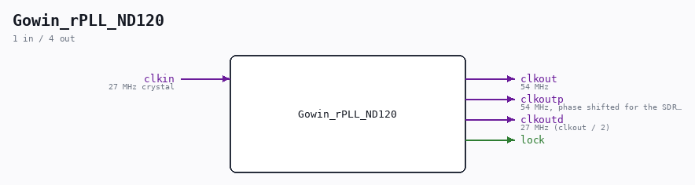

# Gowin_rPLL_ND120

Source: `/mnt/e/Dev/Repos/Ronny/nd-120/Verilog/fpga/tang-nano-20k/src/gowin_rpll_27_54.v`

> Generated by `Verilog/tests/module_doc.py` from the `//!`
> comments in the source. Do not edit by hand - edit the RTL comments and regenerate.

## Description

ND120 - Tang Nano 20K clock generator
One rPLL from the 27 MHz crystal:
clkout  = 54 MHz          - SDRAM controller clock (clk2x)
clkoutp = 54 MHz shifted  - SDRAM chip clock (same phase offset as
the hardware-validated sdram-test PLL)
clkoutd = 27 MHz          - CPU / bus / OSC domain (clkout / 2,
edge-aligned with clkout by the PLL)
Derived from the nand2mario sdram-tang-nano-20k rPLL configuration
(its commented-out 54 MHz option), Apache-2.0.
Last reviewed: 8-JUL-2026
Ronny Hansen

## Ports

| Direction | Width | Name | Description |
|---|---|---|---|
| output | `1` | `clkout` | 54 MHz |
| output | `1` | `clkoutp` | 54 MHz, phase shifted for the SDRAM chip |
| output | `1` | `clkoutd` | 27 MHz (clkout / 2) |
| output | `1` | `lock` |  |
| input | `1` | `clkin` | 27 MHz crystal |
