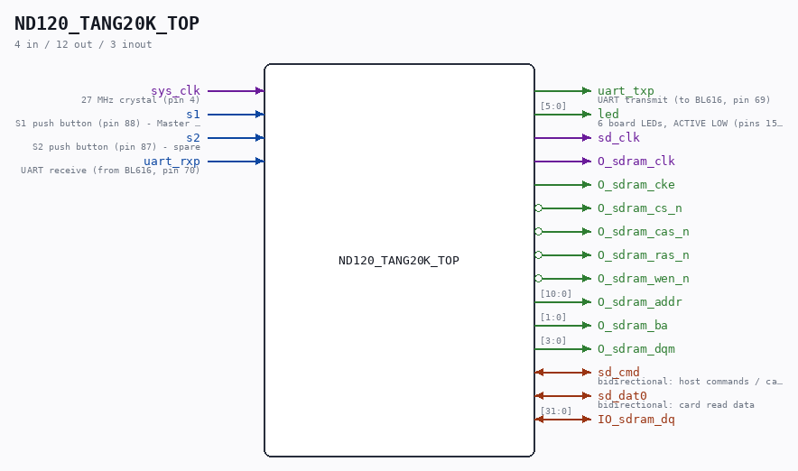

# ND120_TANG20K_TOP

Source: `/mnt/e/Dev/Repos/Ronny/nd-120/Verilog/fpga/tang-nano-20k/src/ND120_TANG20K_TOP.v`

> Generated by `Verilog/tests/module_doc.py` from the `//!`
> comments in the source. Do not edit by hand - edit the RTL comments and regenerate.

## Description

ND120 CPU, MEMORY MANAGEMENT and MEMORY
TOP LEVEL FOR THE TANG NANO 20K (Gowin GW2AR-18)
Sibling of ND120_TOP.v (the Basys3/Verilator top) - the Basys3 top
is untouched by this file. Board decisions (8-JUL-2026):
- one rPLL: 27 MHz CPU/bus/OSC + 54 MHz SDRAM clock pair
- main memory = embedded 8 MB SDRAM (MEM_RAM_49_SDRAM, 2 banks)
- microcode: SKIP_WCS_LOAD bitstream-preloaded WCS, PROM dropped
- console: OPCOM UART 9600 on the BL616 USB serial (pins 69/70)
- S1 = Master Clear (power-on-reset retrigger), S2 spare
Build defines come from src/tang20k_defines.v (first file in the
Gowin project).
Last reviewed: 8-JUL-2026
Ronny Hansen

## Ports

| Direction | Width | Name | Description |
|---|---|---|---|
| input | `1` | `sys_clk` | 27 MHz crystal (pin 4) |
| input | `1` | `s1` | S1 push button (pin 88) - Master Clear / reset |
| input | `1` | `s2` | S2 push button (pin 87) - spare |
| input | `1` | `uart_rxp` | UART receive (from BL616, pin 70) |
| output | `1` | `uart_txp` | UART transmit (to BL616, pin 69) |
| output | `[5:0]` | `led` | 6 board LEDs, ACTIVE LOW (pins 15-20) |
| output | `1` | `sd_clk` |  |
| inout | `1` | `sd_cmd` | bidirectional: host commands / card responses |
| inout | `1` | `sd_dat0` | bidirectional: card read data |
| output | `1` | `O_sdram_clk` |  |
| output | `1` | `O_sdram_cke` |  |
| output | `1` | `O_sdram_cs_n` *(active low)* |  |
| output | `1` | `O_sdram_cas_n` *(active low)* |  |
| output | `1` | `O_sdram_ras_n` *(active low)* |  |
| output | `1` | `O_sdram_wen_n` *(active low)* |  |
| inout | `[31:0]` | `IO_sdram_dq` |  |
| output | `[10:0]` | `O_sdram_addr` |  |
| output | `[1:0]` | `O_sdram_ba` |  |
| output | `[3:0]` | `O_sdram_dqm` |  |
