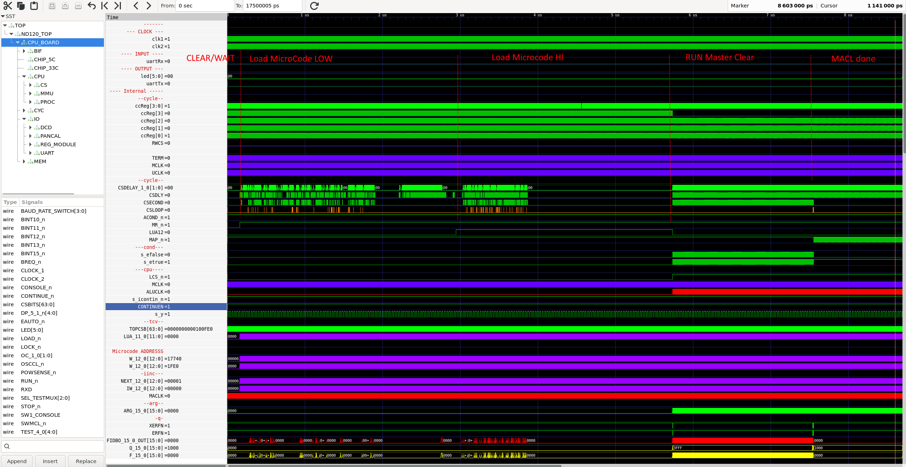

# Verilog code

The Verilog code has been split into subfolder matching the structure of the LogiSim and Design Documents

## Status

Verilator is able to successfully compile and execute microcode load, and continue executing "Master Clear" until finished.

| Folder                                         | Status Logisim           |  Status Verilog                                | Status Vivado                         | Comment    |
|------------------------------------------------|--------------------------|------------------------------------------------|---------------------------------------|------------|
| [DELILAH-CPU](CPU-BOARD-3202/readme.md)        | Logisim drawing complete | Verilog compiles - Missing a lot of testcases  | Syntehesis OK, implementation fails   | CGA        |
| [DECODE-GateArray](DECODE-GateArray/readme.md) | Logisim drawing complete | Verilog compiles - Missing a lot of testcases  | Syntehesis OK, implementation fails   | DGA        |
| [CPU-BOARD-3202](CPU-BOARD-3202/readme.md)     | Logisim drawing complete | Verilog compiles - Missing a lot of testcases  | Syntehesis OK, implementation fails   | Need to validate support chips TTL/MEMORY/++   |
| [PAL](../DesignDocuments/PAL-Code/readme.md)   | No logisim, PALASM source| Verilog compiles - Missing a lot of testcases  | Syntehesis OK, implementation fails   | Hand converted PALASM to Verilog for all PAL's |
| [Shared](Shared/readme.md)                     |                          | Verilog compiles - Missing a lot of testcases  | Syntehesis OK, implementation fails   | Shared code between the CPU, DGA and 3202D CPU board. Mix of converted logisim and manually created modules |

## Run Verilog code using Verilator

There are two folders with test code for verilator

 * sim - contains a simple test of the ND120_TOP module. Saves signal traces to file and is used to verify the Verilog code using GTKWave
 * runsim - Starts the simulation and runs the microcode load and self-test program. After self test it will enable OPCOM for communication with the CPU.

## Verilog code status

| Folder           | # of Verilog Files       | Lines of Verilog code  |
|------------------|--------------------------|------------------------|
| DELILAH-CPU      | 147                      | 22,976                 |
| DECODE-GateArray |  28                      | 4,316                  |
| CPU-BOARD-3202   |  84                      | 48,219                 |
| TOTAL            | 259                      | 75,511                 |

* [Other - including PAL's](Other/Readme.md)

Note: When all modules are merged, number of files and number of lines will be reduced as there is multiple copies of "base components" from Logisim

## Tracking total code over time

| Date       | Files | Lines of code | Lines of comments | Blank lines | Total lines |
|------------|-------|---------------|-------------------|-------------|-------------|
| 21.05.2024 | 262	 |    69,237	 |  10,453	         | 6,721	   |  86,411     |
| 11.11.2024 | 263   |    69,686	 |  10,210	         | 6,807       |  86,703     |
| 28.11.2024 | 264   |    69,731     |   9,853           | 6,694       |  86,278     |

# CPU Boot process

* Some delay to reset all components
* Loads Microcode first 32KB (low)
* Loads Microcode next 32KB (high)
* Starts at microcode address 0 (Master Clear/Power Clear)
* Jumps to MACL
* Clears/Initializes internal registers and sets up UART
* Runs self-test program for CPU, Test 1-8

* Depending on the input from the PANEL keylock it will either try to automatic load code from storage depending on ALD settings 
* - or go to OPCOM mode where one can communicate with the CPU via UART

## Test program verification

